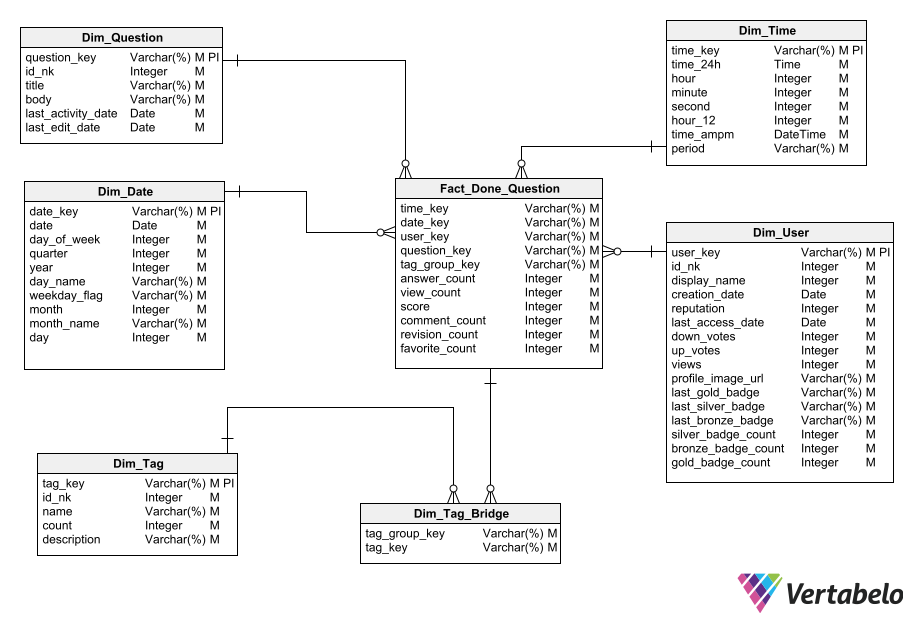
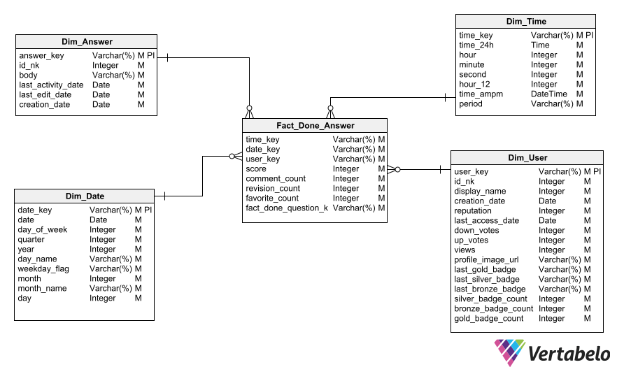

# 1. **StackOverflow profiling**

------------

- [1. **StackOverflow profiling**](#1-stackoverflow-profiling)
  - [1.1. Introduction to business logic](#11-introduction-to-business-logic)
  - [1.2. Description of the dataset and data dictionary of the dataset](#12-description-of-the-dataset-and-data-dictionary-of-the-dataset)
    - [1.2.1. Description](#121-description)
    - [1.2.2. Data dictionary](#122-data-dictionary)
      - [1.2.2.1. Source: Big Query](#1221-source-big-query)
        - [1.2.2.1.1. badges](#12211-badges)
        - [1.2.2.1.2. comments](#12212-comments)
        - [1.2.2.1.3. posts_answers](#12213-posts_answers)
        - [1.2.2.1.4. posts_moderator_nomination](#12214-posts_moderator_nomination)
        - [1.2.2.1.5. posts_orphaned_tag_wiki](#12215-posts_orphaned_tag_wiki)
        - [1.2.2.1.6. post_history](#12216-post_history)
        - [1.2.2.1.7. post_links](#12217-post_links)
        - [1.2.2.1.8. users](#12218-users)
        - [1.2.2.1.9. posts_privilege_wiki](#12219-posts_privilege_wiki)
        - [1.2.2.1.10. posts_questions](#122110-posts_questions)
        - [1.2.2.1.11. posts_tag_wiki](#122111-posts_tag_wiki)
        - [1.2.2.1.12. posts_tag_wiki_excerpt](#122112-posts_tag_wiki_excerpt)
        - [1.2.2.1.13. posts_wiki_placeholder](#122113-posts_wiki_placeholder)
        - [1.2.2.1.14. stackoverflow_posts](#122114-stackoverflow_posts)
        - [1.2.2.1.15. tags](#122115-tags)
        - [1.2.2.1.16. votes](#122116-votes)
      - [1.2.2.2. Source: XML](#1222-source-xml)
        - [1.2.2.2.1. badges](#12221-badges)
        - [1.2.2.2.2. comments](#12222-comments)
        - [1.2.2.2.3. postHistory](#12223-posthistory)
        - [1.2.2.2.4. postLink](#12224-postlink)
        - [1.2.2.2.5. post](#12225-post)
        - [1.2.2.2.6. tags](#12226-tags)
        - [1.2.2.2.7. user](#12227-user)
        - [1.2.2.2.8. view_archive_cleaner](#12228-view_archive_cleaner)
        - [1.2.2.2.9. votes](#12229-votes)
  - [1.3. Data profiling results](#13-data-profiling-results)
    - [1.3.1. Source: Big Query](#131-source-big-query)
      - [1.3.1.1. badges](#1311-badges)
      - [1.3.1.2. comments](#1312-comments)
      - [1.3.1.3. posts_answers](#1313-posts_answers)
      - [1.3.1.4. posts_moderator_nomination](#1314-posts_moderator_nomination)
      - [1.3.1.5. posts_orphaned_tag_wiki](#1315-posts_orphaned_tag_wiki)
      - [1.3.1.6. post_history](#1316-post_history)
      - [1.3.1.7. post_links](#1317-post_links)
      - [1.3.1.8. users](#1318-users)
      - [1.3.1.9. posts_privilege_wiki](#1319-posts_privilege_wiki)
      - [1.3.1.10. posts_questions](#13110-posts_questions)
      - [1.3.1.11. posts_tag_wiki](#13111-posts_tag_wiki)
      - [1.3.1.12. posts_tag_wiki_excerpt](#13112-posts_tag_wiki_excerpt)
      - [1.3.1.13. posts_wiki_placeholder](#13113-posts_wiki_placeholder)
      - [1.3.1.14. stackoverflow_posts](#13114-stackoverflow_posts)
      - [1.3.1.15. tags](#13115-tags)
      - [1.3.1.16. votes](#13116-votes)
    - [1.3.2. Source: XML](#132-source-xml)
      - [1.3.2.1. badges](#1321-badges)
      - [1.3.2.2. comments](#1322-comments)
      - [1.3.2.3. postHistory](#1323-posthistory)
      - [1.3.2.4. postLink](#1324-postlink)
      - [1.3.2.5. post](#1325-post)
      - [1.3.2.6. tags](#1326-tags)
      - [1.3.2.7. user](#1327-user)
      - [1.3.2.8. view_archive_cleaner](#1328-view_archive_cleaner)
      - [1.3.2.9. votes](#1329-votes)
  - [1.4. Specification of analytical needs that the proposed model will solve](#14-specification-of-analytical-needs-that-the-proposed-model-will-solve)
  - [1.5. Proposed dimensional model](#15-proposed-dimensional-model)
    - [1.5.1. Done Question](#151-done-question)
    - [1.5.2. Done Answer](#152-done-answer)
  - [1.6. Mapping by table](#16-mapping-by-table)
    - [1.6.1. Dim_Question](#161-dim_question)
    - [1.6.2. Dim_user](#162-dim_user)
    - [1.6.3. Dim_tag](#163-dim_tag)
    - [1.6.4. Dim_tag_bridge](#164-dim_tag_bridge)
    - [1.6.5. Dim_Time](#165-dim_time)
    - [1.6.6. Dim_Date](#166-dim_date)
    - [1.6.7. Fact_Done_Question](#167-fact_done_question)
    - [1.6.8. Fact_Done_Answer](#168-fact_done_answer)

## 1.1. Introduction to business logic

StackOverflow is a question and answer site for programmers and enthusiasts of the development and use of software was founded in 2008, becoming one of the 50 websites that has a great popularity around the world, fully transforming the way of working of people, we are constantly working to create a kind of library of outlined answers to all questions about programming, developing and using software as such.

Basically the user creates an account to belong to the platform, through that account he can ask the questions that seek to respond to those needs that arise within that day to business day, the user prepares the question and publishes it on the question site , that question becomes a post, consequently this question may have the corresponding answers from the other members of the community, both questions and answers may have points in favor or against, depending on the performance of the user, it can gradually escalate in merits, earning badges that allow you to increase your privileges within the platform, finally becoming a moderator, each question is related to a specialized tag that allows optimizing searches within the community, these tags are usually related to the technologies that ask the most and Answers are generating on the StakOverflow site.

The full meaning of being able to belong to this popular network is to be able at all times to help that group of people who develop within the professions or trades that depend directly on the technology that evolves by leaps and bounds so the needs have grown exponentially That is why the platform increasingly recovers value over time.

The StakOverflow community is an interdisciplinary effort of a group of people working together to be able to add value to the community in the face of the many questions that the site receives, thereby achieving direct help to millions of people in the world by answering all those difficult questions to answer, questions that arise from the need to solve those daily problems that are usually found in work life and of course share knowledge with other people and be able to better continue with their daily activities that their profession, trade or activity demands.

Centralizing the community first of all is one of the values ​​that is most sought to be fulfilled, because in this way healthy communities are promoted that at all times have the sufficient intention to learn and of course give back to the community in a better way as well as adopt a mentality of ethical, sustainable and long-term growth both personally and in the company.

As already mentioned, StackOverflow is a site that has a huge range of opportunities to meet our needs, these needs have been growing in recent years with the exponential curve of users who interact with the new technologies that are emerging over time. , this causes the excessive growth of large amounts or volumes of data, so it is of vital interest to be able to exploit, use or analyze these large volumes of data, analyzes that will yield results on the behavior of this community in recent years, results that will allow reorienting the efforts for the consequent improvement in the operational policies of the platform as such.

That is why a dimensional model will be built that fully represents two very important business processes, one of them is questions asked and the other is answers made, in this way we are basically covering the two main areas of potential analytical interest for the entity. , in such a way that the model will show or have in its presentation layer all the transformed data, structured in such a way that they are consumable by the analytical users, through the construction of a  dashboard , the data will be fully consumed and will be hopes that it satisfies all the needs that users have for data to finally support the strategic decision-making process, it is vitally important to guarantee quality, effectiveness and of course the highest performance so that the model is fully adopted by the StackOverflow community.

The entire dimensional modeling process will be specifically applied in which the business process is dealt with, determination of the level of granularity, identification of dimensions and determination of the metrics that will measure the events that occur in the business process, in this first stage It will cover the entire profiling process on the StackOverflow dataset and the external source with which we will enrich the dataset, the data dictionary of the same to be able to know first-hand table by table and its corresponding structure, in addition, the result of the dimensional modeling through the star schema, finally the mappings process will be covered for each table that will be used to build the dimensional model as such

## 1.2. Description of the dataset and data dictionary of the dataset

### 1.2.1. Description

A continuación describiremos con más detalles cada una de las tablas que conforman nuestro dataset de StackOverflow:

| N°  | Table name                 | Number of records | Size      | column | Used for MD |
| --- | -------------------------- | ----------------- | --------- | ------ | ----------- |
| 1   | badges                     | 39,178,976        | 1.78 GB   | 6      | Yes         |
| 2   | comments                   | 79,220,809        | 16.64 GB  | 7      | No          |
| 3   | posts_answers              | 31,169,249        | 27.6 GB   | 20     | Yes         |
| 4   | posts_moderator_nomination | 334               | 473.5 KB  | 20     | No          |
| 5   | posts_orphaned_tag_wiki    | 167               | 53.34 KB  | 19     | No          |
| 6   | post_history               | 138,808,451       | 109.24 GB | 8      | Yes         |
| 7   | post_links                 | 7,302,589         | 291.1 MB  | 5      | No          |
| 8   | users                      | 14,080,580        | 2.4 GB    | 13     | Yes         |
| 9   | posts_privilege_wiki       | 2                 | 3.49 KB   | 20     | No          |
| 10  | posts_questions            | 20,890,054        | 35.58 GB  | 20     | Yes         |
| 11  | posts_tag_wiki             | 53036             | 36.57 MB  | 20     | Yes         |
| 12  | posts_tag_wiki_excerpt     | 53036             | 11.02 MB  | 20     | No          |
| 13  | posts_wiki_placeholder     | 5                 | 5.63 KB   | 20     | No          |
| 14  | stackoverflow_posts        | 31,017,889        | 31.52 GB  | 20     | Yes         |
| 15  | tags                       | 60,534            | 2.48 MB   | 5      | Yes         |
| 16  | votes                      | 208,577,841       | 6.67 GB   | 4      | Yes         |

### 1.2.2. Data dictionary

#### 1.2.2.1. Source: Big Query

##### 1.2.2.1.1. badges

| Attribute name | Type     | Is mandatory | Is primary | Is foreign | Description                                   |
| -------------- | -------- | ------------ | ---------- | ---------- | --------------------------------------------- |
| id             | Integer  | Yes          | Yes        | No         | Identificador llave primaria de tabla         |
| name           | Varchar  | Yes          | No         | No         | Nombre de la categoría de usuario             |
| date           | Datetime | Yes          | No         | No         | Fecha y Hora registrada del evento            |
| user_id        | Integer  | Yes          | No         | Yes        | Identificador de usuario que inicio el evento |
| class          | Integer  | Yes          | No         | No         | Numero de clase                               |
| tag_based      | Boolean  | Yes          | No         | No         | Indicador de estado actual del usuario        |

##### 1.2.2.1.2. comments

| Attribute name    | Type     | Is mandatory | Is primary | Is foreign | Description                                 |
| ----------------- | -------- | ------------ | ---------- | ---------- | ------------------------------------------- |
| id                | Integer  | Yes          | Yes        | No         | Identificador llave primaria de tabla       |
| text              | Varchar  | Yes          | No         | No         | Nombre de los comentarios                   |
| creation_date     | Datetime | Yes          | No         | No         | Fecha y Hora de creación del comentario     |
| post_id           | Integer  | Yes          | No         | Yes        | Identificador del post o evento de consulta |
| user_id           | Integer  | Yes          | No         | Yes        | Identificador de usuario                    |
| user_display_name | Varchar  | Yes          | No         | No         | Username del usuario                        |
| score             | Integer  | Yes          | No         | No         | Puntaje alcanzado del post                  |

##### 1.2.2.1.3. posts_answers

| Attribute name           | Type     | Is mandatory | Is primary | Is foreign | Description                                                      |
| ------------------------ | -------- | ------------ | ---------- | ---------- | ---------------------------------------------------------------- |
| id                       | Integer  | Yes          | Yes        | No         | Identificador llave primaria de tabla                            |
| title                    | Varchar  | Yes          | No         | No         | Descripción del título de las respuestas                         |
| accepted_answer_id       | Integer  | Yes          | No         | Yes        | Identificador de respuesta aceptada                              |
| comment_count            | Integer  | Yes          | No         | No         | Conteo del número de respuestas recibidas para la pregunta       |
| community_owned_date     | Datetime | Yes          | No         | No         | Fecha y Hora registrada por la plataforma                        |
| creation_date            | Datetime | Yes          | No         | No         | Fecha y Hora de creación del evento                              |
| favorite_count           | Integer  | Yes          | No         | No         | Conteo de los posts o respuestas favoritas                       |
| last_activity_date       | Datetime | Yes          | No         | No         | Fecha y Hora de la última actividad en el post                   |
| last_edit_date           | Datetime | Yes          | No         | No         | Fecha y Hora de la edición del post                              |
| last_editor_display_name | Varchar  | Yes          | No         | No         | Contiene el nombre del editor del post incluyendo el nombre y id |
| last_editor_user_id      | Integer  | Yes          | No         | Yes        | Identificador único del editor del post                          |
| owner_display_name       | Varchar  | Yes          | No         | No         | Nombre del dueño del post o evento de consulta                   |
| owner_user_id            | Integer  | Yes          | No         | Yes        | Identificador del dueño del post o evento de la consulta         |
| parent_id                | Integer  | Yes          | No         | Yes        | Identificador del evento padre                                   |
| post_type_id             | Integer  | Yes          | No         | Yes        | Identificador del tipo de post o evento de consulta              |
| score                    | Integer  | Yes          | No         | No         | Puntaje del post                                                 |
| tags                     | Varchar  | Yes          | No         | No         | Etiqueta del post                                                |
| view_count               | Integer  | Yes          | No         | No         | Conteo de vistas del post                                        |

##### 1.2.2.1.4. posts_moderator_nomination

| Attribute name           | Type     | Is mandatory | Is primary | Is foreign | Description                                        |
| ------------------------ | -------- | ------------ | ---------- | ---------- | -------------------------------------------------- |
| id                       | Integer  | Yes          | Yes        | No         | Identificador llave primaria de tabla              |
| title                    | Varchar  | Yes          | No         | No         | Descripción del titulo                             |
| body                     | Varchar  | Yes          | No         | No         | Descripción de las acciones del moderador del post |
| accepted_answer_id       | Integer  | Yes          | No         | Yes        | Identificador de la respuesta aceptada             |
| answer_count             | Integer  | Yes          | No         | No         | Conteo de las respuestas del post                  |
| comment_count            | Integer  | Yes          | No         | No         | Conteo de los comentarios que el post recibe       |
| community_owned_date     | Datetime | Yes          | No         | No         | Fecha y Hora de las acciones de la comunidad       |
| creation_date            | Datetime | Yes          | No         | No         | Fecha y Hora de creación                           |
| favorite_countt          | Integer  | Yes          | No         | No         | Conteo de los posts favoritos                      |
| last_activity_date       | Datetime | Yes          | No         | No         | Fecha y Hora de la última actividad del moderador  |
| last_edit_date           | Datetime | Yes          | No         | No         | Fecha y Hora de la última edición del moderador    |
| last_editor_display_name | Varchar  | Yes          | No         | No         | Nombre del ultimo editor del post                  |
| last_editor_user_id      | Integer  | Yes          | No         | Yes        | Identificador del ultimo editor del post           |
| owner_display_name       | Varchar  | Yes          | No         | No         | Nombre del dueño del post o evento de consulta     |
| owner_user_id            | Integer  | Yes          | No         | Yes        | Identificador del usuario                          |
| parent_id                | Integer  | Yes          | No         | Yes        | Identificador del propietario                      |
| post_type_id             | Integer  | Yes          | No         | Yes        | Identificador del tipo de post                     |
| score                    | Integer  | Yes          | No         | No         | Puntaje                                            |
| tags                     | Varchar  | Yes          | No         | No         | Etiquetas                                          |
| view_count               | Integer  | Yes          | No         | No         | Conteo de vistas                                   |

##### 1.2.2.1.5. posts_orphaned_tag_wiki

| Attribute name           | Type     | Is mandatory | Is primary | Is foreign | Description                                                  |
| ------------------------ | -------- | ------------ | ---------- | ---------- | ------------------------------------------------------------ |
| id                       | Integer  | Yes          | Yes        | No         | Identificador llave primaria de tabla                        |
| title                    | Varchar  | Yes          | No         | No         | Descripción del titulo                                       |
| body                     | Varchar  | Yes          | No         | No         | Descripción de las acciones                                  |
| accepted_answer_id       | Integer  | Yes          | No         | Yes        | Identificador de la respuesta aceptada                       |
| answer_count             | Integer  | Yes          | No         | No         | Conteo de las respuestas del post                            |
| comment_count            | Integer  | Yes          | No         | No         | Conteo de los comentarios que el post recibe                 |
| community_owned_date     | Datetime | Yes          | No         | No         | Fecha y Hora de las acciones de la comunidad                 |
| creation_date            | Datetime | Yes          | No         | No         | Fecha y Hora de creación                                     |
| favorite_countt          | Integer  | Yes          | No         | No         | Conteo de los posts favoritos                                |
| last_activity_date       | Datetime | Yes          | No         | No         | Fecha y Hora de la última actividad                          |
| last_edit_date           | Datetime | Yes          | No         | No         | Fecha y Hora de la última edición del post                   |
| last_editor_display_name | Varchar  | Yes          | No         | No         | Nombre del ultimo editor del post                            |
| last_editor_user_id      | Integer  | Yes          | No         | Yes        | Identificador del ultimo usuario que llevo a cabo la edicion |
| owner_display_name       | Varchar  | Yes          | No         | No         | Nombre del dueño del post o evento de consulta               |
| parent_id                | Integer  | Yes          | No         | Yes        | Identificador padre                                          |
| post_type_id             | Integer  | Yes          | No         | Yes        | Identificador del tipo de post                               |
| score                    | Integer  | Yes          | No         | No         | Puntaje                                                      |
| tags                     | Varchar  | Yes          | No         | No         | Etiquetas                                                    |
| view_count               | Integer  | Yes          | No         | No         | Conteo de vistas del post                                    |

##### 1.2.2.1.6. post_history

| Attribute name | Type | Is mandatory | Is primary | Is foreign | Description |
| -------------- | ---- | ------------ | ---------- | ---------- | ----------- |
|                |      |              |            |            |             |

##### 1.2.2.1.7. post_links

| Attribute name | Type | Is mandatory | Is primary | Is foreign | Description |
| -------------- | ---- | ------------ | ---------- | ---------- | ----------- |
|                |      |              |            |            |             |

##### 1.2.2.1.8. users

| Attribute name | Type | Is mandatory | Is primary | Is foreign | Description |
| -------------- | ---- | ------------ | ---------- | ---------- | ----------- |
|                |      |              |            |            |             |

##### 1.2.2.1.9. posts_privilege_wiki

| Attribute name | Type | Is mandatory | Is primary | Is foreign | Description |
| -------------- | ---- | ------------ | ---------- | ---------- | ----------- |
|                |      |              |            |            |             |

##### 1.2.2.1.10. posts_questions

| Attribute name | Type | Is mandatory | Is primary | Is foreign | Description |
| -------------- | ---- | ------------ | ---------- | ---------- | ----------- |
|                |      |              |            |            |             |

##### 1.2.2.1.11. posts_tag_wiki

| Attribute name | Type | Is mandatory | Is primary | Is foreign | Description |
| -------------- | ---- | ------------ | ---------- | ---------- | ----------- |
|                |      |              |            |            |             |

##### 1.2.2.1.12. posts_tag_wiki_excerpt

| Attribute name           | Type     | Is mandatory | Is primary | Is foreign | Description                                                  |
| ------------------------ | -------- | ------------ | ---------- | ---------- | ------------------------------------------------------------ |
| Id                       | Integer  | Yes          | Yes        | No         | Identificador de llave primaria de tabla                     |
| Title                    | Varchar  | Yes          | No         | No         | Descripción el titulo                                        |
| Body                     | Varchar  | Yes          | No         | No         | Cuerpo del extracto de la wiki                               |
| accepted_answer_id       | Integer  | Yes          | No         | Yes        | Identificador de la respuesta aceptada                       |
| answer_count             | Integer  | Yes          | No         | No         | Conteo de las respuestas del post                            |
| comment_count            | Integer  | Yes          | No         | No         | Conteo de los comentarios recibidos por el post              |
| community_owned_date     | Datetime | Yes          | No         | No         | Fecha y Hora de las acciones en la comunidad                 |
| creation_date            | Datetime | Yes          | No         | No         | Fecha y Hora de creación                                     |
| favorite_count           | Integer  | Yes          | No         | No         | Conteo de favoritos                                          |
| last_activity_date       | Datetime | Yes          | No         | No         | Fecha y Hora de la última actividad                          |
| last_edit_date           | Datetime | Yes          | No         | No         | Fecha y Hora de la última edición                            |
| last_editor_display_name | Varchar  | Yes          | No         | No         | Nombre del ultimo editor del post                            |
| last_editor_user_id      | Integer  | Yes          | No         | Yes        | Identificador del ultimo usuario que llevo a cabo la edición |
| owner_display_name       | Varchar  | Yes          | No         | No         | Nombre del dueño del post o evento de la consulta            |
| parent_id                | Integer  | Yes          | No         | Yes        | Identificador padre                                          |
| post_type_id             | Integer  | Yes          | No         | Yes        | Identificador del tipo de post                               |
| score                    | Integer  | Yes          | No         | No         | Puntaje                                                      |
| Tags                     | Varchar  | Yes          | No         | No         | Etiquetas                                                    |
| View_count               | Integer  | Yes          | No         | No         | Conteo de vistas del post                                    |

##### 1.2.2.1.13. posts_wiki_placeholder

| Attribute name           | Type     | Is mandatory | Is primary | Is foreign | Description                                                  |
| ------------------------ | -------- | ------------ | ---------- | ---------- | ------------------------------------------------------------ |
| id                       | Integer  | Yes          | Yes        | No         | Identificador de llave primaria de tabla                     |
| title                    | Varchar  | Yes          | No         | No         | Descripción el titulo                                        |
| body                     | Varchar  | Yes          | No         | No         | Cuerpo del placeholder con la wiki                           |
| accepted_answer_id       | Integer  | Yes          | No         | Yes        | Identificador de la respuesta aceptada                       |
| answer_count             | Integer  | Yes          | No         | No         | Conteo de las respuestas del post                            |
| comment_count            | Integer  | Yes          | No         | No         | Conteo de los comentarios recibidos por el post              |
| community_owned_date     | Datetime | Yes          | No         | No         | Fecha y Hora de las acciones en la comunidad                 |
| creation_date            | Datetime | Yes          | No         | No         | Fecha y Hora de creación                                     |
| favorite_count           | Integer  | Yes          | No         | No         | Conteo de favoritos                                          |
| last_activity_date       | Datetime | Yes          | No         | No         | Fecha y Hora de la última actividad                          |
| last_edit_date           | Datetime | Yes          | No         | No         | Fecha y Hora de la última edición                            |
| last_editor_display_name | Varchar  | Yes          | No         | No         | Nombre del ultimo editor del post                            |
| last_editor_user_id      | Integer  | Yes          | No         | Yes        | Identificador del ultimo usuario que llevo a cabo la edición |
| owner_display_name       | Varchar  | Yes          | No         | No         | Nombre del dueño del post o evento de la consulta            |
| parent_id                | Integer  | Yes          | No         | Yes        | Identificador padre                                          |
| post_type_id             | Integer  | Yes          | No         | Yes        | Identificador del tipo de post                               |
| score                    | Integer  | Yes          | No         | No         | Puntaje                                                      |
| Tags                     | Varchar  | Yes          | No         | No         | Etiquetas                                                    |
| View_count               | Integer  | Yes          | No         | No         | Conteo de vistas del post                                    |

##### 1.2.2.1.14. stackoverflow_posts

| Attribute name           | Type     | Is mandatory | Is primary | Is foreign | Description                                                  |
| ------------------------ | -------- | ------------ | ---------- | ---------- | ------------------------------------------------------------ |
| id                       | Integer  | Yes          | Yes        | No         | Identificador de llave primaria de tabla                     |
| title                    | Varchar  | Yes          | No         | No         | Descripción el titulo                                        |
| body                     | Varchar  | Yes          | No         | No         | Cuerpo de los posts de stackoverflow                         |
| accepted_answer_id       | Integer  | Yes          | No         | Yes        | Identificador de la respuesta aceptada                       |
| answer_count             | Integer  | Yes          | No         | No         | Conteo de las respuestas del post                            |
| comment_count            | Integer  | Yes          | No         | No         | Conteo de los comentarios recibidos por el post              |
| community_owned_date     | Datetime | Yes          | No         | No         | Fecha y Hora de las acciones en la comunidad                 |
| creation_date            | Datetime | Yes          | No         | No         | Fecha y Hora de creación                                     |
| favorite_count           | Integer  | Yes          | No         | No         | Conteo de favoritos                                          |
| last_activity_date       | Datetime | Yes          | No         | No         | Fecha y Hora de la última actividad                          |
| last_edit_date           | Datetime | Yes          | No         | No         | Fecha y Hora de la última edición                            |
| last_editor_display_name | Varchar  | Yes          | No         | No         | Nombre del ultimo editor del post                            |
| last_editor_user_id      | Integer  | Yes          | No         | Yes        | Identificador del ultimo usuario que llevo a cabo la edición |
| owner_display_name       | Varchar  | Yes          | No         | No         | Nombre del dueño del post o evento de la consulta            |
| parent_id                | Integer  | Yes          | No         | Yes        | Identificador padre                                          |
| post_type_id             | Integer  | Yes          | No         | Yes        | Identificador del tipo de post                               |
| score                    | Integer  | Yes          | No         | No         | Puntaje                                                      |
| Tags                     | Varchar  | Yes          | No         | No         | Etiquetas                                                    |
| View_count               | Integer  | Yes          | No         | No         | Conteo de vistas del post                                    |

##### 1.2.2.1.15. tags

| Attribute name  | Type    | Is mandatory | Is primary | Is foreign | Description                              |
| --------------- | ------- | ------------ | ---------- | ---------- | ---------------------------------------- |
| Id              | Integer | Yes          | Yes        | No         | Identificador de llave primaria de tabla |
| Tag_name        | Varchar | Yes          | No         | No         | Nombre de la etiqueta                    |
| Count           | Integer | Yes          | No         | No         | Conteo de la etiqueta                    |
| Excerpt_post_id | Integer | No           | No         | Yes        | Identificador del extracto del post      |
| Wiki_post_id    | Integer | No           | No         | Yes        | Identificador de la wiki del post        |

##### 1.2.2.1.16. votes

| Attribute name | Type     | Is mandatory | Is primary | Is foreign | Description                              |
| -------------- | -------- | ------------ | ---------- | ---------- | ---------------------------------------- |
| Id             | Integer  | Yes          | Yes        | No         | Identificador de llave primaria de tabla |
| Creation_date  | Datetime | Yes          | No         | No         | Fecha de creación del voto               |
| Post_id        | Integer  | Yes          | No         | Yes        | Identificador del post                   |
| Vote_type_id   | Integer  | Yes          | No         | Yes        | Indentificador del tipo de voto          |

#### 1.2.2.2. Source: XML

##### 1.2.2.2.1. badges

| Attribute name             | Type     | Is mandatory | Is primary | Is foreign | Description                              |
| -------------------------- | -------- | ------------ | ---------- | ---------- | ---------------------------------------- |
| Row_metamodel_surrogate_id | Integer  | Yes          | Yes        | No         | Identificador de llave primaria de tabla |
| class                      | Integer  | Yes          | No         | No         | Numeración de Categoría                  |
| Date                       | Datetime | Yes          | No         | No         | Descripción de Fecha y Hora              |
| Id                         | Integer  | Yes          | No         | Yes        | Identificador foráneo                    |
| Name                       | Varchar  | Yes          | No         | No         | Descripción de nombre                    |
| TagBased                   | Boolean  | Yes          | No         | No         | Indicador del estado actual              |

##### 1.2.2.2.2. comments

| Attribute name             | Type     | Is mandatory | Is primary | Is foreign | Description                              |
| -------------------------- | -------- | ------------ | ---------- | ---------- | ---------------------------------------- |
| Row_metamodel_surrogate_id | Integer  | Yes          | Yes        | No         | Identificador de llave primaria de tabla |
| ContentLicense             | Varchar  | Yes          | No         | No         | Descripción de la licencia               |
| CreationDate               | Datetime | Yes          | No         | No         | Fecha y Hora de creación                 |
| Id                         | Integer  | Yes          | No         | Yes        | Identificador                            |
| PostId                     | Integer  | Yes          | No         | Yes        | Identificador del post                   |
| Score                      | Integer  | Yes          | No         | No         | Conteo                                   |
| Text                       | Varchar  | Yes          | No         | No         | Descripción del post                     |
| UserId                     | Integer  | Yes          | No         | Yes        | Identificador de usuario                 |
| UserDisplayName            | Varchar  | Yes          | No         | No         | Username del dueño del post              |

##### 1.2.2.2.3. postHistory

| Attribute name             | Type     | Is mandatory | Is primary | Is foreign | Description                              |
| -------------------------- | -------- | ------------ | ---------- | ---------- | ---------------------------------------- |
| Row_metamodel_surrogate_id | Integer  | Yes          | Yes        | No         | Identificador de llave primaria de tabla |
| ContentLicense             | Varchar  | Yes          | No         | No         | Descripción de la licencia               |
| CreationDate               | Datetime | No           | No         | Fecha      | y hora de creación                       |
| Id                         | Integer  | Yes          | No         | Yes        | Identificador                            |
| postHistoryTypeId          | Integer  | Yes          | No         | Yes        | Identificador                            |
| PostId                     | Integer  | Yes          | No         | Yes        | Identificador                            |
| RevisionGUID               | Integer  | Yes          | No         | Yes        | Identificador                            |
| text                       | Varchar  | Yes          | No         | No         | Descripción del post                     |
| UserId                     | Integer  | Yes          | No         | Yes        | Identificador de usuario                 |
| Comment                    | Varchar  | Yes          | No         | No         | Descripción de las acciones              |
| UserDisplayName            | Varchar  | Yes          | No         | No         | Username del usuario                     |

##### 1.2.2.2.4. postLink

| Attribute name             | Type     | Is mandatory | Is primary | Is foreign | Description                              |
| -------------------------- | -------- | ------------ | ---------- | ---------- | ---------------------------------------- |
| Row_metamodel_surrogate_id | Integer  | Yes          | Yes        | No         | Identificador de llave primaria de tabla |
| creationDate               | Datetime | Yes          | No         | No         | Fecha y hora de creación                 |
| Id                         | Integer  | Yes          | No         | No         | Identificador                            |
| LinkTypeId                 | Integer  | Yes          | No         | Yes        | Identificador                            |
| PostId                     | Integer  | Yes          | No         | Yes        | Identificador                            |

##### 1.2.2.2.5. post

| Attribute name             | Type     | Is mandatory | Is primary | Is foreign | Description                                                          |
| -------------------------- | -------- | ------------ | ---------- | ---------- | -------------------------------------------------------------------- |
| Row_metamodel_surrogate_id | Integer  | Yes          | Yes        | No         | Identificador de llave primaria de tabla                             |
| AnswerCount                | Integer  | Yes          | No         | No         | Conteo de respuestas                                                 |
| Body                       | Varchar  | Yes          | No         | No         | Descripción completa del post elaborado                              |
| CommentCount               | Integer  | Yes          | No         | No         | Conteo de comentarios                                                |
| ContentLicense             | Varchar  | Yes          | No         | No         | Descripción de la licencia                                           |
| CreationDate               | Datetime | Yes          | No         | No         | Fecha y hora de creación del post                                    |
| FavoriteCount              | Integer  | Yes          | No         | Yes        | Conteo de favoritos                                                  |
| Id                         | Integer  | Yes          | No         | No         | Identificador                                                        |
| LastActivityDate           | Datetime | Yes          | No         | No         | Fecha y hora de la última actividad                                  |
| OwnerUserId                | Integer  | Yes          | No         | Yes        | Identificador de usuario                                             |
| PostTypeId                 | Integer  | Yes          | No         | Yes        | Identificador del post                                               |
| Score                      | Integer  | Yes          | No         | No         | Puntaje                                                              |
| Tags                       | Varchar  | Yes          | No         | No         | Etiquetas del post                                                   |
| Title                      | Varchar  | Yes          | No         | No         | Título del post                                                      |
| ViewCount                  | Integer  | Yes          | No         | No         | Conteo de visitas                                                    |
| AcceptedAnswerId           | Integer  | Yes          | No         | Yes        | Identificador de respuesta aceptada                                  |
| LastEditDate               | Datetime | Yes          | No         | No         | Fecha y Hora de la última edición                                    |
| LastEditorUserId           | Integer  | Yes          | No         | Yes        | Identificador del ultimo usuario que realizo la operación de edición |
| ParentId                   | Integer  | Yes          | No         | Yes        | Identificador padre                                                  |
| CommunityOwnerDate         | Datetime | Yes          | No         | No         | Fecha y Hora de actividad de la comunidad                            |
| ClosedDate                 | Datetime | Yes          | No         | No         | Fecha y Hora de cierre                                               |
| LastEditorDisplayName      | Varchar  | Yes          | No         | No         | Nombre del ultimo editor                                             |
| OwnerDisplayName           | Varchar  | Yes          | No         | No         | Username                                                             |

##### 1.2.2.2.6. tags

| Attribute name             | Type    | Is mandatory | Is primary | Is foreign | Description                              |
| -------------------------- | ------- | ------------ | ---------- | ---------- | ---------------------------------------- |
| Row_metamodel_surrogate_id | Integer | Yes          | Yes        | No         | Identificador de llave primaria de tabla |
| Count                      | Integer | Yes          | No         | No         | Conteo                                   |
| ExceptPostId               | Integer | Yes          | No         | Yes        | Identificador de excepción de post       |
| Id                         | Integer | Yes          | No         | Yes        | Identificador                            |
| IsRequired                 | Boolean | Yes          | No         | No         | Estado                                   |
| TagName                    | Varchar | Yes          | No         | No         | Nombre de tag                            |
| WikiPostId                 | Integer | Yes          | No         | Yes        | Identificador de post de wiki            |
| IsModeratorOnly            | Boolean | Yes          | No         | No         | Estado de moderador                      |

##### 1.2.2.2.7. user

| Attribute name             | Type     | Is mandatory | Is primary | Is foreign | Description                              |
| -------------------------- | -------- | ------------ | ---------- | ---------- | ---------------------------------------- |
| Row_metadodel_surrogate_id | Integer  | Yes          | Yes        | No         | Identificador de llave primaria de tabla |
| AboutMe                    | Varchar  | Yes          | No         | No         | Descripción del usuario                  |
| AccountId                  | Integer  | Yes          | No         | Yes        | Identificador de cuenta                  |
| CreationDate               | Datetime | Yes          | No         | No         | Fecha y Hora de creación                 |
| DisplayName                | Varchar  | Yes          | No         | No         | Nombre del usuario                       |
| DownVotes                  | Integer  | Yes          | No         | No         | Número de votos bajos                    |
| Id                         | Integer  | Yes          | No         | Yes        | Identificador                            |
| LastAccessDate             | Datetime | Yes          | No         | No         | Fecha y Hora del ultimo acceso           |
| Location                   | Datetime | Yes          | No         | No         | Localidad de donde se realizó el post    |
| Reputation                 | Integer  | Yes          | No         | No         | Numero de reputación                     |
| UpVotes                    | Integer  | Yes          | No         | No         | Número de votos altos                    |
| Views                      | Integer  | Yes          | No         | No         | Numero de vistas                         |
| WebsiteUrl                 | Varchar  | Yes          | No         | No         | Descripción de URL                       |
| ProfileImageUrl            | Varchar  | Yes          | No         | No         | Descripción de URL de imágenes           |

##### 1.2.2.2.8. view_archive_cleaner

| Attribute name             | Type    | Is mandatory | Is primary | Is foreign | Description                              |
| -------------------------- | ------- | ------------ | ---------- | ---------- | ---------------------------------------- |
| Row_metadodel_surrogate_id | Integer | Yes          | Yes        | No         | Identificador de llave primaria de tabla |
| Count                      | Integer | Yes          | No         | No         | Conteo                                   |
| ExceptPostId               | Integer | Yes          | No         | Yes        | Identificador de excepción               |
| Id                         | Integer | Yes          | No         | Yes        | Identificador                            |
| TagName                    | Varchar | Yes          | No         | No         | Nombre del tag                           |
| WikiPostId                 | Integer | Yes          | No         | Yes        | Identificador de post                    |

##### 1.2.2.2.9. votes

| Attribute name             | Type     | Is mandatory | Is primary | Is foreign | Description                              |
| -------------------------- | -------- | ------------ | ---------- | ---------- | ---------------------------------------- |
| Row_metadodel_surrogate_id | Integer  | Yes          | Yes        | No         | Identificador de llave primaria de tabla |
| CreationDate               | Datetime | Yes          | No         | No         | Fecha y Hora de creación                 |
| Id                         | Integer  | Yes          | No         | No         | Identificador                            |
| PostId                     | Integer  | Yes          | No         | Yes        | Identificador de tipo de post            |
| VoteTypeId                 | Integer  | Yes          | No         | Yes        | Identificador de tipo de voto            |
| UserId                     | Integer  | Yes          | No         | Yes        | Identificador de usuario                 |

## 1.3. Data profiling results

### 1.3.1. Source: Big Query

#### 1.3.1.1. badges

| Attribute name | Type     | Proportion of valid (valid / total) | Result                                                                                                                                                                                                                                                                                      | Conclusion              |
| -------------- | -------- | ----------------------------------- | ------------------------------------------------------------------------------------------------------------------------------------------------------------------------------------------------------------------------------------------------------------------------------------------- | ----------------------- |
| id             | Integer  | 100%                                | El campo experimenta una proporción de 100% de registros válidos y 0% no válidos, por lo que es catalogada para poder usarse en la construcción del MD ya que es un campo completamente limpio.                                                                                             | Apto para MD            |
| name           | Varchar  | 100%                                | El campo experimenta una proporción de 100% de registros  válidos y 0% no válidos, por lo que es catalogada para poder usarse en la construcción del MD ya que es un campo completamente limpio.                                                                                            | Apto para MD            |
| date           | Datetime | 100%                                | El campo experimenta una proporción de 100% de registros válidos y 0% no válidos, pero Las filas contienen un formato de fecha y hora  que se tendrá que transformar de tal manera que se busque estandarizar el mismo para la construcción del MD ya que es un campo completamente limpio. | Requiere transformación |
| user_id        | Integer  | 100%                                | El campo experimenta una proporción de 100% de registros válidos y 0% no válidos, por lo que es catalogada para poder usarse en la construcción del MD ya que es un campo completamente limpio.                                                                                             | Apto para MD            |
| class          | Integer  | 100%                                | El campo experimenta una proporción de 100% de registros válidos  y 0% no válidos, por lo que es catalogada para poder usarse en la construcción del MD, ya que es un campo completamente limpio.                                                                                           | Requiere limpieza       |
| Tag_based      | Boolean  | 100%                                | El campo experimenta una proporción de 100% de registros válidos y 0% no válidos, por lo que es catalogada para poder usarse en la construcción del MD, pero requerirá de transformación para buscar el valor más textual.                                                                  | Requiere transformacion |

#### 1.3.1.2. comments

| Attribute name    | Type     | Proportion of valid (valid / total) | Result                                                                                                                                                                                                                                                                                      | Conclusion              |
| ----------------- | -------- | ----------------------------------- | ------------------------------------------------------------------------------------------------------------------------------------------------------------------------------------------------------------------------------------------------------------------------------------------- | ----------------------- |
| id                | Integer  | 100%                                | El campo experimenta una proporción de 100% de registros válidos y 0% no válidos, por lo que es catalogada para poder usarse en la construcción del MD ya que es un campo completamente limpio.                                                                                             | Apto para MD            |
| text              | Varchar  | 100%                                | El campo experimenta una proporción de 100% de registros  válidos y 0% no válidos, por lo que es catalogada para poder usarse en la construcción del MD ya que es un campo completamente limpio.                                                                                            | Apto para MD            |
| creation_date     | Datetime | 100%                                | El campo experimenta una proporción de 100% de registros válidos y 0% no válidos, pero Las filas contienen un formato de fecha y hora  que se tendrá que transformar de tal manera que se busque estandarizar el mismo para la construcción del MD ya que es un campo completamente limpio. | Requiere transformación |
| post_id           | Integer  | 100%                                | El campo experimenta una proporción de 100% de registros válidos y 0% no válidos, por lo que es catalogada para poder usarse en la construcción del MD ya que es un campo completamente limpio.                                                                                             | Apto para MD            |
| user_id           | Integer  | 98%                                 | De las 79.2 M de filas, solo 78.1 M son válidas que representan el 98%, 1.14 M contienen el valor de NULL  que representan el 2%.                                                                                                                                                           | Apto para MD            |
| user_display_name | Varchar  | 1.45%                               | De las 79.2 M de filas, solo 1.15 M son válidas que representan el 0.014%, 78.1 M  contienen el valor de NULL que representan el 98.5%, existen valores atípicos también.                                                                                                                   | No apto para MD         |
| score             | Integer  | 100%                                | El campo experimenta una proporción de 100% de registros válidos y 0% no válidos, por lo que es catalogada para poder usarse en la construcción del MD ya que es un campo completamente limpio.                                                                                             | Apto para MD            |

#### 1.3.1.3. posts_answers

| Attribute name           | Type     | Proportion of valid (valid / total) | Result                                                                                                                                                                                                                                                                                     | Conclusion              |
| ------------------------ | -------- | ----------------------------------- | ------------------------------------------------------------------------------------------------------------------------------------------------------------------------------------------------------------------------------------------------------------------------------------------ | ----------------------- |
| id                       | Integer  | 100%                                | El campo experimenta una proporción de 100% de registros válidos y 0% no válidos, por lo que es catalogada para poder usarse en la construcción del MD ya que es un campo completamente limpio.                                                                                            | Apto para MD            |
| title                    | Varchar  | 0%                                  | El campo experimenta una proporción de 0% de registros  no válidos y 0%  válidos, por lo que es catalogada para no poder usarse en la construcción del MD.                                                                                                                                 | No se puede usar en MD  |
| body                     | Varchar  | 100%                                | El campo experimenta una proporción de 100% de registros válidos y 0% no válido, todas las filas se encuentran en un formato específico que no denota explícitamente el contexto que da a conocer por lo que requerirá de transformación.                                                  | Requiere transformación |
| accepted_answer_id       | Integer  | 0%                                  | El campo experimenta una proporción de 0% de registros válidos y 100% de no válidos, todas las filas para esta columna poseen el valor de null, por lo que se imposibilita obtener los identificadores de las respuestas aceptadas.                                                        | No se puede usar en MD  |
| answer_count             | Integer  | 0%                                  | El campo experimenta una proporción de 0% de registros válidos  y 100% de registros no válidos, todas las filas para esta columna poseen el valor de null, por lo que se imposibilita obtener el conteo del número de respuestas recibidas.                                                | No se puede usar en MD  |
| comment_count            | Integer  | 100%                                | El campo experimenta una proporción de 100% de registros válidos y 0% de registros no válidos, se presentaron algunos valores atípicos por lo que se requerirá aplicar una solución de limpieza de los mismos.                                                                             | Requiere limpieza       |
| community_owned_date     | Datetime | 36%                                 | Se presentaron  solamente 113,484 valores correctos que corresponden al 36% de los válidos y el 64% de no validos por lo que se desconoce el paradero de los datos faltantes.                                                                                                              | No se puede usar en MD  |
| creation_date            | Datetime | 100%                                | El campo experimenta una proporción de 100% de registros válidos y 0% de no válidos, la columna posee una mezcla de formatos tanto para fecha y hora,  por lo que  se requerirá de transformación.                                                                                         | Requiere transformación |
| favorite_count           | Integer  | 0%                                  | El campo experimenta una proporción de 100% de registros no válidos y 0% válido, por lo que es catalogada para no poder usarse en la construcción del MD.                                                                                                                                  | No se puede usar en MD  |
| last_activity_date       | Datetime | 100%                                | El campo experimenta una proporción de 100% de registros válidos y 0% no válidos, pero Las filas contienen un formato de fecha y hora  que se tendrá que transformar de tal manera que se busque estandarizar el mismo para la construcción del MD ya que es un campo completamente limpio | Requiere transformación |
| last_edit_date           | Datetime | 30%                                 | De las  31.2M filas solo 9.59 M  presentaron valores correctos que representan el 30% de válidos, 21.6 M  que representan el 60% de no válidos , estos contiene valores nulos.                                                                                                             | Requiere de limpieza    |
| last_editor_display_name | Varchar  | 0.48%                               | De las 31.2 M filas solo 149, 159 presentaron valores correctos, 31.0 M contiene valores nulos.                                                                                                                                                                                            | No se puede usar en MD  |
| last_editor_user_id      | Integer  | 30%                                 | De las  31.2M filas solo 9.51 M  presentaron valores correctos que representan el 30% de válidos, 21.7 M contiene valores nulos que representan el 60% de no válidos.                                                                                                                      | No se puede usar en MD  |
| owner_display_name       | Varchar  | 2%                                  | De las 31.2 M filas solo 666,892 presentaron valores validos o correctos que representan el 2% de válidos, 30.5 M contiene valores nulos que representan el 98% de no validos.                                                                                                             | No se puede usar en MD  |
| owner_user_id            | Integer  | 98%                                 | De las 31.2 M filas solo 30.9 M presentaron valores validos o correctos que representan el 98% de válidos, 299,663  contiene valores nulos que representan el 2% de no válidos.                                                                                                            | Requiere limpieza       |
| parent_id                | Integer  | 100%                                | El campo experimenta una proporción de 100% de registros válidos y 0% no válidos, por lo que es catalogada para poder usarse en la construcción del MD ya que es un campo completamente limpio.                                                                                            | Apto para MD            |
| post_type_id             | Integer  | 100%                                | El campo experimenta una proporción de 100% de registros válidos y 0% no válidos, por lo que es catalogada para poder usarse en la construcción del MD ya que es un campo completamente limpio.                                                                                            | Apto para MD            |
| score                    | Integer  | 100%                                | El campo experimenta una proporción de 100% de registros válidos y 0% no válidos, por lo que es catalogada para poder usarse en la construcción del MD ya que es un campo completamente limpio.                                                                                            | Apto para MD            |
| tags                     | Varchar  | 1%                                  | De las  31.2M filas solo 1 fila presento valores correctos que representan el 1% de válidos, 31.1M contiene valores nulos que representan el 99% de no válidos.                                                                                                                            | No se pueden usar en MD |
| view_count               | Integer  | 0%                                  | De las  31.2M filas ninguna presento valores correctos que representan el 0% de valores válidos, 31.1M contiene valores nulos que representan el 100% de no válidos.                                                                                                                       | No se pueden usar en MD |

#### 1.3.1.4. posts_moderator_nomination

| Attribute name           | Type     | Proportion of valid (valid / total) | Result                                                                                                                                                                                                                                                                                      | Conclusion              |
| ------------------------ | -------- | ----------------------------------- | ------------------------------------------------------------------------------------------------------------------------------------------------------------------------------------------------------------------------------------------------------------------------------------------- | ----------------------- |
| id                       | Integer  | 100%                                | El campo experimenta una proporción de 100% de registros válidos y 0% no válidos, por lo que es catalogada para poder usarse en la construcción del MD ya que es un campo completamente limpio.                                                                                             | Apto para MD            |
| title                    | Varchar  | 0%                                  | El campo experimento 0% de registros válidos y el 100% de registros no válidos, todas las filas para esta columna poseen el valor de null, por lo que se dificulta obtener el contexto que representa la columna.                                                                           | No se puede usar en MD  |
| body                     | Varchar  | 100%                                | El campo experimenta una proporción de 100% de registros válidos y 0% no válidos, por lo que es catalogada para poder usarse en la construcción del MD ya que es un campo completamente limpio                                                                                              | Apto para MD            |
| accepted_answer_id       | Integer  | 0%                                  | El campo experimento 0% de registros válidos y el 100% de registros no válidos, todas las filas para esta columna poseen el valor de null, por lo que se dificulta obtener el contexto que representa la columna.                                                                           | No se puede usar en MD  |
| answer_count             | Integer  | 0%                                  | El campo experimento 0% de registros válidos y el 100% de registros no válidos, todas las filas para esta columna poseen el valor de null, por lo que se dificulta obtener el contexto que representa la columna.                                                                           | No se puede usar en MD  |
| comment_count            | Integer  | 100%                                | El campo experimenta una proporción de 100% de registros válidos y 0% no válidos, por lo que es catalogada para poder usarse en la construcción del MD ya que es un campo completamente limpio                                                                                              | Apto para MD            |
| community_owned_date     | Datetime | 100%                                | El campo experimenta una proporción de 100% de registros válidos y 0% no válidos, pero Las filas contienen un formato de fecha y hora  que se tendrá que transformar de tal manera que se busque estandarizar el mismo para la construcción del MD ya que es un campo completamente limpio. | Requiere transformacion |
| creation_date            | Datetime | 100%                                | El campo experimenta una proporción de 100% de registros válidos y 0% no válidos, pero Las filas contienen un formato de fecha y hora  que se tendrá que transformar de tal manera que se busque estandarizar el mismo para la construcción del MD ya que es un campo completamente limpio. | Requiere transformación |
| favorite_count           | Integer  | 0%                                  | El campo experimento 0% de registros válidos y el 100% de registros no válidos, todas las filas para esta columna poseen el valor de null, por lo que se dificulta obtener el contexto que representa la columna.                                                                           | No se puede usar en MD  |
| last_activity_date       | Datetime | 100%                                | El campo experimenta una proporción de 100% de registros válidos y 0% no válidos, pero Las filas contienen un formato de fecha y hora  que se tendrá que transformar de tal manera que se busque estandarizar el mismo para la construcción del MD ya que es un campo completamente limpio. | Requiere transformación |
| last_edit_date           | Datetime | 100%                                | El campo experimenta una proporción de 100% de registros válidos y 0% no válidos, pero Las filas contienen un formato de fecha y hora  que se tendrá que transformar de tal manera que se busque estandarizar el mismo para la construcción del MD ya que es un campo completamente limpio. | Requiere transformacion |
| last_editor_display_name | Varchar  | 1.4%                                | De las 334 filas solo 5 presentaron valores validos o correctos que representan el 1.4% de válidos,  el 98.6% representa los no validos contiene valores nulos.                                                                                                                             | No se puede usar en MD  |
| last_editor_user_id      | Integer  | 98%                                 | De las 334 filas solo 329 presentaron valores validos o correctos que representan el 98% de válidos,  el 2% representan valores no válidos.                                                                                                                                                 | Requiere de limpieza    |
| owner_display_name       | Varchar  | 1.8%                                | De las 334 filas solo 6 presentaron valores validos o correctos que representan el 1.8% de válidos, 98.2% representa los no validos conteniendo valores nulos.                                                                                                                              | No se puede usar en MD  |
| owner_user_id            | Integer  | 98%                                 | De las 334 flas solo 328 presentaron valores validos o correctos que representan el 98% de válidos,  2% representa  a los valores no válidos, por lo que requiere de limpieza.                                                                                                              | Requiere limpieza       |
| parent_id                | Integer  | 0%                                  | El campo experimento 0% de registros válidos y el 100% de registros no válidos, todas las filas para esta columna poseen el valor de null, por lo que se dificulta obtener el contexto que representa la columna.                                                                           | No se puede usar en MD  |
| post_type_id             | Integer  | 100%                                | El campo experimenta una proporción de 100% de registros válidos y 0% no válidos, por lo que es catalogada para poder usarse en la construcción del MD ya que es un campo completamente limpio.                                                                                             | Apto para MD            |
| score                    | Integer  | 100%                                | El campo experimenta una proporción de 100% de registros válidos y 0% no válidos, por lo que es catalogada para poder usarse en la construcción del MD ya que es un campo completamente limpio.                                                                                             | Apto para MD            |
| tags                     | Varchar  | 0%                                  | El campo experimento 0% de registros válidos y el 100% de registros no válidos, todas las filas para esta columna poseen el valor de null, por lo que se dificulta obtener el contexto que representa la columna.                                                                           | No se pueden usar en MD |
| view_count               | Integer  | 0%                                  | El campo experimento 0% de registros válidos y el 100% de registros no válidos, todas las filas para esta columna poseen el valor de null, por lo que se dificulta obtener el contexto que representa la columna.                                                                           | No se pueden usar en MD |

#### 1.3.1.5. posts_orphaned_tag_wiki

| Attribute name           | Type     | Proportion of valid (valid / total) | Result                                                                                                                                                                                                                                                                                                       | Conclusion              |
| ------------------------ | -------- | ----------------------------------- | ------------------------------------------------------------------------------------------------------------------------------------------------------------------------------------------------------------------------------------------------------------------------------------------------------------ | ----------------------- |
| id                       | Integer  | 100%                                | El campo experimenta una proporción de 100% de registros válidos y 0% no válidos, por lo que es catalogada para poder usarse en la construcción del MD ya que es un campo completamente limpio.                                                                                                              | Apto para MD            |
| title                    | Varchar  | 0%                                  | El campo experimento 0% de registros válidos y el 100% de registros no válidos, todas las filas para esta columna poseen el valor de null, por lo que se dificulta obtener el contexto que representa la columna.                                                                                            | No se puede usar en MD  |
| body                     | Varchar  | 33%                                 | De las 167 filas solo 111  presentaron valores correctos que representan el 33% de válidos, 67% que representan no validos contiendo estos  valores nulos, por lo que requerirá un proceso de limpieza previamente.                                                                                          | Requiere limpieza       |
| accepted_answer_id       | Integer  | 0%                                  | El campo experimento 0% de registros válidos y el 100% de registros no válidos, todas las filas para esta columna poseen el valor de null, por lo que se dificulta obtener el contexto que representa la columna.                                                                                            | No se puede usar en MD  |
| answer_count             | Integer  | 0%                                  | El campo experimento 0% de registros válidos y el 100% de registros no válidos, todas las filas para esta columna poseen el valor de null, por lo que se dificulta obtener el contexto que representa la columna.                                                                                            | No se puede usar en MD  |
| comment_count            | Integer  | 100%                                | El campo experimenta una proporción de 100% de registros válidos siendo estos 167 y 0% no válidos, por lo que es catalogada para poder usarse en la construcción del MD ya que es un campo completamente limpio.                                                                                             | Apto para MD            |
| community_owned_date     | Datetime | 1.8%                                | El campo experimenta una proporción de 1.8% de registros validos siendo estos solamente 3, 98.2% que representan los no validos  siendo estos 164 registros.                                                                                                                                                 | No se puede usar en MD  |
| creation_date            | Datetime | 100%                                | El campo experimenta una proporción de 100% de registros válidos  y 0% no válidos, pero Las filas contienen un formato de fecha y hora  que se tendrá que transformar de tal manera que se busque estandarizar el mismo para la construcción del MD ya que es un campo completamente limpio.                 | Requiere transformación |
| favorite_count           | Integer  | 0%                                  | El campo experimenta una proporción de  0% de registros válidos  y el 100% de registros no válidos siendo estos 167, todas las filas para esta columna poseen el valor de null, por lo que se dificulta obtener el contexto que representa la columna.                                                       | No se puede usar en MD  |
| last_activity_date       | Datetime | 100%                                | El campo experimenta una proporción de 100% de registros válidos siendo estos 167 y 0% no válidos, pero Las filas contienen un formato de fecha y hora  que se tendrá que transformar de tal manera que se busque estandarizar el mismo para la construcción del MD ya que es un campo completamente limpio. | Requiere transformación |
| last_edit_date           | Datetime | 100%                                | El campo experimenta una proporción de 100% de registros válidos siendo estos 167 y 0% no válidos, pero Las filas contienen un formato de fecha y hora  que se tendrá que transformar de tal manera que se busque estandarizar el mismo para la construcción del MD ya que es un campo completamente limpio. | Requiere transformacion |
| last_editor_display_name | Varchar  | 1.2%                                | De las 167 filas solo 2 presentaron valores   correctos que representan el 1.2%, el resto 98.8%  contiene valores nulos                                                                                                                                                                                      | No se puede usar en MD  |
| last_editor_user_id      | Integer  | 98.8%                               | De las 167 filas solo 165 presentaron valores   correctos que representan el 98.8% de válidos, el resto 1.2% contiene valores nulos, por lo que requerirá de un proceso de limpieza.                                                                                                                         | Requiere de limpieza    |
| owner_display_name       | Varchar  | 0%                                  | El campo experimenta una proporción de  0% de registros válidos  y el 100% de registros no válidos siendo estos 167, todas las filas para esta columna poseen el valor de null, por lo que se dificulta obtener el contexto que representa la columna.                                                       | No se puede usar en MD  |
| parent_id                | Integer  | 0%                                  | El campo experimenta una proporción de  0% de registros válidos  y el 100% de registros no válidos siendo estos 167, todas las filas para esta columna poseen el valor de null, por lo que se dificulta obtener el contexto que representa la columna.                                                       | No se puede usar en MD  |
| post_type_id             | Integer  | 100%                                | El campo experimenta una proporción de 100% de registros válidos siendo estos 167 y 0% no válidos, por lo que es catalogada para poder usarse en la construcción del MD ya que es un campo completamente limpio.                                                                                             | Apto para MD            |
| score                    | Integer  | 100%                                | El campo experimenta una proporción de 100% de registros válidos siendo estos 167 y 0% no válidos, por lo que es catalogada para poder usarse en la construcción del MD ya que es un campo completamente limpio.                                                                                             | Apto para MD            |
| tags                     | Varchar  | 0%                                  | El campo experimenta una proporción de  0% de registros válidos  y el 100% de registros no válidos siendo estos 167, todas las filas para esta columna poseen el valor de null, por lo que se dificulta obtener el contexto que representa la columna.                                                       | No se pueden usar en MD |
| view_count               | Integer  | 0%                                  | El campo experimenta una proporción de  0% de registros válidos  y el 100% de registros no válidos siendo estos 167, todas las filas para esta columna poseen el valor de null, por lo que se dificulta obtener el contexto que representa la columna.                                                       | No se pueden usar en MD |

#### 1.3.1.6. post_history

| Attribute name | Type | Proportion of valid (valid / total) | Result | Conclusion |
| -------------- | ---- | ----------------------------------- | ------ | ---------- |
|                |      |                                     |        |            |

#### 1.3.1.7. post_links

| Attribute name | Type | Proportion of valid (valid / total) | Result | Conclusion |
| -------------- | ---- | ----------------------------------- | ------ | ---------- |
|                |      |                                     |        |            |

#### 1.3.1.8. users

| Attribute name | Type | Proportion of valid (valid / total) | Result | Conclusion |
| -------------- | ---- | ----------------------------------- | ------ | ---------- |
|                |      |                                     |        |            |

#### 1.3.1.9. posts_privilege_wiki

| Attribute name | Type | Proportion of valid (valid / total) | Result | Conclusion |
| -------------- | ---- | ----------------------------------- | ------ | ---------- |
|                |      |                                     |        |            |

#### 1.3.1.10. posts_questions

| Attribute name | Type | Proportion of valid (valid / total) | Result | Conclusion |
| -------------- | ---- | ----------------------------------- | ------ | ---------- |
|                |      |                                     |        |            |

#### 1.3.1.11. posts_tag_wiki

| Attribute name | Type | Proportion of valid (valid / total) | Result | Conclusion |
| -------------- | ---- | ----------------------------------- | ------ | ---------- |
|                |      |                                     |        |            |

#### 1.3.1.12. posts_tag_wiki_excerpt

| Attribute name           | Type     | Proportion of valid (valid / total) | Result                                   | Conclusion             |
| ------------------------ | -------- | ----------------------------------- | ---------------------------------------- | ---------------------- |
| id                       | Integer  | 100%                                | Todos válidos, pero hay pocos registros. | No se puede usar en MD |
| Title                    | Varchar  | 0%                                  | Todos son nulos                          | No se puede usar en MD |
| body                     | Varchar  | 100%                                | Todos válidos, pero hay pocos registros  | No se puede usar en MD |
| accepted_answer_id       | Integer  | 0%                                  | Todos son nulos                          | No se puede usar en MD |
| answer_count             | Integer  | 0%                                  | Todos son nulos                          | No se puede usar en MD |
| comment_count            | Integer  | 100%                                | Todos válidos, pero hay pocos registros  | No se puede usar en MD |
| community_owned_date     | Datetime | 0%                                  | Todos son nulos                          | No se puede usar en MD |
| creation_date            | Datetime | 100%                                | Todos válidos, pero hay pocos registros  | No se puede usar en MD |
| favorite_count           | Integer  | 0%                                  | Todos son nulos                          | No se puede usar en MD |
| last_activity_date       | Datetime | 100%                                | Todos válidos, pero hay pocos registros  | No se puede usar en MD |
| last_edit_date           | Datetime | 100%                                | Todos válidos, pero hay pocos registros. | No se puede usar en MD |
| last_editor_display_name | Varchar  | 0%                                  | Todos son nulos.                         | No se puede usar en MD |
| last_editor_user_id      | Integer  | 100%                                | Todos válidos, pero hay pocos registros. | No se puede usar en MD |
| owner_display_name       | Varchar  | 0%                                  | Todos son nulos.                         | No se puede usar en MD |
| Owner_user_id            | Integer  | 100%                                | Todos válidos, pero hay pocos registros. | No se puede usar en MD |
| parent_id                | Integer  | 0%                                  | Todos son nulos.                         | No se puede usar en MD |
| post_type_id             | Integer  | 100%                                | Todos válidos, pero hay pocos registros. | No se puede usar en MD |
| score                    | Integer  | 100%                                | Todos válidos, pero hay pocos registros. | No se puede usar en MD |
| tags                     | Varchar  | 0%                                  | Todos son nulos.                         | No se puede usar en MD |
| view_count               | Integer  | 0%                                  | Todos son nulos.                         | No se puede usar en MD |

#### 1.3.1.13. posts_wiki_placeholder

| Attribute name           | Type     | Proportion of valid (valid / total) | Result                                                                                 | Conclusion             |
| ------------------------ | -------- | ----------------------------------- | -------------------------------------------------------------------------------------- | ---------------------- |
| id                       | Integer  | 100%                                | Todos válidos                                                                          | Apto para MD           |
| Title                    | Varchar  | 1%                                  | Mayoría nulos                                                                          | No se puede usar en MD |
| body                     | Varchar  | 92%                                 | La mayoría de registros tienen datos, pero requerirá limpieza para los que están nulos | Requiere  limpieza     |
| accepted_answer_id       | Integer  | 0%                                  | Todos son nulos                                                                        | No se puede usar en MD |
| answer_count             | Integer  | 0%                                  | Todos son nulos                                                                        | No se puede usar en MD |
| comment_count            | Integer  | 100%                                | Todos válidos                                                                          | Apto para MD           |
| community_owned_date     | Datetime | 0%                                  | Todos son nulos                                                                        | No se puede usar en MD |
| creation_date            | Datetime | 100%                                | Todos válidos                                                                          | Apto para MD           |
| favorite_count           | Integer  | 0%                                  | Todos son nulos                                                                        | No se puede usar en MD |
| last_activity_date       | Datetime | 100%                                | Todos válidos                                                                          | Apto para MD           |
| last_edit_date           | Datetime | 100%                                | Todos válidos                                                                          | Apto para MD           |
| last_editor_display_name | Varchar  | 1%                                  | Mayoría nulos                                                                          | No se puede usar en MD |
| last_editor_user_id      | Integer  | 99%                                 | Todos válidos, pero hay pocos registros                                                | Requiere limpieza      |
| owner_display_name       | Varchar  | 1%                                  | Mayoría nulos                                                                          | No se puede usar en MD |
| Owner_user_id            | Integer  | 99%                                 | La mayoría de registros tienen datos, pero requerirá limpieza para los que están nulos | Requiere  limpieza     |
| parent_id                | Integer  | 0%                                  | Todos son nulos                                                                        | No se puede usar en MD |
| post_type_id             | Integer  | 100%                                | Todos válidos                                                                          | Apto para MD           |
| score                    | Integer  | 100%                                | Todos válidos                                                                          | Apto para MD           |
| tags                     | Varchar  | 0%                                  | Todos son nulos                                                                        | No se puede usar en MD |
| view_count               | Integer  | 0%                                  | Todos son nulos                                                                        | No se puede usar en MD |

#### 1.3.1.14. stackoverflow_posts

| Attribute name           | Type     | Proportion of valid (valid / total)                                                        | Result                                                                                 | Conclusion             |
| ------------------------ | -------- | ------------------------------------------------------------------------------------------ | -------------------------------------------------------------------------------------- | ---------------------- |
| id                       | Integer  | 100%                                                                                       | Todos válidos                                                                          | Apto para MD           |
| Title                    | Varchar  | 38%                                                                                        | Muchos nulos, pero se puede rescatar                                                   | Requiere limpieza      |
| body                     | Varchar  | 100%                                                                                       | La mayoría de registros tienen datos, pero requerirá limpieza para los que están nulos | Apto para MD           |
| accepted_answer_id       | Integer  | 21%                                                                                        | Mayoría nulos                                                                          | No se puede usar en MD |
| answer_count             | Integer  | 38%                                                                                        | Muchos nulos, pero se puede rescatar                                                   | Requiere limpieza      |
| comment_count            | Integer  | 100%                                                                                       | Todos válidos                                                                          | Apto para MD           |
| community_owned_date     | Datetime | 0%                                                                                         | Todos son nulos                                                                        | No se puede usar en MD |
| creation_date            | Datetime | 100%                                                                                       | Todos válidos                                                                          | Apto para MD           |
| favorite_count           | Integer  | 9%                                                                                         | Mayoría nulos                                                                          | No se puede usar en MD |
| last_activity_date       | Datetime | 100%                                                                                       | Todos válidos                                                                          | Apto para MD           |
| last_edit_date           | Datetime | 36%                                                                                        | Muchos nulos, pero se puede rescatar                                                   | Requiere limpieza      |
| last_editor_display_name | Varchar  | 1%                                                                                         | Mayoría nulos                                                                          | No se puede usar en MD |
| last_editor_user_id      | Integer  | 36%                                                                                        | Muchos nulos, pero se puede rescatar                                                   | Requiere limpieza      |
| owner_display_name       | Varchar  | 2%                                                                                         | Mayoría nulos                                                                          | No se puede usar en MD |
| Owner_user_id            | Integer  | 99%	La mayoría de registros tienen datos, pero requerirá limpieza para los que están nulos | Requiere  limpieza                                                                     |
| parent_id                | Integer  | 62%                                                                                        | Mayoría validos                                                                        | Requiere limpieza      |
| post_type_id             | Integer  | 100%                                                                                       | Todos válidos                                                                          | Apto para MD           |
| score                    | Integer  | 100%                                                                                       | Todos válidos                                                                          | Apto para MD           |
| tags                     | Varchar  | 38%                                                                                        | Muchos nulos, pero se puede rescatar                                                   | Requiere limpieza      |
| view_count               | Integer  | 38%                                                                                        | Muchos nulos, pero se puede rescatar                                                   | Requiere limpieza      |

#### 1.3.1.15. tags

| Attribute name  | Type    | Proportion of valid (valid / total) | Result          | Conclusion        |
| --------------- | ------- | ----------------------------------- | --------------- | ----------------- |
| id              | Integer | 100%                                | Todos válidos   | Apto para MD      |
| Tag_name        | Varchar | 100%                                | Todos válidos   | Apto para MD      |
| count           | Integer | 100%                                | Todos válidos   | Apto para MD      |
| Excerpt_post_id | Integer | 72%                                 | Mayoría validos | Requiere limpieza |
| Wiki_post_id    | Integer | 72%                                 | Muchos validos  | Requiere limpieza |

#### 1.3.1.16. votes

| Attribute name | Type    | Proportion of valid (valid / total) | Result        | Conclusion   |
| -------------- | ------- | ----------------------------------- | ------------- | ------------ |
| id             | Integer | 100%                                | Todos válidos | Apto para MD |
| Creation_date  | Varchar | 100%                                | Todos válidos | Apto para MD |
| Post_id        | Integer | 100%                                | Todos válidos | Apto para MD |
| Vote_type_id   | Integer | 100%                                | Todos válidos | Apto para MD |

### 1.3.2. Source: XML

#### 1.3.2.1. badges

| Attribute name           | Type     | Proportion of valid (valid / total) | Result                                                                                                                                                                                                                                                                                                         | Conclusion              |
| ------------------------ | -------- | ----------------------------------- | -------------------------------------------------------------------------------------------------------------------------------------------------------------------------------------------------------------------------------------------------------------------------------------------------------------- | ----------------------- |
| row_metamodel_surrage_id | Integer  | 100%                                | El campo experimenta una proporción de 100% de registros válidos siendo estos 15180 y 0% no válidos, por lo que es catalogada para poder usarse en la construcción del MD ya que es un campo completamente limpio.                                                                                             | Apto para MD            |
| Class                    | Integer  | 100%                                | El campo experimenta una proporción de 100% de registros válidos siendo estos 15180 y 0% no válidos, por lo que es catalogada para poder usarse en la construcción del MD ya que es un campo completamente limpio.                                                                                             | Apto para MD            |
| Date                     | Datetime | 100%                                | El campo experimenta una proporción de 100% de registros válidos siendo estos 15180 y 0% no válidos, pero Las filas contienen un formato de fecha y hora  que se tendrá que transformar de tal manera que se busque estandarizar el mismo para la construcción del MD ya que es un campo completamente limpio. | Requiere transformacion |
| Id                       | Integer  | 100%                                | El campo experimenta una proporción de 100% de registros válidos siendo estos 15180 y 0% no válidos, por lo que es catalogada para poder usarse en la construcción del MD ya que es un campo completamente limpio.                                                                                             | Apto para MD            |
| Name                     | Varchar  | 100%                                | El campo experimenta una proporción de 100% de registros válidos y 0% no válidos, por lo que es catalogada para poder usarse en la construcción del MD ya que es un campo completamente limpio                                                                                                                 | Apto para MD            |
| TagBased                 | Boolean  | 100%                                | El campo experimenta una proporción de 100% de registros válidos y 0% no válido, por lo que es catalogada para poder usarse en la construcción del MD, pero requerirá de transformación para buscar el valor más textual.                                                                                      | Requiere transformacion |

#### 1.3.2.2. comments

| Attribute name           | Type     | Proportion of valid (valid / total) | Result                                                                                                                                                                                                                                                                                                         | Conclusion              |
| ------------------------ | -------- | ----------------------------------- | -------------------------------------------------------------------------------------------------------------------------------------------------------------------------------------------------------------------------------------------------------------------------------------------------------------- | ----------------------- |
| row_metamodel_surrage_id | Integer  | 100%                                | El campo experimenta una proporción de 100% de registros válidos siendo estos 13695 y 0% no válidos, por lo que es catalogada para poder usarse en la construcción del MD ya que es un campo completamente limpio.                                                                                             | Apto para MD            |
| ContentLicense           | Integer  | 100%                                | El campo experimenta una proporción de 100% de registros válidos siendo estos 13695 y 0% no válidos, por lo que es catalogada para poder usarse en la construcción del MD ya que es un campo completamente limpio.                                                                                             | Apto para MD            |
| CreationDate             | Datetime | 100%                                | El campo experimenta una proporción de 100% de registros válidos siendo estos 13695 y 0% no válidos, pero Las filas contienen un formato de fecha y hora  que se tendrá que transformar de tal manera que se busque estandarizar el mismo para la construcción del MD ya que es un campo completamente limpio. | Requiere transformacion |
| Id                       | Integer  | 100%                                | El campo experimenta una proporción de 100% de registros válidos siendo estos 13695 y 0% no válidos, por lo que es catalogada para poder usarse en la construcción del MD ya que es un campo completamente limpio.                                                                                             | Apto para MD            |
| PostId                   | Integer  | 100%                                | El campo experimenta una proporción de 100% de registros válidos siendo estos 13695 y 0% no válidos, por lo que es catalogada para poder usarse en la construcción del MD ya que es un campo completamente limpio.                                                                                             | Apto para MD            |
| Score                    | Integer  | 100%                                | El campo experimenta una proporción de 100% de registros válidos siendo estos 13695 y 0% no válidos, por lo que es catalogada para poder usarse en la construcción del MD ya que es un campo completamente limpio.                                                                                             | Apto para MD            |
| Text                     | Varchar  | 100%                                | El campo experimenta una proporción de 100% de registros válidos siendo estos 13695 y 0% no válidos, por lo que es catalogada para poder usarse en la construcción del MD ya que es un campo completamente limpio.                                                                                             | Apto para MD            |
| UserId                   | Integer  | 100%                                | El campo experimenta una proporción de 100% de registros válidos siendo estos 13695 y 0% no válidos, por lo que es catalogada para poder usarse en la construcción del MD ya que es un campo completamente limpio.                                                                                             | Apto para MD            |
| UserDisplayName          | Varchar  | 5.7%                                | De las 13965  filas solo 784 presentaron valores correctos que representan el 5.7% de válidos, 94.3% representa los no validos conteniendo valores nulos en su totalidad.                                                                                                                                      | No se puede usar en MD  |

#### 1.3.2.3. postHistory

| Attribute name           | Type     | Proportion of valid (valid / total) | Result                                                                                                                                                                                                                                                                                                         | Conclusion              |
| ------------------------ | -------- | ----------------------------------- | -------------------------------------------------------------------------------------------------------------------------------------------------------------------------------------------------------------------------------------------------------------------------------------------------------------- | ----------------------- |
| row_metamodel_surrage_id | Integer  | 100%                                | El campo experimenta una proporción de 100% de registros válidos siendo estos 16717 y 0% no válidos, por lo que es catalogada para poder usarse en la construcción del MD ya que es un campo completamente limpio.                                                                                             | Apto para MD            |
| ContentLicense           | Integer  | 95%                                 | El campo experimenta una proporción de 95% de registros válidos siendo estos 15921 y 5% no válidos, por lo que es catalogada para poder usarse en la construcción del MD, pero requerirá de limpieza.                                                                                                          | Requiere de limpieza    |
| CreationDate             | Datetime | 100%                                | El campo experimenta una proporción de 100% de registros válidos siendo estos 16717 y 0% no válidos, pero Las filas contienen un formato de fecha y hora  que se tendrá que transformar de tal manera que se busque estandarizar el mismo para la construcción del MD ya que es un campo completamente limpio. | Requiere transformacion |
| Id                       | Integer  | 100%                                | El campo experimenta una proporción de 100% de registros válidos siendo estos 16717 y 0% no válidos, por lo que es catalogada para poder usarse en la construcción del MD ya que es un campo completamente limpio.                                                                                             | Apto para MD            |
| postHistoryTypeId        | Integer  | 100%                                | El campo experimenta una proporción de 100% de registros válidos siendo estos 16717 y 0% no válidos, por lo que es catalogada para poder usarse en la construcción del MD ya que es un campo completamente limpio.                                                                                             | Apto para MD            |
| PostId                   | Integer  | 100%                                | El campo experimenta una proporción de 100% de registros válidos siendo estos 16717 y 0% no válidos, por lo que es catalogada para poder usarse en la construcción del MD ya que es un campo completamente limpio.                                                                                             | Apto para MD            |
| RevisionGUID             | Integer  | 100%                                | El campo experimenta una proporción de 100% de registros válidos siendo estos 16717 y 0% no válidos, por lo que es catalogada para poder usarse en la construcción del MD ya que es un campo completamente limpio.                                                                                             | Apto para MD            |
| Text                     | Varchar  | 94%                                 | El campo experimenta una proporción de 94% de registros válidos siendo estos 15734 y 4.8% no válidos nulos siendo estos 815, 1% no validos con ceros siendo estos 168, por lo que requerirá de limpieza.                                                                                                       | Requiere de limpieza    |
| UserId                   | Integer  | 95%                                 | El campo experimenta una proporción de 95% de registros válidos siendo estos 15912 y 5% no válidos nulos siendo estos 805 por lo que requerirá de limpieza.                                                                                                                                                    | Requiere de limpieza    |
| Comment                  | Varchar  | 49.9%                               | El campo experimenta una proporción de 49.4% de registros válidos siendo estos 8255 y 50.6% no válidos nulos siendo estos 8462, requerirá de limpieza.                                                                                                                                                         | Requiere de limpieza    |
| UserDisplayName          | Varchar  | 3.5%                                | El campo experimenta una proporción de 3.5% de registros válidos siendo estos 581 y 96.5% no válidos nulos siendo estos 16136.                                                                                                                                                                                 | No se puede usar en MD  |

#### 1.3.2.4. postLink

| Attribute name           | Type     | Proportion of valid (valid / total) | Result                                                                                                                                                                                                                                                                                                        | Conclusion              |
| ------------------------ | -------- | ----------------------------------- | ------------------------------------------------------------------------------------------------------------------------------------------------------------------------------------------------------------------------------------------------------------------------------------------------------------- | ----------------------- |
| row_metamodel_surrage_id | Integer  | 100%                                | El campo experimenta una proporción de 100% de registros válidos siendo estos 2008 y 0% no válidos, por lo que es catalogada para poder usarse en la construcción del MD ya que es un campo completamente limpio.                                                                                             | Apto para MD            |
| CreationDate             | Datetime | 100%                                | El campo experimenta una proporción de 100% de registros válidos siendo estos 2008 y 0% no válidos, pero Las filas contienen un formato de fecha y hora  que se tendrá que transformar de tal manera que se busque estandarizar el mismo para la construcción del MD ya que es un campo completamente limpio. | Requiere transformacion |
| Id                       | Integer  | 100%                                | El campo experimenta una proporción de 100% de registros válidos siendo estos 2008 y 0% no válidos, por lo que es catalogado para poder usarse en la construcción del MD ya que es un campo completamente limpio.                                                                                             | Apto para MD            |
| LinkTypeId               | Integer  | 100%                                | El campo experimenta una proporción de 100% de registros válidos siendo estos 2008 y 0% no válidos, por lo que es catalogado para poder usarse en la construcción del MD ya que es un campo completamente limpio.                                                                                             | Apto para MD            |
| PostId                   | Integer  | 100%                                | El campo experimenta una proporción de 100% de registros válidos siendo estos 2008 y 0% no válidos, por lo que es catalogado para poder usarse en la construcción del MD ya que es un campo completamente limpio.                                                                                             | Apto para MD            |

#### 1.3.2.5. post

| Attribute name           | Type     | Proportion of valid (valid / total) | Result                                                                                                                                                                                                                                                                                                         | Conclusion                 |
| ------------------------ | -------- | ----------------------------------- | -------------------------------------------------------------------------------------------------------------------------------------------------------------------------------------------------------------------------------------------------------------------------------------------------------------- | -------------------------- |
| row_metamodel_surrage_id | Integer  | 100%                                | El campo experimenta una proporción de 100% de registros válidos siendo estos 4399 y 0% no válidos, por lo que es catalogada para poder usarse en la construcción del MD ya que es un campo completamente limpio.                                                                                              | Apto para MD               |
| AnswerCount              | Integer  | 38%                                 | El campo experimenta una proporción de 38% de registros válidos siendo estos 1682 y 62% no válidos nulos siendo estos 2717, siendo este campo de interés analítico por lo que requerirá de limpieza.                                                                                                           | Requiere de limpieza       |
| Body                     | Varchar  | 99%                                 | El campo experimenta una proporción de 99% de registros válidos siendo estos 4385 y 1% no válidos ceros siendo estos 14  , este es campo es de interés analítico por lo que requerirá de limpieza.                                                                                                             | Apto para MD               |
| CommentCount             | Integer  | 100%                                | El campo experimenta una proporción de 100% de registros válidos siendo estos 4399 y 0% no válidos, por lo que es catalogada para poder usarse en la construcción del MD ya que es un campo completamente limpio.                                                                                              | Apto para MD               |
| ContentLincense          | Varchar  | 100%                                | El campo experimenta una proporción de 100% de registros válidos siendo estos 4399 y 0% no válidos, por lo que es catalogado para poder usarse en la construcción del MD ya que es un campo completamente limpio.                                                                                              | Apto para MD               |
| CreationDate             | Datetime | 100%                                | El campo experimenta una proporción de 100% de registros válidos siendo estos  4399 y 0% no válidos, pero las filas contienen un formato de fecha y hora  que se tendrá que transformar de tal manera que se busque estandarizar el mismo para la construcción del MD ya que es un campo completamente limpio. | Requiere transformacion    |
| FavoriteCount            | Integer  | 10%                                 | El campo experimenta una proporción de 10% de registros válidos siendo estos 440 y 90% no válidos siendo estos 3959.                                                                                                                                                                                           | No se puede usar en MD     |
| Id                       | Integer  | 100%                                | El campo experimenta una proporción de 100% de registros válidos siendo estos 4399 y 0% no válidos, por lo que es catalogada para poder usarse en la construcción del MD ya que es un campo completamente limpio.                                                                                              | Apto para MD               |
| LastActivityDate         | Varchar  | 100%                                | El campo experimenta una proporción de 100% de registros válidos siendo estos  4399 y 0% no válidos, pero las filas contienen un formato de fecha y hora  que se tendrá que transformar de tal manera que se busque estandarizar el mismo para la construcción del MD ya que es un campo completamente limpio. | Requiere de transformación |
| OwnerUserId              | Integer  | 95%                                 | El campo experimenta una proporción de 95% de registros válidos siendo estos 4208 y 5% no válidos nulos siendo estos 191.                                                                                                                                                                                      | Requiere de limpieza       |
| PostTypeId               | Integer  | 100%                                | El campo experimenta una proporción de 100% de registros válidos siendo estos 4399 y 0% no válidos, por lo que es catalogado para poder usarse en la construcción del MD ya que es un campo completamente limpio.                                                                                              | Apto para MD               |
| Score                    | Integer  | 100%                                | El campo experimenta una proporción de 100% de registros válidos siendo estos 4399 y 0% no válidos, por lo que es catalogado para poder usarse en la construcción del MD ya que es un campo completamente limpio.                                                                                              | Apto para MD               |
| Tags                     | Varchar  | 38%                                 | El campo experimenta una proporción de 38% de registros válidos siendo estos 1682 y 62% no válidos nulos siendo estos 2717, siendo este un campo de interés analítico será necesario un proceso de limpieza.                                                                                                   | Requiere limpieza          |
| Title                    | Varchar  | 38%                                 | El campo experimenta una proporción de 38% de registros válidos siendo estos 1683 y 62% no válidos nulos siendo estos 2716, siendo este un campo de interés analítico será necesario un proceso de limpieza.                                                                                                   | Requiere de limpieza       |
| ViewCount                | Integer  | 38%%                                | El campo experimenta una proporción de 38% de registros válidos siendo estos 1682 y 62% no válidos nulos siendo estos 2717, siendo este un campo de interés analítico será necesario un proceso de limpieza.                                                                                                   | Requiere limpieza          |
| AcceptedAnswerId         | Integer  | 18%                                 | El campo experimenta una proporción de 18% de registros válidos siendo estos 810 y 82% no válidos nulos siendo estos 3589.                                                                                                                                                                                     | No se puede usar en MD     |
| LastEditorUserId         | Integer  | 63%                                 | El campo experimenta una proporción de 63% de registros válidos siendo estos 2799 y 37% no válidos nulos siendo estos 1600.                                                                                                                                                                                    | Requiere limpieza          |
| ParentId                 | Integer  | 57%                                 | El campo experimenta una proporción de 57% de registros válidos siendo estos 2517 y 43% no válidos nulos siendo estos 1882.                                                                                                                                                                                    | Requiere de limpieza       |
| CommunityOwnerDate       | Varchar  | 6.2%                                | El campo experimenta una proporción de 6.2% de registros válidos siendo estos 274 y 93.8% no válidos nulos siendo estos 4125.                                                                                                                                                                                  | No se puede usar en MD     |
| CloseDate                | Datetime | 3.8%                                | El campo experimenta una proporción de 3.8% de registros válidos siendo estos 169 y 96.2% no válidos nulos siendo estos 4230                                                                                                                                                                                   | No se puede usar en MD     |
| LastEditorDisplayName    | Varchar  | 1.7%                                | El campo experimenta una proporción de 1.7% de registros válidos siendo estos 77 y 96.2% no válidos nulos siendo estos 4222                                                                                                                                                                                    | No se puede usar en MD     |
| OwnerDisplayName         | Varchar  | 5.3%                                | El campo experimenta una proporción de 5.3% de registros válidos siendo estos 235 y 94.7% no válidos nulos siendo estos 4164                                                                                                                                                                                   | No se puede usar en MD     |

#### 1.3.2.6. tags

| Attribute name           | Type    | Proportion of valid (valid / total) | Result                                                                                                                                                                                                           | Conclusion             |
| ------------------------ | ------- | ----------------------------------- | ---------------------------------------------------------------------------------------------------------------------------------------------------------------------------------------------------------------- | ---------------------- |
| row_metamodel_surrage_id | Integer | 100%                                | El campo experimenta una proporción de 100% de registros válidos siendo estos 175 y 0% no válidos, por lo que es catalogada para poder usarse en la construcción del MD ya que es un campo completamente limpio. | Apto para MD           |
| Count                    | Integer | 100%                                | El campo experimenta una proporción de 100% de registros válidos siendo estos 175 y 0% no válidos, por lo que es catalogada para poder usarse en la construcción del MD ya que es un campo completamente limpio. | Apto para MD           |
| ExceptPostId             | Integer | 53%                                 | El campo experimenta una proporción de 53% de registros válidos siendo estos 93 y 47% no válidos nulos siendo estos 82, siendo este un campo de interés analítico será necesario un proceso de limpieza.         | Requiere de limpieza   |
| IsRequired               | Integer | 2.3%                                | El campo experimenta una proporción de 2.3% de registros válidos siendo estos 4 y 97.7% no válidos nulos siendo estos 171.                                                                                       | No se puede usar en MD |
| TagName                  | Varchar | 100%                                | El campo experimenta una proporción de 100% de registros válidos siendo estos 175 y 0% no válidos, por lo que es catalogada para poder usarse en la construcción del MD ya que es un campo completamente limpio. | Apto para MD           |
| WikiPostId               | Integer | 53%                                 | El campo experimenta una proporción de 53% de registros válidos siendo estos 93 y 47% no válidos nulos siendo estos 82.                                                                                          | No se puede usar en MD |
| IsModeratorOnly          | Boolean | 6.8%                                | El campo experimenta una proporción de 6.8% de registros válidos siendo estos 12 y 93.2% no válidos nulos siendo estos 163.                                                                                      | No se puede usar en MD |

#### 1.3.2.7. user

| Attribute name           | Type    | Proportion of valid (valid / total) | Result                                                                                                                                                                                                                                                                                                          | Conclusion                 |
| ------------------------ | ------- | ----------------------------------- | --------------------------------------------------------------------------------------------------------------------------------------------------------------------------------------------------------------------------------------------------------------------------------------------------------------- | -------------------------- |
| row_metamodel_surrage_id | Integer | 100%                                | El campo experimenta una proporción de 100% de registros válidos siendo estos 19638 y 0% no válidos, por lo que es catalogada para poder usarse en la construcción del MD ya que es un campo completamente limpio.                                                                                              | Apto para MD               |
| AboutMe                  | Varchar | 28%                                 | El campo experimenta una proporción de 28% de registros válidos siendo estos 5644 y 63% no válidos nulos siendo estos 12335, 8% no validos ceros.                                                                                                                                                               | No se puede usar en MD     |
| AccountId                | Integer | 100%                                | El campo experimenta una proporción de 100% de registros válidos siendo estos 19638 y 0% no válidos, por lo que es catalogado para poder usarse en la construcción del MD ya que es un campo completamente limpio.                                                                                              | Apto para  MD              |
| CreationDate             | Varchar | 100%                                | El campo experimenta una proporción de 100% de registros válidos siendo estos  19638 y 0% no válidos, pero las filas contienen un formato de fecha y hora  que se tendrá que transformar de tal manera que se busque estandarizar el mismo para la construcción del MD ya que es un campo completamente limpio. | Requiere de transformacion |
| DisplayName              | Varchar | 100%                                | El campo experimenta una proporción de 100% de registros válidos siendo estos 19638 y 0% no válidos, por lo que es catalogada para poder usarse en la construcción del MD ya que es un campo completamente limpio.                                                                                              | Apto para MD               |
| DownVotes                | Integer | 100%                                | El campo experimenta una proporción de 100% de registros válidos siendo estos 19638 y 0% no válidos, por lo que es catalogado para poder usarse en la construcción del MD ya que es un campo completamente limpio.                                                                                              | Apto para MD               |
| Id                       | Integer | 100%                                | El campo experimenta una proporción de 100% de registros válidos siendo estos 19638 y 0% no válidos, por lo que es catalogado para poder usarse en la construcción del MD ya que es un campo completamente limpio.                                                                                              | Apto para MD               |
| LastAccessDate           | Varchar | 100%                                | El campo experimenta una proporción de 100% de registros válidos siendo estos  19638 y 0% no válidos, pero las filas contienen un formato de fecha y hora  que se tendrá que transformar de tal manera que se busque estandarizar el mismo para la construcción del MD ya que es un campo completamente limpio. | Requiere transformacion    |
| Location                 | Varchar | 1.4%                                | El campo experimenta una proporción de 1.4% de registros válidos siendo estos 7344 y 98.6% no válidos nulos siendo estos 12292, 0.01% no validos ceros.                                                                                                                                                         | No se puede usar en MD     |
| Reputation               | Integer | 100%                                | El campo experimenta una proporción de 100% de registros válidos siendo estos 19638 y 0% no válidos, por lo que es catalogado para poder usarse en la construcción del MD ya que es un campo completamente limpio.                                                                                              | Apto para MD               |
| UpVotes                  | Integer | 100%                                | El campo experimenta una proporción de 100% de registros válidos siendo estos 19638 y 0% no válidos, por lo que es catalogado para poder usarse en la construcción del MD ya que es un campo completamente limpio.                                                                                              | Apto para MD               |
| Views                    | Integer | 100%                                | El campo experimenta una proporción de 100% de registros válidos siendo estos 19638 y 0% no válidos, por lo que es catalogado para poder usarse en la construcción del MD ya que es un campo completamente limpio.                                                                                              | Apto para MD               |
| WebsiteUrl               | Varchar | 1.1%                                | El campo experimenta una proporción de 1.1% de registros válidos siendo estos 2110 y 69% no válidos nulos siendo estos 13567, 20% no validos cero siendo estos 3961.                                                                                                                                            | No se puede usar en MD     |
| ProfileImageUrl          | Varchar | 93%                                 | El campo experimenta una proporción de 93% de registros válidos siendo estos 18304 y 7% no válidos siendo estos 1334.                                                                                                                                                                                           | Requiere de limpieza       |

#### 1.3.2.8. view_archive_cleaner

| Attribute name           | Type    | Proportion of valid (valid / total) | Result                                                                                                                                                                                                            | Conclusion           |
| ------------------------ | ------- | ----------------------------------- | ----------------------------------------------------------------------------------------------------------------------------------------------------------------------------------------------------------------- | -------------------- |
| row_metamodel_surrage_id | Integer | 100%                                | El campo experimenta una proporción de 100% de registros válidos siendo estos 2690 y 0% no válidos, por lo que es catalogada para poder usarse en la construcción del MD ya que es un campo completamente limpio. | Apto para MD         |
| Count                    | Integer | 100%                                | El campo experimenta una proporción de 100% de registros válidos siendo estos 2690 y 0% no válidos, por lo que es catalogada para poder usarse en la construcción del MD ya que es un campo completamente limpio. | Apto para MD         |
| ExceptpostId             | Integer | 55%                                 | El campo experimenta una proporción de 55% de registros válidos siendo estos 1494 y 45% no válidos nulos siendo estos 1196.                                                                                       | Requiere de limpieza |
| Id                       | Integer | 100%                                | El campo experimenta una proporción de 100% de registros válidos siendo estos 2690 y 0% no válidos, por lo que es catalogada para poder usarse en la construcción del MD ya que es un campo completamente limpio. | Apto para MD         |
| TagName                  | Varchar | 100%                                | El campo experimenta una proporción de 100% de registros válidos siendo estos 2690 y 0% no válidos, por lo que es catalogada para poder usarse en la construcción del MD ya que es un campo completamente limpio. | Apto para MD         |
| WikiPostId               | Integer | 55%                                 | El campo experimenta una proporción de 55% de registros válidos siendo estos 1494 y 45% no válidos nulos siendo estos 1196.                                                                                       | Requiere de limpieza |

#### 1.3.2.9. votes

| Attribute name           | Type     | Proportion of valid (valid / total) | Result                                                                                                                                                                                                             | Conclusion                 |
| ------------------------ | -------- | ----------------------------------- | ------------------------------------------------------------------------------------------------------------------------------------------------------------------------------------------------------------------ | -------------------------- |
| row_metamodel_surrage_id | Integer  | 100%                                | El campo experimenta una proporción de 100% de registros válidos siendo estos 34074 y 0% no válidos, por lo que es catalogada para poder usarse en la construcción del MD ya que es un campo completamente limpio. | Apto para MD               |
| CreationDate             | Datetime | 100%                                | El campo experimenta una proporción de 100% de registros válidos siendo estos 34074 y 0% no válidos, por lo que es catalogada para poder usarse en la construcción del MD ya que es un campo completamente limpio. | Requiere de transformacion |
| Id                       | Integer  | 100%                                | El campo experimenta una proporción de 100% de registros válidos siendo estos 34074 y 0% no válidos, por lo que es catalogada para poder usarse en la construcción del MD ya que es un campo completamente limpio. | Apto para MD               |
| PostId                   | Integer  | 100%                                | El campo experimenta una proporción de 100% de registros válidos siendo estos 34074 y 0% no válidos, por lo que es catalogada para poder usarse en la construcción del MD ya que es un campo completamente limpio. | Apto para MD               |
| VoteTypeId               | Integer  | 100%                                | El campo experimenta una proporción de 100% de registros válidos siendo estos 34074 y 0% no válidos, por lo que es catalogada para poder usarse en la construcción del MD ya que es un campo completamente limpio. | Apto para MD               |
| UserId                   | Integer  | 3.4%                                | El campo experimenta una proporción de 3.4% de registros válidos siendo estos 1147  y 96.6% no válidos nulos siendo estos 32927.                                                                                   | No se puede usar en MD     |

## 1.4. Specification of analytical needs that the proposed model will solve

Our dimensional model is based on the StackOverflow data set, the needs that it will solve are the following:

- The total of questions asked during a defined period.
- The percentage of questions that have been answered over the years.
- The day of the week that you have had the most questions answered within a defined period.
- Users with the highest reputation.
- Users who have contributed the most by solving questions for a defined time.
- The questions that have had the most visits during a period.
- Which technologies are the most frequently asked questions during a period.
- The answers with the highest votes during a period.
- The increase in questions during quarantine compared to previous years.
- The answers that have received the most feedback.

These are just some of the questions that we could answer, it is hoped that the dimensional model will allow analytical users to be able to answer more types of questions.

## 1.5. Proposed dimensional model

### 1.5.1. Done Question

### 1.5.2. Done Answer

## 1.6. Mapping by table

| **Source field nomenclature**                                                               |
| ------------------------------------------------------------------------------------------- |
| 
**[Dataset]  :  [Esquema]   =>  [Tabla]  => [Campo]**
 |

### 1.6.1. Dim_Question

| Column name | Type | Source | Comment | Sample |
| ----------- | ---- | ------ | ------- | ------ |
|             |      |        |         |        |

### 1.6.2. Dim_user

| Column name | Type | Source | Comment | Sample |
| ----------- | ---- | ------ | ------- | ------ |
|             |      |        |         |        |

### 1.6.3. Dim_tag
- **Description:** Store the tags for the questions
- **Granularity:** A record represents a tag
- **Uniqueness policy:** The ETL searches the tags and assigns a surrogate key when the tag is new
- **Nulliness policy:** All fields are required
- **SCD policy:**  All fields use SCD 1

| Column name | Display name | Type    | Source                              | Comment                      | Sample                                            |
| ----------- | ------------ | ------- | ----------------------------------- | ---------------------------- | ------------------------------------------------- |
| tag_key     | tag_key      | String  | -                                   | Surragate key generated      | 68d2e3f                                           |
| id_nk       | id_nk        | Integer | bigquery:stakoverflow =>tags=>id    | Natural Key                  | 1                                                 |
| Name        | Name         | String  | bigquery:stakoverflow =>tags=>name  | -                            | JavaScript                                        |
| Count       | Count        | Integer | bigquery:stakoverflow =>tags=>count | -                            | 100                                               |
| Description | Description  | String  | -                                   | Extract of StakOverflow page | For questions regarding programming in ECMAScript |

### 1.6.4. Dim_tag_bridge
- **Description:** The bridge stores the relation between the fact table and the tag table
- **Granularity:** A record represents a group of tags for a question
- **Uniqueness policy:** The ETL searches the tags and assigns a surrogate key when the tag is new
- **Nulliness policy:** All fields are required

| Column name   | Display name  | Type   | Source | Comment       | Sample            |
| ------------- | ------------- | ------ | ------ | ------------- | ----------------- |
| tag_group_key | Tag group key | String | -      | Surragate key | generated	68d2e3f |
| tag_key       | Tag key       | String | -      | Foreign key   | -                 |

### 1.6.5. Dim_Time
- **Description:** This dimension stores records about time
- **Granularity:** A record represents the time in a day
- **Uniqueness policy:** A record represents the time in a day
- **Nulliness policy:** All fields are required
- **SCD policy:**  All fields use SCD 0
- 
| Column name | Display name | Type     | Source | Comment                 | Sample       |
| ----------- | ------------ | -------- | ------ | ----------------------- | ------------ |
| time_key    | Time key     | String   | -      | Surragate key generated | 127          |
| time_24h    | Time 24h     | Time     | -      | -                       | 12:01:27 AM  |
| Hour        | Hour         | Integer  | -      | -                       | 0            |
| Minute      | Minute       | Integer  | -      | -                       | 1            |
| Second      | Second       | Integer  | -      | -                       | 27           |
| hour_12     | Hour 12      | Integer  | -      | -                       | 12           |
| time_ampm   | AM-PM        | DateTime | -      | -                       | 12:01:27 a.m |
| Period      | Period       | String   | -      | -                       | midnight     |

### 1.6.6. Dim_Date
- **Description:** This dimension stores records about day
- **Granularity:** A record represents a day in a year
- **Uniqueness policy:** A record represents a day in a year
- **Nulliness policy:** All fields are required
- **SCD policy:**  All fields use SCD 0

| Column name  | Display name | Type    | Source | Comment                 | Sample   |
| ------------ | ------------ | ------- | ------ | ----------------------- | -------- |
| date_key     | Date key     | String  | -      | Surragate key generated | 20130101 |
| Date         | Date         | Date    | -      | -                       | 01/01/13 |
| day_of_week  | Day of week  | Integer | -      | -                       | 1        |
| Quarter      | Quarter      | Integer | -      | -                       | 2        |
| Year         | Year         | Integer | -      | -                       | 2013     |
| day_name     | Day name     | String  | -      | -                       | Thursday |
| weekday_flag | Weekday flag | String  | -      | -                       | Weekday  |
| Month        | Month        | Integer | -      | -                       | 1        |
| month_name   | Month name   | String  | -      | -                       | January  |
| Day          | Day          | Integer | -      | -                       | 1        |

### 1.6.7. Fact_Done_Question

| Column name | Type | Source | Comment | Sample |
| ----------- | ---- | ------ | ------- | ------ |
|             |      |        |         |        |

### 1.6.8. Fact_Done_Answer

- **Description:**  Contains all the events that occur in the done response business process
- **Granularity:** a record represents a response
- **Uniqueness Policy:** Etl will build a record in the fact table based on the new answers to the questions asked in StakOverflow.
- **Invalidity policy:** All fields are required.
- **Policy of absence of context:** When a dimension does not apply to a row of the fact, a foreign key will be defined to indicate the absence of data from it.

| Column name  | Display name | Type    | Source | Comment                 | Sample   |
| ------------ | ------------ | ------- | ------ | ----------------------- | -------- |
|  time_key           |Time key | String     | Dim_Time.time_key       | Foreign key pointing to Dim_Time        |-        |
|  date_key           | Date key| String     | Dim_Date.date_key      | Foreign key pointing to Dim_Date        |-        |
| user_key            | User key| String     | Dim_User.user_key      | Foreign key pointing to Dim_User        |-        |
|  score             | Score| Integer     | bquery:stakoverflow =>post_answer=>score      | -       |5       |
|  comment_count          |Comment count  | Integer     |bquery:stakoverflow =>post_answer=comment_count     |  -      |4        |
|  revision_count   |  Revision count| Integer    | bquery:stakoverflow =>post_history       | Calculater ETL       |1        |
|  favorite_count  | Favorite count| Integer    | bquery:stakoverflow =>post_answer=favorite_count     | -      |2       |
| fact_done_question_key  |   Fact done question key| Integer    | Fact_Done_Question     | Foreing Key pointing to Fact_Done_Question      |-      |

