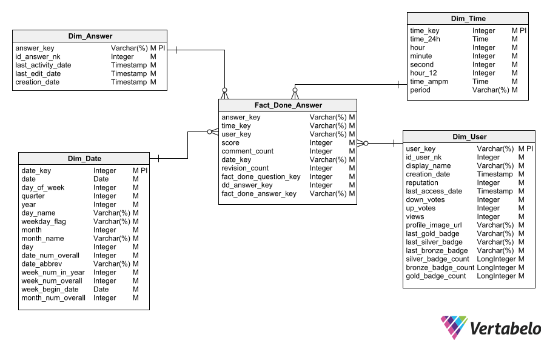

# 1. **StackOverflow profiling**

------------

- [1. **StackOverflow profiling**](#1-stackoverflow-profiling)
  - [1.1. Introduction to business logic](#11-introduction-to-business-logic)
  - [1.2. Description of the dataset and data dictionary of the dataset](#12-description-of-the-dataset-and-data-dictionary-of-the-dataset)
    - [1.2.1. Description](#121-description)
    - [1.2.2. Data dictionary](#122-data-dictionary)
      - [1.2.2.1. Source: Big Query](#1221-source-big-query)
        - [1.2.2.1.1. badges](#12211-badges)
        - [1.2.2.1.2. comments](#12212-comments)
        - [1.2.2.1.3. posts_answers](#12213-posts_answers)
        - [1.2.2.1.4. posts_moderator_nomination](#12214-posts_moderator_nomination)
        - [1.2.2.1.5. posts_orphaned_tag_wiki](#12215-posts_orphaned_tag_wiki)
        - [1.2.2.1.6. post_history](#12216-post_history)
        - [1.2.2.1.7. post_links](#12217-post_links)
        - [1.2.2.1.8. users](#12218-users)
        - [1.2.2.1.9. posts_privilege_wiki](#12219-posts_privilege_wiki)
        - [1.2.2.1.10. posts_questions](#122110-posts_questions)
        - [1.2.2.1.11. posts_tag_wiki](#122111-posts_tag_wiki)
        - [1.2.2.1.12. posts_tag_wiki_excerpt](#122112-posts_tag_wiki_excerpt)
        - [1.2.2.1.13. posts_wiki_placeholder](#122113-posts_wiki_placeholder)
        - [1.2.2.1.14. stackoverflow_posts](#122114-stackoverflow_posts)
        - [1.2.2.1.15. tags](#122115-tags)
        - [1.2.2.1.16. votes](#122116-votes)
  - [1.3. Data profiling results](#13-data-profiling-results)
    - [1.3.1. Source: Big Query](#131-source-big-query)
      - [1.3.1.1. badges](#1311-badges)
      - [1.3.1.2. comments](#1312-comments)
      - [1.3.1.3. posts_answers](#1313-posts_answers)
      - [1.3.1.4. posts_moderator_nomination](#1314-posts_moderator_nomination)
      - [1.3.1.5. posts_orphaned_tag_wiki](#1315-posts_orphaned_tag_wiki)
      - [1.3.1.6. post_history](#1316-post_history)
      - [1.3.1.7. post_links](#1317-post_links)
      - [1.3.1.8. users](#1318-users)
      - [1.3.1.9. posts_privilege_wiki](#1319-posts_privilege_wiki)
      - [1.3.1.10. posts_questions](#13110-posts_questions)
      - [1.3.1.11. posts_tag_wiki](#13111-posts_tag_wiki)
      - [1.3.1.12. posts_tag_wiki_excerpt](#13112-posts_tag_wiki_excerpt)
      - [1.3.1.13. posts_wiki_placeholder](#13113-posts_wiki_placeholder)
      - [1.3.1.14. stackoverflow_posts](#13114-stackoverflow_posts)
      - [1.3.1.15. tags](#13115-tags)
      - [1.3.1.16. votes](#13116-votes)
  - [1.4. Specification of analytical needs that the proposed model will solve](#14-specification-of-analytical-needs-that-the-proposed-model-will-solve)
  - [1.5. Proposed dimensional model](#15-proposed-dimensional-model)
    - [1.5.1. Star schema 1](#151-star-schema-1)
    - [1.5.2. Star schema 2](#152-star-schema-2)
  - [1.6. Mapping by table](#16-mapping-by-table)
    - [1.6.1. Dim_Question](#161-dim_question)
    - [1.6.2. Dim_Answer](#162-dim_answer)
    - [1.6.3. Dim_User](#163-dim_user)
    - [1.6.4. Dim_tag](#164-dim_tag)
    - [1.6.5. Dim_tag_bridge](#165-dim_tag_bridge)
    - [1.6.6. Dim_Time](#166-dim_time)
    - [1.6.7. Dim_Date](#167-dim_date)
    - [1.6.8. Fact_Done_Question](#168-fact_done_question)
    - [1.6.9. Fact_Done_Answer](#169-fact_done_answer)

## 1.1. Introduction to business logic

StackOverflow is a question and answer site for programmers, enthusiasts of developing and using software. It was founded in 2008, becoming one of the most popular websites around the world. Completely transforming the way people work. Constant work is being done to create a library of detailed answers to all questions about programming, development and use of software as such.

The user creates an account to be part of the platform. Through this account, they will ask the questions that allow them to respond to those needs that arise during the development of their work activities. The user elaborates the question and publishes it on the site, that question becomes a post. So you can have the corresponding answers from other members of the community.
  
Both questions and answers can have points for or against and depending on the user's performance, they can go up in merit, earning badges that allow them to increase their privileges within the platform. Thanks to these merits they will be able to become moderators. Each question is associated with a specialized tag that allows you to optimize searches within the community, these tags are related to the technologies that generate the most questions and answers on the StakOverflow site.
  
The meaning of belonging to this platform is to help that group of people who work within the professions related to technologies that evolve by leaps and bounds. Obviously the needs have increased exponentially so the platform gains much more value over time.
  
The StakOverflow community is an interdisciplinary effort, that is, a group of people from different areas working together to add value to the community in response to the questions the site receives. It is directly supporting millions of people in the world, answering the set of questions that arise from the need to solve problems encountered in working life.
 
Centralizing the community above all is one of the main values that is most pursued, because in this way healthy communities are promoted. Healthy communities that at all times are intent enough to learn, give back to the community, and adopt a long-term ethical growth mindset.
  
StackOverflow is a site that has a huge range of opportunities to solve our needs, needs that have experienced growth in recent years. This is due to the exponential curve of users who interact with new technologies, causing the excessive growth of large volumes of data. It is of vital interest to be able to exploit, use or analyze these large volumes of data as they will give us an overview of the behavior of this community. Results that will allow redirecting efforts for the consequent improvement in the operational policies of the site as such.
  
That is why a dimensional model will be built that will fully represent two very important business processes, one of them is questions asked and the other is answers made. In this way we are covering the two main areas of potential analytical interest for the entity. The final model will be stored in a presentation layer where the transformed data will be structured to be consumable by analytical users.
  
Through the construction of a dashboard, it will be possible for the data to be fully consumed and it is expected that it will satisfy all the needs that users have for data. It is of vital importance to guarantee the quality, the effectiveness and of course the performance so that the model is fully adopted by the StackOverflow community.
  
Dimensional modeling will be applied, made up of the business process, determination of the level of granularity, identification of dimensions and determination of metrics that will measure the events that occur in the business process. In the first stage, the entire profiling process will be covered on the StackOverflow dataset, the data dictionary to be able to know table by table and its structure. In addition, the result of the dimensional modeling will be evidenced by means of the star schema and finally the mapping process will be covered for each table that will be used to build the dimensional model as such.
  
 

## 1.2. Description of the dataset and data dictionary of the dataset

### 1.2.1. Description 

Next, it is detailed in a concrete way how the data that makes up the StackOverflow dataset is organized:

| Characteristic  |Description   | 
| --- | --------------------------|
|Data origin:| The data comes from a relational or transactional database model, stored on the BigQuery platform for the StackOverflow Q&A site.|
|Format:| The data is organized in 16 tables with csv format, with headers in their tables, use of separators such as [,].|
|Structure:| Each of the tables that the relational model has have their corresponding primary and foreign keys by which they are related. Having with it metadata corresponding to the scheme that each one has, that is, their respective data types for each column that makes it up.|
|Dataset time period:| The dataset includes data from the year 2008 to May 2021, updating this quarterly.|

Below we will describe in more detail each of the tables that make up our StackOverflow dataset:

| N°  | Table name                 | Number of records | Size      | column | Used for MD |
| --- | -------------------------- | ----------------- | --------- | ------ | ----------- |
| 1   | badges                     | 39,178,976        | 1.78 GB   | 6      | Yes         |
| 2   | comments                   | 79,220,809        | 16.64 GB  | 7      | No          |
| 3   | posts_answers              | 31,169,249        | 27.6 GB   | 20     | Yes         |
| 4   | posts_moderator_nomination | 334               | 473.5 KB  | 20     | No          |
| 5   | posts_orphaned_tag_wiki    | 167               | 53.34 KB  | 19     | No          |
| 6   | post_history               | 138,808,451       | 109.24 GB | 8      | Yes         |
| 7   | post_links                 | 7,302,589         | 291.1 MB  | 5      | No          |
| 8   | users                      | 14,080,580        | 2.4 GB    | 13     | Yes         |
| 9   | posts_privilege_wiki       | 2                 | 3.49 KB   | 20     | No          |
| 10  | posts_questions            | 20,890,054        | 35.58 GB  | 20     | Yes         |
| 11  | posts_tag_wiki             | 53036             | 36.57 MB  | 20     | Yes         |
| 12  | posts_tag_wiki_excerpt     | 53036             | 11.02 MB  | 20     | No          |
| 13  | posts_wiki_placeholder     | 5                 | 5.63 KB   | 20     | No          |
| 14  | stackoverflow_posts        | 31,017,889        | 31.52 GB  | 20     | Yes         |
| 15  | tags                       | 60,534            | 2.48 MB   | 5      | Yes         |
| 16  | votes                      | 208,577,841       | 6.67 GB   | 4      | Yes         |

### 1.2.2. Data dictionary

#### 1.2.2.1. Source: Big Query

##### 1.2.2.1.1. badges

| Attribute name | Type     | Is mandatory | Is primary | Is foreign | Description                                   |
| -------------- | -------- | ------------ | ---------- | ---------- | --------------------------------------------- |
| id             | Integer  | Yes          | Yes        | No         | Identificador llave primaria de tabla         |
| name           | Varchar  | Yes          | No         | No         | Nombre de la categoría de usuario             |
| date           | Datetime | Yes          | No         | No         | Fecha y Hora registrada del evento            |
| user_id        | Integer  | Yes          | No         | Yes        | Identificador de usuario que inicio el evento |
| class          | Integer  | Yes          | No         | No         | Numero de clase                               |
| tag_based      | Boolean  | Yes          | No         | No         | Indicador de estado actual del usuario        |

##### 1.2.2.1.2. comments

| Attribute name    | Type     | Is mandatory | Is primary | Is foreign | Description                                 |
| ----------------- | -------- | ------------ | ---------- | ---------- | ------------------------------------------- |
| id                | Integer  | Yes          | Yes        | No         | Identificador llave primaria de tabla       |
| text              | Varchar  | Yes          | No         | No         | Nombre de los comentarios                   |
| creation_date     | Datetime | Yes          | No         | No         | Fecha y Hora de creación del comentario     |
| post_id           | Integer  | Yes          | No         | Yes        | Identificador del post o evento de consulta |
| user_id           | Integer  | Yes          | No         | Yes        | Identificador de usuario                    |
| user_display_name | Varchar  | Yes          | No         | No         | Username del usuario                        |
| score             | Integer  | Yes          | No         | No         | Puntaje alcanzado del post                  |

##### 1.2.2.1.3. posts_answers

| Attribute name           | Type     | Is mandatory | Is primary | Is foreign | Description                                                      |
| ------------------------ | -------- | ------------ | ---------- | ---------- | ---------------------------------------------------------------- |
| id                       | Integer  | Yes          | Yes        | No         | Identificador llave primaria de tabla                            |
| title                    | Varchar  | Yes          | No         | No         | Descripción del título de las respuestas                         |
| accepted_answer_id       | Integer  | Yes          | No         | Yes        | Identificador de respuesta aceptada                              |
| comment_count            | Integer  | Yes          | No         | No         | Conteo del número de respuestas recibidas para la pregunta       |
| community_owned_date     | Datetime | Yes          | No         | No         | Fecha y Hora registrada por la plataforma                        |
| creation_date            | Datetime | Yes          | No         | No         | Fecha y Hora de creación del evento                              |
| favorite_count           | Integer  | Yes          | No         | No         | Conteo de los posts o respuestas favoritas                       |
| last_activity_date       | Datetime | Yes          | No         | No         | Fecha y Hora de la última actividad en el post                   |
| last_edit_date           | Datetime | Yes          | No         | No         | Fecha y Hora de la edición del post                              |
| last_editor_display_name | Varchar  | Yes          | No         | No         | Contiene el nombre del editor del post incluyendo el nombre y id |
| last_editor_user_id      | Integer  | Yes          | No         | Yes        | Identificador único del editor del post                          |
| owner_display_name       | Varchar  | Yes          | No         | No         | Nombre del dueño del post o evento de consulta                   |
| owner_user_id            | Integer  | Yes          | No         | Yes        | Identificador del dueño del post o evento de la consulta         |
| parent_id                | Integer  | Yes          | No         | Yes        | Identificador del evento padre                                   |
| post_type_id             | Integer  | Yes          | No         | Yes        | Identificador del tipo de post o evento de consulta              |
| score                    | Integer  | Yes          | No         | No         | Puntaje del post                                                 |
| tags                     | Varchar  | Yes          | No         | No         | Etiqueta del post                                                |
| view_count               | Integer  | Yes          | No         | No         | Conteo de vistas del post                                        |

##### 1.2.2.1.4. posts_moderator_nomination

| Attribute name           | Type     | Is mandatory | Is primary | Is foreign | Description                                        |
| ------------------------ | -------- | ------------ | ---------- | ---------- | -------------------------------------------------- |
| id                       | Integer  | Yes          | Yes        | No         | Identificador llave primaria de tabla              |
| title                    | Varchar  | Yes          | No         | No         | Descripción del titulo                             |
| body                     | Varchar  | Yes          | No         | No         | Descripción de las acciones del moderador del post |
| accepted_answer_id       | Integer  | Yes          | No         | Yes        | Identificador de la respuesta aceptada             |
| answer_count             | Integer  | Yes          | No         | No         | Conteo de las respuestas del post                  |
| comment_count            | Integer  | Yes          | No         | No         | Conteo de los comentarios que el post recibe       |
| community_owned_date     | Datetime | Yes          | No         | No         | Fecha y Hora de las acciones de la comunidad       |
| creation_date            | Datetime | Yes          | No         | No         | Fecha y Hora de creación                           |
| favorite_countt          | Integer  | Yes          | No         | No         | Conteo de los posts favoritos                      |
| last_activity_date       | Datetime | Yes          | No         | No         | Fecha y Hora de la última actividad del moderador  |
| last_edit_date           | Datetime | Yes          | No         | No         | Fecha y Hora de la última edición del moderador    |
| last_editor_display_name | Varchar  | Yes          | No         | No         | Nombre del ultimo editor del post                  |
| last_editor_user_id      | Integer  | Yes          | No         | Yes        | Identificador del ultimo editor del post           |
| owner_display_name       | Varchar  | Yes          | No         | No         | Nombre del dueño del post o evento de consulta     |
| owner_user_id            | Integer  | Yes          | No         | Yes        | Identificador del usuario                          |
| parent_id                | Integer  | Yes          | No         | Yes        | Identificador del propietario                      |
| post_type_id             | Integer  | Yes          | No         | Yes        | Identificador del tipo de post                     |
| score                    | Integer  | Yes          | No         | No         | Puntaje                                            |
| tags                     | Varchar  | Yes          | No         | No         | Etiquetas                                          |
| view_count               | Integer  | Yes          | No         | No         | Conteo de vistas                                   |

##### 1.2.2.1.5. posts_orphaned_tag_wiki

| Attribute name           | Type     | Is mandatory | Is primary | Is foreign | Description                                                  |
| ------------------------ | -------- | ------------ | ---------- | ---------- | ------------------------------------------------------------ |
| id                       | Integer  | Yes          | Yes        | No         | Identificador llave primaria de tabla                        |
| title                    | Varchar  | Yes          | No         | No         | Descripción del titulo                                       |
| body                     | Varchar  | Yes          | No         | No         | Descripción de las acciones                                  |
| accepted_answer_id       | Integer  | Yes          | No         | Yes        | Identificador de la respuesta aceptada                       |
| answer_count             | Integer  | Yes          | No         | No         | Conteo de las respuestas del post                            |
| comment_count            | Integer  | Yes          | No         | No         | Conteo de los comentarios que el post recibe                 |
| community_owned_date     | Datetime | Yes          | No         | No         | Fecha y Hora de las acciones de la comunidad                 |
| creation_date            | Datetime | Yes          | No         | No         | Fecha y Hora de creación                                     |
| favorite_countt          | Integer  | Yes          | No         | No         | Conteo de los posts favoritos                                |
| last_activity_date       | Datetime | Yes          | No         | No         | Fecha y Hora de la última actividad                          |
| last_edit_date           | Datetime | Yes          | No         | No         | Fecha y Hora de la última edición del post                   |
| last_editor_display_name | Varchar  | Yes          | No         | No         | Nombre del ultimo editor del post                            |
| last_editor_user_id      | Integer  | Yes          | No         | Yes        | Identificador del ultimo usuario que llevo a cabo la edicion |
| owner_display_name       | Varchar  | Yes          | No         | No         | Nombre del dueño del post o evento de consulta               |
| parent_id                | Integer  | Yes          | No         | Yes        | Identificador padre                                          |
| post_type_id             | Integer  | Yes          | No         | Yes        | Identificador del tipo de post                               |
| score                    | Integer  | Yes          | No         | No         | Puntaje                                                      |
| tags                     | Varchar  | Yes          | No         | No         | Etiquetas                                                    |
| view_count               | Integer  | Yes          | No         | No         | Conteo de vistas del post                                    |

##### 1.2.2.1.6. post_history

| Attribute name       | Type     | Is mandatory | Is primary | Is foreign | Description                                    |
| -------------------- | -------- | ------------ | ---------- | ---------- | ---------------------------------------------- |
| id                   | Integer  | Yes          | Yes        | No         | Identificador de llave primaria de tabla       |
| creation_date        | DateTime | Yes          | No         | No         | Fecha y Hora de creación                       |
| post_id              | Integer  | Yes          | No         | Yes        | Identificador del post                         |
| post_history_type_id | Integer  | Yes          | No         | Yes        | Identificador del tipo de history              |
| revision_guid        | Varchar  | Yes          | No         | No         | Identificador de grupo del historial de cambio |
| user_id              | Varchar  | No           | No         | Yes        | Identificador del usuario                      |
| text                 | Varchar  | No           | No         | No         | Texto referente al cambio                      |
| comment              | Varchar  | No           | No         | No         | Comentario opcional                            |

##### 1.2.2.1.7. post_links

| Attribute name  | Type     | Is mandatory | Is primary | Is foreign | Description                                |
| --------------- | -------- | ------------ | ---------- | ---------- | ------------------------------------------ |
| id              | Integer  | Yes          | Yes        | No         | Identificador de llave primaria de tabla   |
| creation_date   | DateTime | Yes          | No         | No         | Fecha y Hora de creación                   |
| link_type_id    | Integer  | Yes          | No         | Yes        | Identificador del tipo de link             |
| post_id         | Integer  | Yes          | No         | Yes        | Identificador del post                     |
| related_post_id | Integer  | Yes          | No         | Yes        | Identificador del post relacionado al post |

##### 1.2.2.1.8. users

| Attribute name    | Type     | Is mandatory | Is primary | Is foreign | Description                              |
| ----------------- | -------- | ------------ | ---------- | ---------- | ---------------------------------------- |
| id                | Integer  | Yes          | Yes        | No         | Identificador de llave primaria de tabla |
| display_name      | Varchar  | Yes          | No         | No         | El nombre a mostrar del usuario          |
| about_me          | Varchar  | No           | No         | No         | Descripción acerca del usuario           |
| age               | Varchar  | No           | No         | No         | Edad del usuario                         |
| creation_date     | DateTime | Yes          | No         | No         | Fecha y Hora de creación                 |
| last_access_date  | DateTime | Yes          | No         | No         | Fecha y Hora del ultimo acceso al sitio  |
| location          | Varchar  | No           | No         | No         | Lugar donde vive el usuario              |
| reputation        | Integer  | Yes          | No         | No         | Reputacion que se ha ganado el usuario   |
| up_votes          | Integer  | Yes          | No         | No         | Votos a favor                            |
| down_votes        | Integer  | Yes          | No         | No         | Votos en contra                          |
| views             | Integer  | Yes          | No         | No         | Visitas que ha tenido en su perfil       |
| profile_image_url | Varchar  | No           | No         | No         | Avatar del usuario                       |
| website_url       | Varchar  | No           | No         | No         | Url del sitio web del usuario            |

##### 1.2.2.1.9. posts_privilege_wiki

| Attribute name           | Type     | Is mandatory | Is primary | Is foreign | Description                                                  |
| ------------------------ | -------- | ------------ | ---------- | ---------- | ------------------------------------------------------------ |
| id                       | Integer  | Yes          | Yes        | No         | Identificador de llave primaria de tabla                     |
| title                    | Varchar  | No           | No         | No         | Título de la wiki                                            |
| body                     | Varchar  | Yes          | No         | No         | Descripción de la wiki                                       |
| accepted_answer_id       | Integer  | No           | No         | Yes        | Identificador de la respuesta aceptada                       |
| answer_count             | Integer  | No           | No         | No         | Conteo de las respuestas                                     |
| comment_count            | Integer  | No           | No         | No         | Conteo de los comentarios                                    |
| community_owned_date     | DateTime | No           | No         | No         | Fecha y Hora de las acciones en la comunidad                 |
| creation_date            | DateTime | Yes          | No         | No         | Fecha y Hora de creación                                     |
| favorite_count           | Integer  | No           | No         | No         | Conteo de favoritos                                          |
| last_activity_date       | DateTime | Yes          | No         | No         | Fecha y Hora de la última actividad                          |
| last_edit_date           | DateTime | Yes          | No         | No         | Fecha y Hora de la última edición                            |
| last_editor_display_name | Varchar  | No           | No         | No         | Nombre del ultimo editor de la wiki                          |
| last_editor_user_id      | Integer  | Yes          | No         | Yes        | Identificador del ultimo usuario que llevo a cabo la edición |
| owner_display_name       | Varchar  | No           | No         | No         | Nombre del usuario que creo la wiki                          |
| owner_user_id            | Integer  | No           | No         | Yes        | Identificador del usuario que creo la wiki                   |
| parent_id                | Integer  | No           | No         | Yes        | Identificador de la wiki padre                               |
| post_type_id             | Integer  | Yes          | No         | Yes        | Identificador del tipo de wiki                               |
| score                    | Integer  | Yes          | No         | No         | Puntaje                                                      |
| tags                     | Varchar  | No           | No         | No         | Etiquetas                                                    |
| view_count               | Integer  | No           | No         | No         | Conteo de vistas de la wiki                                  |

##### 1.2.2.1.10. posts_questions

| Attribute name           | Type     | Is mandatory | Is primary | Is foreign | Description                                                  |
| ------------------------ | -------- | ------------ | ---------- | ---------- | ------------------------------------------------------------ |
| id                       | Integer  | Yes          | Yes        | No         | Identificador de llave primaria de tabla                     |
| title                    | Varchar  | Yes          | No         | No         | Título del Post                                              |
| body                     | Varchar  | Yes          | No         | No         | Descripción del post                                         |
| accepted_answer_id       | Integer  | No           | No         | Yes        | Identificador de la respuesta aceptada                       |
| answer_count             | Integer  | Yes          | No         | No         | Conteo de las respuestas                                     |
| comment_count            | Integer  | Yes          | No         | No         | Conteo de los comentarios                                    |
| community_owned_date     | DateTime | No           | No         | No         | Fecha y Hora de las acciones en la comunidad                 |
| creation_date            | DateTime | Yes          | No         | No         | Fecha y Hora de creación                                     |
| favorite_count           | Integer  | No           | No         | No         | Conteo de favoritos                                          |
| last_activity_date       | DateTime | Yes          | No         | No         | Fecha y Hora de la última actividad                          |
| last_edit_date           | DateTime | No           | No         | No         | Fecha y Hora de la última edición                            |
| last_editor_display_name | Varchar  | No           | No         | No         | Nombre del ultimo editor del post                            |
| last_editor_user_id      | Integer  | No           | No         | Yes        | Identificador del ultimo usuario que llevo a cabo la edición |
| owner_display_name       | Varchar  | No           | No         | No         | Nombre del usuario que creo el post                          |
| owner_user_id            | Integer  | No           | No         | Yes        | Identificador del usuario que creo el post                   |
| parent_id                | Integer  | No           | No         | Yes        | Identificador del post padre                                 |
| post_type_id             | Integer  | Yes          | No         | Yes        | Identificador del tipo de post                               |
| score                    | Integer  | Yes          | No         | No         | Puntaje                                                      |
| tags                     | Varchar  | Yes          | No         | No         | Etiquetas                                                    |
| view_count               | Integer  | Yes          | No         | No         | Conteo de vistas del post                                    |

##### 1.2.2.1.11. posts_tag_wiki

| Attribute name           | Type     | Is mandatory | Is primary | Is foreign | Description                                                  |
| ------------------------ | -------- | ------------ | ---------- | ---------- | ------------------------------------------------------------ |
| id                       | Integer  | Yes          | Yes        | No         | Identificador de llave primaria de tabla                     |
| title                    | Varchar  | No           | No         | No         | Título del tag de wiki                                       |
| body                     | Varchar  | No           | No         | No         | Descripción del tag de wiki                                  |
| accepted_answer_id       | Integer  | No           | No         | Yes        | Identificador de la respuesta aceptada                       |
| answer_count             | Integer  | No           | No         | No         | Conteo de las respuestas                                     |
| comment_count            | Integer  | Yes          | No         | No         | Conteo de los comentarios                                    |
| community_owned_date     | DateTime | No           | No         | No         | Fecha y Hora de las acciones en la comunidad                 |
| creation_date            | DateTime | Yes          | No         | No         | Fecha y Hora de creación                                     |
| favorite_count           | Integer  | No           | No         | No         | Conteo de favoritos                                          |
| last_activity_date       | DateTime | Yes          | No         | No         | Fecha y Hora de la última actividad                          |
| last_edit_date           | DateTime | Yes          | No         | No         | Fecha y Hora de la última edición                            |
| last_editor_display_name | Varchar  | No           | No         | No         | Nombre del ultimo editor del tag wiki                        |
| last_editor_user_id      | Integer  | No           | No         | Yes        | Identificador del ultimo usuario que llevo a cabo la edición |
| owner_display_name       | Varchar  | No           | No         | No         | Nombre del usuario que creo el tag wiki                      |
| owner_user_id            | Integer  | No           | No         | Yes        | Identificador del usuario que creo el tag wiki               |
| parent_id                | Integer  | No           | No         | Yes        | Identificador del post padre                                 |
| post_type_id             | Integer  | Yes          | No         | Yes        | Identificador del tipo de wiki                               |
| score                    | Integer  | Yes          | No         | No         | Puntaje                                                      |
| tags                     | Varchar  | No           | No         | No         | Etiquetas                                                    |
| view_count               | Integer  | No           | No         | No         | Conteo de vistas de la wiki                                  |

##### 1.2.2.1.12. posts_tag_wiki_excerpt

| Attribute name           | Type     | Is mandatory | Is primary | Is foreign | Description                                                  |
| ------------------------ | -------- | ------------ | ---------- | ---------- | ------------------------------------------------------------ |
| Id                       | Integer  | Yes          | Yes        | No         | Identificador de llave primaria de tabla                     |
| Title                    | Varchar  | Yes          | No         | No         | Descripción el titulo                                        |
| Body                     | Varchar  | Yes          | No         | No         | Cuerpo del extracto de la wiki                               |
| accepted_answer_id       | Integer  | Yes          | No         | Yes        | Identificador de la respuesta aceptada                       |
| answer_count             | Integer  | Yes          | No         | No         | Conteo de las respuestas del post                            |
| comment_count            | Integer  | Yes          | No         | No         | Conteo de los comentarios recibidos por el post              |
| community_owned_date     | Datetime | Yes          | No         | No         | Fecha y Hora de las acciones en la comunidad                 |
| creation_date            | Datetime | Yes          | No         | No         | Fecha y Hora de creación                                     |
| favorite_count           | Integer  | Yes          | No         | No         | Conteo de favoritos                                          |
| last_activity_date       | Datetime | Yes          | No         | No         | Fecha y Hora de la última actividad                          |
| last_edit_date           | Datetime | Yes          | No         | No         | Fecha y Hora de la última edición                            |
| last_editor_display_name | Varchar  | Yes          | No         | No         | Nombre del ultimo editor del post                            |
| last_editor_user_id      | Integer  | Yes          | No         | Yes        | Identificador del ultimo usuario que llevo a cabo la edición |
| owner_display_name       | Varchar  | Yes          | No         | No         | Nombre del dueño del post o evento de la consulta            |
| parent_id                | Integer  | Yes          | No         | Yes        | Identificador padre                                          |
| post_type_id             | Integer  | Yes          | No         | Yes        | Identificador del tipo de post                               |
| score                    | Integer  | Yes          | No         | No         | Puntaje                                                      |
| Tags                     | Varchar  | Yes          | No         | No         | Etiquetas                                                    |
| View_count               | Integer  | Yes          | No         | No         | Conteo de vistas del post                                    |

##### 1.2.2.1.13. posts_wiki_placeholder

| Attribute name           | Type     | Is mandatory | Is primary | Is foreign | Description                                                  |
| ------------------------ | -------- | ------------ | ---------- | ---------- | ------------------------------------------------------------ |
| id                       | Integer  | Yes          | Yes        | No         | Identificador de llave primaria de tabla                     |
| title                    | Varchar  | Yes          | No         | No         | Descripción el titulo                                        |
| body                     | Varchar  | Yes          | No         | No         | Cuerpo del placeholder con la wiki                           |
| accepted_answer_id       | Integer  | Yes          | No         | Yes        | Identificador de la respuesta aceptada                       |
| answer_count             | Integer  | Yes          | No         | No         | Conteo de las respuestas del post                            |
| comment_count            | Integer  | Yes          | No         | No         | Conteo de los comentarios recibidos por el post              |
| community_owned_date     | Datetime | Yes          | No         | No         | Fecha y Hora de las acciones en la comunidad                 |
| creation_date            | Datetime | Yes          | No         | No         | Fecha y Hora de creación                                     |
| favorite_count           | Integer  | Yes          | No         | No         | Conteo de favoritos                                          |
| last_activity_date       | Datetime | Yes          | No         | No         | Fecha y Hora de la última actividad                          |
| last_edit_date           | Datetime | Yes          | No         | No         | Fecha y Hora de la última edición                            |
| last_editor_display_name | Varchar  | Yes          | No         | No         | Nombre del ultimo editor del post                            |
| last_editor_user_id      | Integer  | Yes          | No         | Yes        | Identificador del ultimo usuario que llevo a cabo la edición |
| owner_display_name       | Varchar  | Yes          | No         | No         | Nombre del dueño del post o evento de la consulta            |
| parent_id                | Integer  | Yes          | No         | Yes        | Identificador padre                                          |
| post_type_id             | Integer  | Yes          | No         | Yes        | Identificador del tipo de post                               |
| score                    | Integer  | Yes          | No         | No         | Puntaje                                                      |
| Tags                     | Varchar  | Yes          | No         | No         | Etiquetas                                                    |
| View_count               | Integer  | Yes          | No         | No         | Conteo de vistas del post                                    |

##### 1.2.2.1.14. stackoverflow_posts

| Attribute name           | Type     | Is mandatory | Is primary | Is foreign | Description                                                  |
| ------------------------ | -------- | ------------ | ---------- | ---------- | ------------------------------------------------------------ |
| id                       | Integer  | Yes          | Yes        | No         | Identificador de llave primaria de tabla                     |
| title                    | Varchar  | Yes          | No         | No         | Descripción el titulo                                        |
| body                     | Varchar  | Yes          | No         | No         | Cuerpo de los posts de stackoverflow                         |
| accepted_answer_id       | Integer  | Yes          | No         | Yes        | Identificador de la respuesta aceptada                       |
| answer_count             | Integer  | Yes          | No         | No         | Conteo de las respuestas del post                            |
| comment_count            | Integer  | Yes          | No         | No         | Conteo de los comentarios recibidos por el post              |
| community_owned_date     | Datetime | Yes          | No         | No         | Fecha y Hora de las acciones en la comunidad                 |
| creation_date            | Datetime | Yes          | No         | No         | Fecha y Hora de creación                                     |
| favorite_count           | Integer  | Yes          | No         | No         | Conteo de favoritos                                          |
| last_activity_date       | Datetime | Yes          | No         | No         | Fecha y Hora de la última actividad                          |
| last_edit_date           | Datetime | Yes          | No         | No         | Fecha y Hora de la última edición                            |
| last_editor_display_name | Varchar  | Yes          | No         | No         | Nombre del ultimo editor del post                            |
| last_editor_user_id      | Integer  | Yes          | No         | Yes        | Identificador del ultimo usuario que llevo a cabo la edición |
| owner_display_name       | Varchar  | Yes          | No         | No         | Nombre del dueño del post o evento de la consulta            |
| parent_id                | Integer  | Yes          | No         | Yes        | Identificador padre                                          |
| post_type_id             | Integer  | Yes          | No         | Yes        | Identificador del tipo de post                               |
| score                    | Integer  | Yes          | No         | No         | Puntaje                                                      |
| Tags                     | Varchar  | Yes          | No         | No         | Etiquetas                                                    |
| View_count               | Integer  | Yes          | No         | No         | Conteo de vistas del post                                    |

##### 1.2.2.1.15. tags

| Attribute name  | Type    | Is mandatory | Is primary | Is foreign | Description                              |
| --------------- | ------- | ------------ | ---------- | ---------- | ---------------------------------------- |
| Id              | Integer | Yes          | Yes        | No         | Identificador de llave primaria de tabla |
| Tag_name        | Varchar | Yes          | No         | No         | Nombre de la etiqueta                    |
| Count           | Integer | Yes          | No         | No         | Conteo de la etiqueta                    |
| Excerpt_post_id | Integer | No           | No         | Yes        | Identificador del extracto del post      |
| Wiki_post_id    | Integer | No           | No         | Yes        | Identificador de la wiki del post        |

##### 1.2.2.1.16. votes

| Attribute name | Type     | Is mandatory | Is primary | Is foreign | Description                              |
| -------------- | -------- | ------------ | ---------- | ---------- | ---------------------------------------- |
| Id             | Integer  | Yes          | Yes        | No         | Identificador de llave primaria de tabla |
| Creation_date  | Datetime | Yes          | No         | No         | Fecha de creación del voto               |
| Post_id        | Integer  | Yes          | No         | Yes        | Identificador del post                   |
| Vote_type_id   | Integer  | Yes          | No         | Yes        | Indentificador del tipo de voto          |

#### 1.2.2.2. Source: XML

##### 1.2.2.2.1. badges

| Attribute name             | Type     | Is mandatory | Is primary | Is foreign | Description                              |
| -------------------------- | -------- | ------------ | ---------- | ---------- | ---------------------------------------- |
| Row_metamodel_surrogate_id | Integer  | Yes          | Yes        | No         | Identificador de llave primaria de tabla |
| class                      | Integer  | Yes          | No         | No         | Numeración de Categoría                  |
| Date                       | Datetime | Yes          | No         | No         | Descripción de Fecha y Hora              |
| Id                         | Integer  | Yes          | No         | Yes        | Identificador foráneo                    |
| Name                       | Varchar  | Yes          | No         | No         | Descripción de nombre                    |
| TagBased                   | Boolean  | Yes          | No         | No         | Indicador del estado actual              |

##### 1.2.2.2.2. comments

| Attribute name             | Type     | Is mandatory | Is primary | Is foreign | Description                              |
| -------------------------- | -------- | ------------ | ---------- | ---------- | ---------------------------------------- |
| Row_metamodel_surrogate_id | Integer  | Yes          | Yes        | No         | Identificador de llave primaria de tabla |
| ContentLicense             | Varchar  | Yes          | No         | No         | Descripción de la licencia               |
| CreationDate               | Datetime | Yes          | No         | No         | Fecha y Hora de creación                 |
| Id                         | Integer  | Yes          | No         | Yes        | Identificador                            |
| PostId                     | Integer  | Yes          | No         | Yes        | Identificador del post                   |
| Score                      | Integer  | Yes          | No         | No         | Conteo                                   |
| Text                       | Varchar  | Yes          | No         | No         | Descripción del post                     |
| UserId                     | Integer  | Yes          | No         | Yes        | Identificador de usuario                 |
| UserDisplayName            | Varchar  | Yes          | No         | No         | Username del dueño del post              |

##### 1.2.2.2.3. postHistory

| Attribute name             | Type     | Is mandatory | Is primary | Is foreign | Description                              |
| -------------------------- | -------- | ------------ | ---------- | ---------- | ---------------------------------------- |
| Row_metamodel_surrogate_id | Integer  | Yes          | Yes        | No         | Identificador de llave primaria de tabla |
| ContentLicense             | Varchar  | Yes          | No         | No         | Descripción de la licencia               |
| CreationDate               | Datetime | No           | No         | Fecha      | y hora de creación                       |
| Id                         | Integer  | Yes          | No         | Yes        | Identificador                            |
| postHistoryTypeId          | Integer  | Yes          | No         | Yes        | Identificador                            |
| PostId                     | Integer  | Yes          | No         | Yes        | Identificador                            |
| RevisionGUID               | Integer  | Yes          | No         | Yes        | Identificador                            |
| text                       | Varchar  | Yes          | No         | No         | Descripción del post                     |
| UserId                     | Integer  | Yes          | No         | Yes        | Identificador de usuario                 |
| Comment                    | Varchar  | Yes          | No         | No         | Descripción de las acciones              |
| UserDisplayName            | Varchar  | Yes          | No         | No         | Username del usuario                     |

##### 1.2.2.2.4. postLink

| Attribute name             | Type     | Is mandatory | Is primary | Is foreign | Description                              |
| -------------------------- | -------- | ------------ | ---------- | ---------- | ---------------------------------------- |
| Row_metamodel_surrogate_id | Integer  | Yes          | Yes        | No         | Identificador de llave primaria de tabla |
| creationDate               | Datetime | Yes          | No         | No         | Fecha y hora de creación                 |
| Id                         | Integer  | Yes          | No         | No         | Identificador                            |
| LinkTypeId                 | Integer  | Yes          | No         | Yes        | Identificador                            |
| PostId                     | Integer  | Yes          | No         | Yes        | Identificador                            |

##### 1.2.2.2.5. post

| Attribute name             | Type     | Is mandatory | Is primary | Is foreign | Description                                                          |
| -------------------------- | -------- | ------------ | ---------- | ---------- | -------------------------------------------------------------------- |
| Row_metamodel_surrogate_id | Integer  | Yes          | Yes        | No         | Identificador de llave primaria de tabla                             |
| AnswerCount                | Integer  | Yes          | No         | No         | Conteo de respuestas                                                 |
| Body                       | Varchar  | Yes          | No         | No         | Descripción completa del post elaborado                              |
| CommentCount               | Integer  | Yes          | No         | No         | Conteo de comentarios                                                |
| ContentLicense             | Varchar  | Yes          | No         | No         | Descripción de la licencia                                           |
| CreationDate               | Datetime | Yes          | No         | No         | Fecha y hora de creación del post                                    |
| FavoriteCount              | Integer  | Yes          | No         | Yes        | Conteo de favoritos                                                  |
| Id                         | Integer  | Yes          | No         | No         | Identificador                                                        |
| LastActivityDate           | Datetime | Yes          | No         | No         | Fecha y hora de la última actividad                                  |
| OwnerUserId                | Integer  | Yes          | No         | Yes        | Identificador de usuario                                             |
| PostTypeId                 | Integer  | Yes          | No         | Yes        | Identificador del post                                               |
| Score                      | Integer  | Yes          | No         | No         | Puntaje                                                              |
| Tags                       | Varchar  | Yes          | No         | No         | Etiquetas del post                                                   |
| Title                      | Varchar  | Yes          | No         | No         | Título del post                                                      |
| ViewCount                  | Integer  | Yes          | No         | No         | Conteo de visitas                                                    |
| AcceptedAnswerId           | Integer  | Yes          | No         | Yes        | Identificador de respuesta aceptada                                  |
| LastEditDate               | Datetime | Yes          | No         | No         | Fecha y Hora de la última edición                                    |
| LastEditorUserId           | Integer  | Yes          | No         | Yes        | Identificador del ultimo usuario que realizo la operación de edición |
| ParentId                   | Integer  | Yes          | No         | Yes        | Identificador padre                                                  |
| CommunityOwnerDate         | Datetime | Yes          | No         | No         | Fecha y Hora de actividad de la comunidad                            |
| ClosedDate                 | Datetime | Yes          | No         | No         | Fecha y Hora de cierre                                               |
| LastEditorDisplayName      | Varchar  | Yes          | No         | No         | Nombre del ultimo editor                                             |
| OwnerDisplayName           | Varchar  | Yes          | No         | No         | Username                                                             |

##### 1.2.2.2.6. tags

| Attribute name             | Type    | Is mandatory | Is primary | Is foreign | Description                              |
| -------------------------- | ------- | ------------ | ---------- | ---------- | ---------------------------------------- |
| Row_metamodel_surrogate_id | Integer | Yes          | Yes        | No         | Identificador de llave primaria de tabla |
| Count                      | Integer | Yes          | No         | No         | Conteo                                   |
| ExceptPostId               | Integer | Yes          | No         | Yes        | Identificador de excepción de post       |
| Id                         | Integer | Yes          | No         | Yes        | Identificador                            |
| IsRequired                 | Boolean | Yes          | No         | No         | Estado                                   |
| TagName                    | Varchar | Yes          | No         | No         | Nombre de tag                            |
| WikiPostId                 | Integer | Yes          | No         | Yes        | Identificador de post de wiki            |
| IsModeratorOnly            | Boolean | Yes          | No         | No         | Estado de moderador                      |

##### 1.2.2.2.7. user

| Attribute name             | Type     | Is mandatory | Is primary | Is foreign | Description                              |
| -------------------------- | -------- | ------------ | ---------- | ---------- | ---------------------------------------- |
| Row_metadodel_surrogate_id | Integer  | Yes          | Yes        | No         | Identificador de llave primaria de tabla |
| AboutMe                    | Varchar  | Yes          | No         | No         | Descripción del usuario                  |
| AccountId                  | Integer  | Yes          | No         | Yes        | Identificador de cuenta                  |
| CreationDate               | Datetime | Yes          | No         | No         | Fecha y Hora de creación                 |
| DisplayName                | Varchar  | Yes          | No         | No         | Nombre del usuario                       |
| DownVotes                  | Integer  | Yes          | No         | No         | Número de votos bajos                    |
| Id                         | Integer  | Yes          | No         | Yes        | Identificador                            |
| LastAccessDate             | Datetime | Yes          | No         | No         | Fecha y Hora del ultimo acceso           |
| Location                   | Datetime | Yes          | No         | No         | Localidad de donde se realizó el post    |
| Reputation                 | Integer  | Yes          | No         | No         | Numero de reputación                     |
| UpVotes                    | Integer  | Yes          | No         | No         | Número de votos altos                    |
| Views                      | Integer  | Yes          | No         | No         | Numero de vistas                         |
| WebsiteUrl                 | Varchar  | Yes          | No         | No         | Descripción de URL                       |
| ProfileImageUrl            | Varchar  | Yes          | No         | No         | Descripción de URL de imágenes           |

##### 1.2.2.2.8. view_archive_cleaner

| Attribute name             | Type    | Is mandatory | Is primary | Is foreign | Description                              |
| -------------------------- | ------- | ------------ | ---------- | ---------- | ---------------------------------------- |
| Row_metadodel_surrogate_id | Integer | Yes          | Yes        | No         | Identificador de llave primaria de tabla |
| Count                      | Integer | Yes          | No         | No         | Conteo                                   |
| ExceptPostId               | Integer | Yes          | No         | Yes        | Identificador de excepción               |
| Id                         | Integer | Yes          | No         | Yes        | Identificador                            |
| TagName                    | Varchar | Yes          | No         | No         | Nombre del tag                           |
| WikiPostId                 | Integer | Yes          | No         | Yes        | Identificador de post                    |

##### 1.2.2.2.9. votes

| Attribute name             | Type     | Is mandatory | Is primary | Is foreign | Description                              |
| -------------------------- | -------- | ------------ | ---------- | ---------- | ---------------------------------------- |
| Row_metadodel_surrogate_id | Integer  | Yes          | Yes        | No         | Identificador de llave primaria de tabla |
| CreationDate               | Datetime | Yes          | No         | No         | Fecha y Hora de creación                 |
| Id                         | Integer  | Yes          | No         | No         | Identificador                            |
| PostId                     | Integer  | Yes          | No         | Yes        | Identificador de tipo de post            |
| VoteTypeId                 | Integer  | Yes          | No         | Yes        | Identificador de tipo de voto            |
| UserId                     | Integer  | Yes          | No         | Yes        | Identificador de usuario                 |

## 1.3. Data profiling results

### 1.3.1. Source: Big Query

- **Used Tool:** Google Cloud Dataprep 
- **Description:** Dataprep is an interactive web application in which users define the data preparation rules by interacting with a sample of their data

#### 1.3.1.1. badges

| Attribute name | Type     | Proportion of valid (valid / total) | Result                                                                                                                                                                                                                                                                                      | Conclusion              |
| -------------- | -------- | ----------------------------------- | ------------------------------------------------------------------------------------------------------------------------------------------------------------------------------------------------------------------------------------------------------------------------------------------- | ----------------------- |
| id             | Integer  | 100%                                | El campo experimenta una proporción de 100% de registros válidos y 0% no válidos, por lo que es catalogada para poder usarse en la construcción del MD ya que es un campo completamente limpio.                                                                                             | Apto para MD            |
| name           | Varchar  | 100%                                | El campo experimenta una proporción de 100% de registros  válidos y 0% no válidos, por lo que es catalogada para poder usarse en la construcción del MD ya que es un campo completamente limpio.                                                                                            | Apto para MD            |
| date           | Datetime | 100%                                | El campo experimenta una proporción de 100% de registros válidos y 0% no válidos, pero Las filas contienen un formato de fecha y hora  que se tendrá que transformar de tal manera que se busque estandarizar el mismo para la construcción del MD ya que es un campo completamente limpio. | Requiere transformación |
| user_id        | Integer  | 100%                                | El campo experimenta una proporción de 100% de registros válidos y 0% no válidos, por lo que es catalogada para poder usarse en la construcción del MD ya que es un campo completamente limpio.                                                                                             | Apto para MD            |
| class          | Integer  | 100%                                | El campo experimenta una proporción de 100% de registros válidos  y 0% no válidos, por lo que es catalogada para poder usarse en la construcción del MD, ya que es un campo completamente limpio.                                                                                           | Requiere limpieza       |
| Tag_based      | Boolean  | 100%                                | El campo experimenta una proporción de 100% de registros válidos y 0% no válidos, por lo que es catalogada para poder usarse en la construcción del MD, pero requerirá de transformación para buscar el valor más textual.                                                                  | Requiere transformacion |

#### 1.3.1.2. comments

| Attribute name    | Type     | Proportion of valid (valid / total) | Result                                                                                                                                                                                                                                                                                      | Conclusion              |
| ----------------- | -------- | ----------------------------------- | ------------------------------------------------------------------------------------------------------------------------------------------------------------------------------------------------------------------------------------------------------------------------------------------- | ----------------------- |
| id                | Integer  | 100%                                | El campo experimenta una proporción de 100% de registros válidos y 0% no válidos, por lo que es catalogada para poder usarse en la construcción del MD ya que es un campo completamente limpio.                                                                                             | Apto para MD            |
| text              | Varchar  | 100%                                | El campo experimenta una proporción de 100% de registros  válidos y 0% no válidos, por lo que es catalogada para poder usarse en la construcción del MD ya que es un campo completamente limpio.                                                                                            | Apto para MD            |
| creation_date     | Datetime | 100%                                | El campo experimenta una proporción de 100% de registros válidos y 0% no válidos, pero Las filas contienen un formato de fecha y hora  que se tendrá que transformar de tal manera que se busque estandarizar el mismo para la construcción del MD ya que es un campo completamente limpio. | Requiere transformación |
| post_id           | Integer  | 100%                                | El campo experimenta una proporción de 100% de registros válidos y 0% no válidos, por lo que es catalogada para poder usarse en la construcción del MD ya que es un campo completamente limpio.                                                                                             | Apto para MD            |
| user_id           | Integer  | 98%                                 | De las 79.2 M de filas, solo 78.1 M son válidas que representan el 98%, 1.14 M contienen el valor de NULL  que representan el 2%.                                                                                                                                                           | Apto para MD            |
| user_display_name | Varchar  | 1.45%                               | De las 79.2 M de filas, solo 1.15 M son válidas que representan el 0.014%, 78.1 M  contienen el valor de NULL que representan el 98.5%, existen valores atípicos también.                                                                                                                   | No apto para MD         |
| score             | Integer  | 100%                                | El campo experimenta una proporción de 100% de registros válidos y 0% no válidos, por lo que es catalogada para poder usarse en la construcción del MD ya que es un campo completamente limpio.                                                                                             | Apto para MD            |

#### 1.3.1.3. posts_answers

| Attribute name           | Type     | Proportion of valid (valid / total) | Result                                                                                                                                                                                                                                                                                     | Conclusion              |
| ------------------------ | -------- | ----------------------------------- | ------------------------------------------------------------------------------------------------------------------------------------------------------------------------------------------------------------------------------------------------------------------------------------------ | ----------------------- |
| id                       | Integer  | 100%                                | El campo experimenta una proporción de 100% de registros válidos y 0% no válidos, por lo que es catalogada para poder usarse en la construcción del MD ya que es un campo completamente limpio.                                                                                            | Apto para MD            |
| title                    | Varchar  | 0%                                  | El campo experimenta una proporción de 0% de registros  no válidos y 0%  válidos, por lo que es catalogada para no poder usarse en la construcción del MD.                                                                                                                                 | No se puede usar en MD  |
| body                     | Varchar  | 100%                                | El campo experimenta una proporción de 100% de registros válidos y 0% no válido, todas las filas se encuentran en un formato específico que no denota explícitamente el contexto que da a conocer por lo que requerirá de transformación.                                                  | Requiere transformación |
| accepted_answer_id       | Integer  | 0%                                  | El campo experimenta una proporción de 0% de registros válidos y 100% de no válidos, todas las filas para esta columna poseen el valor de null, por lo que se imposibilita obtener los identificadores de las respuestas aceptadas.                                                        | No se puede usar en MD  |
| answer_count             | Integer  | 0%                                  | El campo experimenta una proporción de 0% de registros válidos  y 100% de registros no válidos, todas las filas para esta columna poseen el valor de null, por lo que se imposibilita obtener el conteo del número de respuestas recibidas.                                                | No se puede usar en MD  |
| comment_count            | Integer  | 100%                                | El campo experimenta una proporción de 100% de registros válidos y 0% de registros no válidos, se presentaron algunos valores atípicos por lo que se requerirá aplicar una solución de limpieza de los mismos.                                                                             | Requiere limpieza       |
| community_owned_date     | Datetime | 36%                                 | Se presentaron  solamente 113,484 valores correctos que corresponden al 36% de los válidos y el 64% de no validos por lo que se desconoce el paradero de los datos faltantes.                                                                                                              | No se puede usar en MD  |
| creation_date            | Datetime | 100%                                | El campo experimenta una proporción de 100% de registros válidos y 0% de no válidos, la columna posee una mezcla de formatos tanto para fecha y hora,  por lo que  se requerirá de transformación.                                                                                         | Requiere transformación |
| favorite_count           | Integer  | 0%                                  | El campo experimenta una proporción de 100% de registros no válidos y 0% válido, por lo que es catalogada para no poder usarse en la construcción del MD.                                                                                                                                  | No se puede usar en MD  |
| last_activity_date       | Datetime | 100%                                | El campo experimenta una proporción de 100% de registros válidos y 0% no válidos, pero Las filas contienen un formato de fecha y hora  que se tendrá que transformar de tal manera que se busque estandarizar el mismo para la construcción del MD ya que es un campo completamente limpio | Requiere transformación |
| last_edit_date           | Datetime | 30%                                 | De las  31.2M filas solo 9.59 M  presentaron valores correctos que representan el 30% de válidos, 21.6 M  que representan el 60% de no válidos , estos contiene valores nulos.                                                                                                             | Requiere de limpieza    |
| last_editor_display_name | Varchar  | 0.48%                               | De las 31.2 M filas solo 149, 159 presentaron valores correctos, 31.0 M contiene valores nulos.                                                                                                                                                                                            | No se puede usar en MD  |
| last_editor_user_id      | Integer  | 30%                                 | De las  31.2M filas solo 9.51 M  presentaron valores correctos que representan el 30% de válidos, 21.7 M contiene valores nulos que representan el 60% de no válidos.                                                                                                                      | No se puede usar en MD  |
| owner_display_name       | Varchar  | 2%                                  | De las 31.2 M filas solo 666,892 presentaron valores validos o correctos que representan el 2% de válidos, 30.5 M contiene valores nulos que representan el 98% de no validos.                                                                                                             | No se puede usar en MD  |
| owner_user_id            | Integer  | 98%                                 | De las 31.2 M filas solo 30.9 M presentaron valores validos o correctos que representan el 98% de válidos, 299,663  contiene valores nulos que representan el 2% de no válidos.                                                                                                            | Requiere limpieza       |
| parent_id                | Integer  | 100%                                | El campo experimenta una proporción de 100% de registros válidos y 0% no válidos, por lo que es catalogada para poder usarse en la construcción del MD ya que es un campo completamente limpio.                                                                                            | Apto para MD            |
| post_type_id             | Integer  | 100%                                | El campo experimenta una proporción de 100% de registros válidos y 0% no válidos, por lo que es catalogada para poder usarse en la construcción del MD ya que es un campo completamente limpio.                                                                                            | Apto para MD            |
| score                    | Integer  | 100%                                | El campo experimenta una proporción de 100% de registros válidos y 0% no válidos, por lo que es catalogada para poder usarse en la construcción del MD ya que es un campo completamente limpio.                                                                                            | Apto para MD            |
| tags                     | Varchar  | 1%                                  | De las  31.2M filas solo 1 fila presento valores correctos que representan el 1% de válidos, 31.1M contiene valores nulos que representan el 99% de no válidos.                                                                                                                            | No se pueden usar en MD |
| view_count               | Integer  | 0%                                  | De las  31.2M filas ninguna presento valores correctos que representan el 0% de valores válidos, 31.1M contiene valores nulos que representan el 100% de no válidos.                                                                                                                       | No se pueden usar en MD |

#### 1.3.1.4. posts_moderator_nomination

| Attribute name           | Type     | Proportion of valid (valid / total) | Result                                                                                                                                                                                                                                                                                      | Conclusion              |
| ------------------------ | -------- | ----------------------------------- | ------------------------------------------------------------------------------------------------------------------------------------------------------------------------------------------------------------------------------------------------------------------------------------------- | ----------------------- |
| id                       | Integer  | 100%                                | El campo experimenta una proporción de 100% de registros válidos y 0% no válidos, por lo que es catalogada para poder usarse en la construcción del MD ya que es un campo completamente limpio.                                                                                             | Apto para MD            |
| title                    | Varchar  | 0%                                  | El campo experimento 0% de registros válidos y el 100% de registros no válidos, todas las filas para esta columna poseen el valor de null, por lo que se dificulta obtener el contexto que representa la columna.                                                                           | No se puede usar en MD  |
| body                     | Varchar  | 100%                                | El campo experimenta una proporción de 100% de registros válidos y 0% no válidos, por lo que es catalogada para poder usarse en la construcción del MD ya que es un campo completamente limpio                                                                                              | Apto para MD            |
| accepted_answer_id       | Integer  | 0%                                  | El campo experimento 0% de registros válidos y el 100% de registros no válidos, todas las filas para esta columna poseen el valor de null, por lo que se dificulta obtener el contexto que representa la columna.                                                                           | No se puede usar en MD  |
| answer_count             | Integer  | 0%                                  | El campo experimento 0% de registros válidos y el 100% de registros no válidos, todas las filas para esta columna poseen el valor de null, por lo que se dificulta obtener el contexto que representa la columna.                                                                           | No se puede usar en MD  |
| comment_count            | Integer  | 100%                                | El campo experimenta una proporción de 100% de registros válidos y 0% no válidos, por lo que es catalogada para poder usarse en la construcción del MD ya que es un campo completamente limpio                                                                                              | Apto para MD            |
| community_owned_date     | Datetime | 100%                                | El campo experimenta una proporción de 100% de registros válidos y 0% no válidos, pero Las filas contienen un formato de fecha y hora  que se tendrá que transformar de tal manera que se busque estandarizar el mismo para la construcción del MD ya que es un campo completamente limpio. | Requiere transformacion |
| creation_date            | Datetime | 100%                                | El campo experimenta una proporción de 100% de registros válidos y 0% no válidos, pero Las filas contienen un formato de fecha y hora  que se tendrá que transformar de tal manera que se busque estandarizar el mismo para la construcción del MD ya que es un campo completamente limpio. | Requiere transformación |
| favorite_count           | Integer  | 0%                                  | El campo experimento 0% de registros válidos y el 100% de registros no válidos, todas las filas para esta columna poseen el valor de null, por lo que se dificulta obtener el contexto que representa la columna.                                                                           | No se puede usar en MD  |
| last_activity_date       | Datetime | 100%                                | El campo experimenta una proporción de 100% de registros válidos y 0% no válidos, pero Las filas contienen un formato de fecha y hora  que se tendrá que transformar de tal manera que se busque estandarizar el mismo para la construcción del MD ya que es un campo completamente limpio. | Requiere transformación |
| last_edit_date           | Datetime | 100%                                | El campo experimenta una proporción de 100% de registros válidos y 0% no válidos, pero Las filas contienen un formato de fecha y hora  que se tendrá que transformar de tal manera que se busque estandarizar el mismo para la construcción del MD ya que es un campo completamente limpio. | Requiere transformacion |
| last_editor_display_name | Varchar  | 1.4%                                | De las 334 filas solo 5 presentaron valores validos o correctos que representan el 1.4% de válidos,  el 98.6% representa los no validos contiene valores nulos.                                                                                                                             | No se puede usar en MD  |
| last_editor_user_id      | Integer  | 98%                                 | De las 334 filas solo 329 presentaron valores validos o correctos que representan el 98% de válidos,  el 2% representan valores no válidos.                                                                                                                                                 | Requiere de limpieza    |
| owner_display_name       | Varchar  | 1.8%                                | De las 334 filas solo 6 presentaron valores validos o correctos que representan el 1.8% de válidos, 98.2% representa los no validos conteniendo valores nulos.                                                                                                                              | No se puede usar en MD  |
| owner_user_id            | Integer  | 98%                                 | De las 334 flas solo 328 presentaron valores validos o correctos que representan el 98% de válidos,  2% representa  a los valores no válidos, por lo que requiere de limpieza.                                                                                                              | Requiere limpieza       |
| parent_id                | Integer  | 0%                                  | El campo experimento 0% de registros válidos y el 100% de registros no válidos, todas las filas para esta columna poseen el valor de null, por lo que se dificulta obtener el contexto que representa la columna.                                                                           | No se puede usar en MD  |
| post_type_id             | Integer  | 100%                                | El campo experimenta una proporción de 100% de registros válidos y 0% no válidos, por lo que es catalogada para poder usarse en la construcción del MD ya que es un campo completamente limpio.                                                                                             | Apto para MD            |
| score                    | Integer  | 100%                                | El campo experimenta una proporción de 100% de registros válidos y 0% no válidos, por lo que es catalogada para poder usarse en la construcción del MD ya que es un campo completamente limpio.                                                                                             | Apto para MD            |
| tags                     | Varchar  | 0%                                  | El campo experimento 0% de registros válidos y el 100% de registros no válidos, todas las filas para esta columna poseen el valor de null, por lo que se dificulta obtener el contexto que representa la columna.                                                                           | No se pueden usar en MD |
| view_count               | Integer  | 0%                                  | El campo experimento 0% de registros válidos y el 100% de registros no válidos, todas las filas para esta columna poseen el valor de null, por lo que se dificulta obtener el contexto que representa la columna.                                                                           | No se pueden usar en MD |

#### 1.3.1.5. posts_orphaned_tag_wiki

| Attribute name           | Type     | Proportion of valid (valid / total) | Result                                                                                                                                                                                                                                                                                                       | Conclusion              |
| ------------------------ | -------- | ----------------------------------- | ------------------------------------------------------------------------------------------------------------------------------------------------------------------------------------------------------------------------------------------------------------------------------------------------------------ | ----------------------- |
| id                       | Integer  | 100%                                | El campo experimenta una proporción de 100% de registros válidos y 0% no válidos, por lo que es catalogada para poder usarse en la construcción del MD ya que es un campo completamente limpio.                                                                                                              | Apto para MD            |
| title                    | Varchar  | 0%                                  | El campo experimento 0% de registros válidos y el 100% de registros no válidos, todas las filas para esta columna poseen el valor de null, por lo que se dificulta obtener el contexto que representa la columna.                                                                                            | No se puede usar en MD  |
| body                     | Varchar  | 33%                                 | De las 167 filas solo 111  presentaron valores correctos que representan el 33% de válidos, 67% que representan no validos contiendo estos  valores nulos, por lo que requerirá un proceso de limpieza previamente.                                                                                          | Requiere limpieza       |
| accepted_answer_id       | Integer  | 0%                                  | El campo experimento 0% de registros válidos y el 100% de registros no válidos, todas las filas para esta columna poseen el valor de null, por lo que se dificulta obtener el contexto que representa la columna.                                                                                            | No se puede usar en MD  |
| answer_count             | Integer  | 0%                                  | El campo experimento 0% de registros válidos y el 100% de registros no válidos, todas las filas para esta columna poseen el valor de null, por lo que se dificulta obtener el contexto que representa la columna.                                                                                            | No se puede usar en MD  |
| comment_count            | Integer  | 100%                                | El campo experimenta una proporción de 100% de registros válidos siendo estos 167 y 0% no válidos, por lo que es catalogada para poder usarse en la construcción del MD ya que es un campo completamente limpio.                                                                                             | Apto para MD            |
| community_owned_date     | Datetime | 1.8%                                | El campo experimenta una proporción de 1.8% de registros validos siendo estos solamente 3, 98.2% que representan los no validos  siendo estos 164 registros.                                                                                                                                                 | No se puede usar en MD  |
| creation_date            | Datetime | 100%                                | El campo experimenta una proporción de 100% de registros válidos  y 0% no válidos, pero Las filas contienen un formato de fecha y hora  que se tendrá que transformar de tal manera que se busque estandarizar el mismo para la construcción del MD ya que es un campo completamente limpio.                 | Requiere transformación |
| favorite_count           | Integer  | 0%                                  | El campo experimenta una proporción de  0% de registros válidos  y el 100% de registros no válidos siendo estos 167, todas las filas para esta columna poseen el valor de null, por lo que se dificulta obtener el contexto que representa la columna.                                                       | No se puede usar en MD  |
| last_activity_date       | Datetime | 100%                                | El campo experimenta una proporción de 100% de registros válidos siendo estos 167 y 0% no válidos, pero Las filas contienen un formato de fecha y hora  que se tendrá que transformar de tal manera que se busque estandarizar el mismo para la construcción del MD ya que es un campo completamente limpio. | Requiere transformación |
| last_edit_date           | Datetime | 100%                                | El campo experimenta una proporción de 100% de registros válidos siendo estos 167 y 0% no válidos, pero Las filas contienen un formato de fecha y hora  que se tendrá que transformar de tal manera que se busque estandarizar el mismo para la construcción del MD ya que es un campo completamente limpio. | Requiere transformacion |
| last_editor_display_name | Varchar  | 1.2%                                | De las 167 filas solo 2 presentaron valores   correctos que representan el 1.2%, el resto 98.8%  contiene valores nulos                                                                                                                                                                                      | No se puede usar en MD  |
| last_editor_user_id      | Integer  | 98.8%                               | De las 167 filas solo 165 presentaron valores   correctos que representan el 98.8% de válidos, el resto 1.2% contiene valores nulos, por lo que requerirá de un proceso de limpieza.                                                                                                                         | Requiere de limpieza    |
| owner_display_name       | Varchar  | 0%                                  | El campo experimenta una proporción de  0% de registros válidos  y el 100% de registros no válidos siendo estos 167, todas las filas para esta columna poseen el valor de null, por lo que se dificulta obtener el contexto que representa la columna.                                                       | No se puede usar en MD  |
| parent_id                | Integer  | 0%                                  | El campo experimenta una proporción de  0% de registros válidos  y el 100% de registros no válidos siendo estos 167, todas las filas para esta columna poseen el valor de null, por lo que se dificulta obtener el contexto que representa la columna.                                                       | No se puede usar en MD  |
| post_type_id             | Integer  | 100%                                | El campo experimenta una proporción de 100% de registros válidos siendo estos 167 y 0% no válidos, por lo que es catalogada para poder usarse en la construcción del MD ya que es un campo completamente limpio.                                                                                             | Apto para MD            |
| score                    | Integer  | 100%                                | El campo experimenta una proporción de 100% de registros válidos siendo estos 167 y 0% no válidos, por lo que es catalogada para poder usarse en la construcción del MD ya que es un campo completamente limpio.                                                                                             | Apto para MD            |
| tags                     | Varchar  | 0%                                  | El campo experimenta una proporción de  0% de registros válidos  y el 100% de registros no válidos siendo estos 167, todas las filas para esta columna poseen el valor de null, por lo que se dificulta obtener el contexto que representa la columna.                                                       | No se pueden usar en MD |
| view_count               | Integer  | 0%                                  | El campo experimenta una proporción de  0% de registros válidos  y el 100% de registros no válidos siendo estos 167, todas las filas para esta columna poseen el valor de null, por lo que se dificulta obtener el contexto que representa la columna.                                                       | No se pueden usar en MD |

#### 1.3.1.6. post_history

| Attribute name       | Type     | Proportion of valid (valid / total) | Result                                                 | Conclusion        |
| -------------------- | -------- | ----------------------------------- | ------------------------------------------------------ | ----------------- |
| id                   | Integer  | 100%                                | Registros 100% válidos                                 | Apto para MD      |
| creation_date        | DateTime | 100%                                | Registros 100% válidos                                 | Apto para MD      |
| post_id              | Integer  | 100%                                | Registros 100% válidos                                 | Apto para MD      |
| post_history_type_id | Integer  | 100%                                | Registros 100% válidos                                 | Apto para MD      |
| revision_guid        | Varchar  | 100%                                | Registros 100% válidos                                 | Apto para MD      |
| user_id              | Varchar  | 95%                                 | Registros 95% válidos, campo aporta valor analítico    | Requiere limpieza |
| text                 | Varchar  | 96%                                 | Registros 96% válidos, campo no aporta valor analítico | No apto para MD   |
| comment              | Varchar  | 31%                                 | Registros 31% válidos                                  | No apto para MD   |

#### 1.3.1.7. post_links

| Attribute name  | Type     | Proportion of valid (valid / total) | Result                 | Conclusion   |
| --------------- | -------- | ----------------------------------- | ---------------------- | ------------ |
| id              | Integer  | 100%                                | Registros 100% válidos | Apto para MD |
| creation_date   | DateTime | 100%                                | Registros 100% válidos | Apto para MD |
| link_type_id    | Integer  | 100%                                | Registros 100% válidos | Apto para MD |
| post_id         | Integer  | 100%                                | Registros 100% válidos | Apto para MD |
| related_post_id | Integer  | 100%                                | Registros 100% válidos | Apto para MD |

#### 1.3.1.8. users

| Attribute name    | Type     | Proportion of valid (valid / total) | Result                                               | Conclusion        |
| ----------------- | -------- | ----------------------------------- | ---------------------------------------------------- | ----------------- |
| id                | Integer  | 100%                                | Registros 100% válidos                               | Apto para MD      |
| display_name      | Varchar  | 100%                                | Registros 100% válidos                               | Apto para MD      |
| about_me          | Varchar  | 9%                                  | Registros 9% válidos                                 | No apto para MD   |
| age               | Varchar  | 0%                                  | Registros 0% válidos                                 | No apto para MD   |
| creation_date     | DateTime | 100%                                | Registros 100% válidos                               | Apto para MD      |
| last_access_date  | DateTime | 100%                                | Registros 100% válidos                               | Apto para MD      |
| location          | Varchar  | 25%                                 | Registros 25% válidos, campo no se puede dar formato | No apto para MD   |
| reputation        | Integer  | 100%                                | Registros 100% válidos                               | Apto para MD      |
| up_votes          | Integer  | 100%                                | Registros 100% válidos                               | Apto para MD      |
| down_votes        | Integer  | 100%                                | Registros 100% válidos                               | Apto para MD      |
| views             | Integer  | 100%                                | Registros 100% válidos                               | Apto para MD      |
| profile_image_url | Varchar  | 84%                                 | Registros 84% válidos, campo se usará en dashboard   | Requiere limpieza |
| website_ur        | Varchar  | 6%                                  | Registros 6% válidos                                 | No apto para MD   |

#### 1.3.1.9. posts_privilege_wiki

| Attribute name           | Type     | Proportion of valid (valid / total) | Result                                            | Conclusion      |
| ------------------------ | -------- | ----------------------------------- | ------------------------------------------------- | --------------- |
| id                       | Integer  | 100%                                | Registros 100% válidos, sin embargo son muy pocos | No apto para MD |
| title                    | Varchar  | 0%                                  | Registros 0% válidos                              | No apto para MD |
| body                     | Varchar  | 100%                                | Registros 100% válidos, sin embargo son muy pocos | No apto para MD |
| accepted_answer_id       | Integer  | 0%                                  | Registros 0% válidos                              | No apto para MD |
| answer_count             | Integer  | 0%                                  | Registros 0% válidos                              | No apto para MD |
| comment_count            | Integer  | 0%                                  | Registros 0% válidos                              | No apto para MD |
| community_owned_date     | DateTime | 0%                                  | Registros 0% válidos                              | No apto para MD |
| creation_date            | DateTime | 100%                                | Registros 100% válidos, sin embargo son muy pocos | No apto para MD |
| favorite_count           | Integer  | 0%                                  | Registros 0% válidos                              | No apto para MD |
| last_activity_date       | DateTime | 100%                                | Registros 100% válidos, sin embargo son muy pocos | No apto para MD |
| last_edit_date           | DateTime | 100%                                | Registros 100% válidos, sin embargo son muy pocos | No apto para MD |
| last_editor_display_name | Varchar  | 0%                                  | Registros 0% válidos                              | No apto para MD |
| last_editor_user_id      | Integer  | 100%                                | Registros 100% válidos, sin embargo son muy pocos | No apto para MD |
| owner_display_name       | Varchar  | 0%                                  | Registros 0% válidos                              | No apto para MD |
| owner_user_id            | Integer  | 100%                                | Registros 100% válidos, sin embargo son muy pocos | No apto para MD |
| parent_id                | Integer  | 0%                                  | Registros 0% válidos                              | No apto para MD |
| post_type_id             | Integer  | 100%                                | Registros 100% válidos, sin embargo son muy pocos | No apto para MD |
| score                    | Integer  | 100%                                | Registros 100% válidos, sin embargo son muy pocos | No apto para MD |
| tags                     | Varchar  | 0%                                  | Registros 0% válidos                              | No apto para MD |
| view_count               | Integer  | 0%                                  | Registros 0% válidos                              | No apto para MD |

#### 1.3.1.10. posts_questions

| Attribute name           | Type     | Proportion of valid (valid / total) | Result                                                | Conclusion        |
| ------------------------ | -------- | ----------------------------------- | ----------------------------------------------------- | ----------------- |
| id                       | Integer  | 100%                                | Registros 100% válidos                                | Apto para MD      |
| title                    | Varchar  | 100%                                | Registros 100% válidos                                | Apto para MD      |
| body                     | Varchar  | 100%                                | Registros 100% válidos                                | Apto para MD      |
| accepted_answer_id       | Integer  | 51%                                 | Registros 51% válidos, campo aporta valor analítico   | Requiere limpieza |
| answer_count             | Integer  | 100%                                | Registros 100% válidos                                | Apto para MD      |
| comment_count            | Integer  | 100%                                | Registros 100% válidos                                | Apto para MD      |
| community_owned_date     | DateTime | 0.1%                                | Registros 0.1% válidos                                | No apto para MD   |
| creation_date            | DateTime | 100%                                | Registros 100% válidos                                | Apto para MD      |
| favorite_count           | Integer  | 22.1%                               | Registros 22% válidos                                 | Requiere limpieza |
| last_activity_date       | DateTime | 100%                                | Registros 100% válidos                                | Apto para MD      |
| last_edit_date           | DateTime | 54.8%                               | Registros 54.8% válidos, campo aporta valor analítico | Requiere limpieza |
| last_editor_display_name | Varchar  | 1.1%                                | Registros 1.1% válidos                                | No apto para MD   |
| last_editor_user_id      | Integer  | 54%                                 | Registros 54% válidos, no aporta valor analítico      | No apto para MD   |
| owner_display_name       | Varchar  | 2%                                  | Registros 2% válidos                                  | No apto para MD   |
| owner_user_id            | Integer  | 98%                                 | Registros 98% válidos, aporta valor analítico         | Requiere limpieza |
| parent_id                | Integer  | 0%                                  | Registros 0% válidos                                  | No apto para MD   |
| post_type_id             | Integer  | 100%                                | Registros 100% válidos                                | Apto para MD      |
| score                    | Integer  | 100%                                | Registros 100% válidos                                | Apto para MD      |
| tags                     | Varchar  | 100%                                | Registros 100% válidos                                | Apto para MD      |
| view_count               | Integer  | 100%                                | Registros 100% válidos                                | Apto para MD      |

#### 1.3.1.11. posts_tag_wiki

| Attribute name           | Type     | Proportion of valid (valid / total) | Result                                                | Conclusion        |
| ------------------------ | -------- | ----------------------------------- | ----------------------------------------------------- | ----------------- |
| id                       | Integer  | 100%                                | Registros 100% válidos                                | Apto para MD      |
| title                    | Varchar  | 0%                                  | Registros 0% válidos                                  | No apto para MD   |
| body                     | Varchar  | 72%                                 | Registros 72% válidos, no genera valor analítico      | No apto para MD   |
| accepted_answer_id       | Integer  | 0%                                  | Registros 0% válidos                                  | No apto para MD   |
| answer_count             | Integer  | 0%                                  | Registros 0% válidos                                  | No apto para MD   |
| comment_count            | Integer  | 100%                                | Registros 100% válidos                                | Apto para MD      |
| community_owned_date     | DateTime | 0.6%                                | Registros 0.6% válidos                                | No apto para MD   |
| creation_date            | DateTime | 100%                                | Registros 100% válidos                                | Apto para MD      |
| favorite_count           | Integer  | 0%                                  | Registros 0% válidos                                  | No apto para MD   |
| last_activity_date       | DateTime | 100%                                | Registros 100% válidos                                | Apto para MD      |
| last_edit_date           | DateTime | 100%                                | Registros 100% válidos                                | Apto para MD      |
| last_editor_display_name | Varchar  | 1.1%                                | Registros 1.1% válidos                                | No apto para MD   |
| last_editor_user_id      | Integer  | 92.2%                               | Registros 92.2% válidos, campo aporta valor analítico | Requiere limpieza |
| owner_display_name       | Varchar  | 0.6%                                | Registros 0.6% válidos                                | No apto para MD   |
| owner_user_id            | Integer  | 99.4%                               | Registros 99.4% válidos, campo aporta valor analítico | Requiere limpieza |
| parent_id                | Integer  | 0%                                  | Registros 0% válidos                                  | No apto para MD   |
| post_type_id             | Integer  | 100%                                | Registros 100% válidos                                | Apto para MD      |
| score                    | Integer  | 100%                                | Registros 100% válidos                                | Apto para MD      |
| tags                     | Varchar  | 0%                                  | Registros 0% válidos                                  | No apto para MD   |
| view_count               | Integer  | 0%                                  | Registros 0% válidos                                  | No apto para MD   |

#### 1.3.1.12. posts_tag_wiki_excerpt

| Attribute name           | Type     | Proportion of valid (valid / total) | Result                                   | Conclusion             |
| ------------------------ | -------- | ----------------------------------- | ---------------------------------------- | ---------------------- |
| id                       | Integer  | 100%                                | Todos válidos, pero hay pocos registros. | No se puede usar en MD |
| Title                    | Varchar  | 0%                                  | Todos son nulos                          | No se puede usar en MD |
| body                     | Varchar  | 100%                                | Todos válidos, pero hay pocos registros  | No se puede usar en MD |
| accepted_answer_id       | Integer  | 0%                                  | Todos son nulos                          | No se puede usar en MD |
| answer_count             | Integer  | 0%                                  | Todos son nulos                          | No se puede usar en MD |
| comment_count            | Integer  | 100%                                | Todos válidos, pero hay pocos registros  | No se puede usar en MD |
| community_owned_date     | Datetime | 0%                                  | Todos son nulos                          | No se puede usar en MD |
| creation_date            | Datetime | 100%                                | Todos válidos, pero hay pocos registros  | No se puede usar en MD |
| favorite_count           | Integer  | 0%                                  | Todos son nulos                          | No se puede usar en MD |
| last_activity_date       | Datetime | 100%                                | Todos válidos, pero hay pocos registros  | No se puede usar en MD |
| last_edit_date           | Datetime | 100%                                | Todos válidos, pero hay pocos registros. | No se puede usar en MD |
| last_editor_display_name | Varchar  | 0%                                  | Todos son nulos.                         | No se puede usar en MD |
| last_editor_user_id      | Integer  | 100%                                | Todos válidos, pero hay pocos registros. | No se puede usar en MD |
| owner_display_name       | Varchar  | 0%                                  | Todos son nulos.                         | No se puede usar en MD |
| Owner_user_id            | Integer  | 100%                                | Todos válidos, pero hay pocos registros. | No se puede usar en MD |
| parent_id                | Integer  | 0%                                  | Todos son nulos.                         | No se puede usar en MD |
| post_type_id             | Integer  | 100%                                | Todos válidos, pero hay pocos registros. | No se puede usar en MD |
| score                    | Integer  | 100%                                | Todos válidos, pero hay pocos registros. | No se puede usar en MD |
| tags                     | Varchar  | 0%                                  | Todos son nulos.                         | No se puede usar en MD |
| view_count               | Integer  | 0%                                  | Todos son nulos.                         | No se puede usar en MD |

#### 1.3.1.13. posts_wiki_placeholder

| Attribute name           | Type     | Proportion of valid (valid / total) | Result                                                                                 | Conclusion             |
| ------------------------ | -------- | ----------------------------------- | -------------------------------------------------------------------------------------- | ---------------------- |
| id                       | Integer  | 100%                                | Todos válidos                                                                          | Apto para MD           |
| Title                    | Varchar  | 1%                                  | Mayoría nulos                                                                          | No se puede usar en MD |
| body                     | Varchar  | 92%                                 | La mayoría de registros tienen datos, pero requerirá limpieza para los que están nulos | Requiere  limpieza     |
| accepted_answer_id       | Integer  | 0%                                  | Todos son nulos                                                                        | No se puede usar en MD |
| answer_count             | Integer  | 0%                                  | Todos son nulos                                                                        | No se puede usar en MD |
| comment_count            | Integer  | 100%                                | Todos válidos                                                                          | Apto para MD           |
| community_owned_date     | Datetime | 0%                                  | Todos son nulos                                                                        | No se puede usar en MD |
| creation_date            | Datetime | 100%                                | Todos válidos                                                                          | Apto para MD           |
| favorite_count           | Integer  | 0%                                  | Todos son nulos                                                                        | No se puede usar en MD |
| last_activity_date       | Datetime | 100%                                | Todos válidos                                                                          | Apto para MD           |
| last_edit_date           | Datetime | 100%                                | Todos válidos                                                                          | Apto para MD           |
| last_editor_display_name | Varchar  | 1%                                  | Mayoría nulos                                                                          | No se puede usar en MD |
| last_editor_user_id      | Integer  | 99%                                 | Todos válidos, pero hay pocos registros                                                | Requiere limpieza      |
| owner_display_name       | Varchar  | 1%                                  | Mayoría nulos                                                                          | No se puede usar en MD |
| Owner_user_id            | Integer  | 99%                                 | La mayoría de registros tienen datos, pero requerirá limpieza para los que están nulos | Requiere  limpieza     |
| parent_id                | Integer  | 0%                                  | Todos son nulos                                                                        | No se puede usar en MD |
| post_type_id             | Integer  | 100%                                | Todos válidos                                                                          | Apto para MD           |
| score                    | Integer  | 100%                                | Todos válidos                                                                          | Apto para MD           |
| tags                     | Varchar  | 0%                                  | Todos son nulos                                                                        | No se puede usar en MD |
| view_count               | Integer  | 0%                                  | Todos son nulos                                                                        | No se puede usar en MD |

#### 1.3.1.14. stackoverflow_posts

| Attribute name           | Type     | Proportion of valid (valid / total)                                                        | Result                                                                                 | Conclusion             |
| ------------------------ | -------- | ------------------------------------------------------------------------------------------ | -------------------------------------------------------------------------------------- | ---------------------- |
| id                       | Integer  | 100%                                                                                       | Todos válidos                                                                          | Apto para MD           |
| Title                    | Varchar  | 38%                                                                                        | Muchos nulos, pero se puede rescatar                                                   | Requiere limpieza      |
| body                     | Varchar  | 100%                                                                                       | La mayoría de registros tienen datos, pero requerirá limpieza para los que están nulos | Apto para MD           |
| accepted_answer_id       | Integer  | 21%                                                                                        | Mayoría nulos                                                                          | No se puede usar en MD |
| answer_count             | Integer  | 38%                                                                                        | Muchos nulos, pero se puede rescatar                                                   | Requiere limpieza      |
| comment_count            | Integer  | 100%                                                                                       | Todos válidos                                                                          | Apto para MD           |
| community_owned_date     | Datetime | 0%                                                                                         | Todos son nulos                                                                        | No se puede usar en MD |
| creation_date            | Datetime | 100%                                                                                       | Todos válidos                                                                          | Apto para MD           |
| favorite_count           | Integer  | 9%                                                                                         | Mayoría nulos                                                                          | No se puede usar en MD |
| last_activity_date       | Datetime | 100%                                                                                       | Todos válidos                                                                          | Apto para MD           |
| last_edit_date           | Datetime | 36%                                                                                        | Muchos nulos, pero se puede rescatar                                                   | Requiere limpieza      |
| last_editor_display_name | Varchar  | 1%                                                                                         | Mayoría nulos                                                                          | No se puede usar en MD |
| last_editor_user_id      | Integer  | 36%                                                                                        | Muchos nulos, pero se puede rescatar                                                   | Requiere limpieza      |
| owner_display_name       | Varchar  | 2%                                                                                         | Mayoría nulos                                                                          | No se puede usar en MD |
| Owner_user_id            | Integer  | 99% |	La mayoría de registros tienen datos, pero requerirá limpieza para los que están nulos | Requiere  limpieza                                                                     |
| parent_id                | Integer  | 62%                                                                                        | Mayoría validos                                                                        | Requiere limpieza      |
| post_type_id             | Integer  | 100%                                                                                       | Todos válidos                                                                          | Apto para MD           |
| score                    | Integer  | 100%                                                                                       | Todos válidos                                                                          | Apto para MD           |
| tags                     | Varchar  | 38%                                                                                        | Muchos nulos, pero se puede rescatar                                                   | Requiere limpieza      |
| view_count               | Integer  | 38%                                                                                        | Muchos nulos, pero se puede rescatar                                                   | Requiere limpieza      |

#### 1.3.1.15. tags

| Attribute name  | Type    | Proportion of valid (valid / total) | Result          | Conclusion        |
| --------------- | ------- | ----------------------------------- | --------------- | ----------------- |
| id              | Integer | 100%                                | Todos válidos   | Apto para MD      |
| Tag_name        | Varchar | 100%                                | Todos válidos   | Apto para MD      |
| count           | Integer | 100%                                | Todos válidos   | Apto para MD      |
| Excerpt_post_id | Integer | 72%                                 | Mayoría validos | Requiere limpieza |
| Wiki_post_id    | Integer | 72%                                 | Muchos validos  | Requiere limpieza |

#### 1.3.1.16. votes

| Attribute name | Type    | Proportion of valid (valid / total) | Result        | Conclusion   |
| -------------- | ------- | ----------------------------------- | ------------- | ------------ |
| id             | Integer | 100%                                | Todos válidos | Apto para MD |
| Creation_date  | Varchar | 100%                                | Todos válidos | Apto para MD |
| Post_id        | Integer | 100%                                | Todos válidos | Apto para MD |
| Vote_type_id   | Integer | 100%                                | Todos válidos | Apto para MD |

## 1.4. Specification of analytical needs that the proposed model will solve

Our dimensional model is based on the StackOverflow data set, the needs that it will solve are the following:

1. ¿What is the total number of questions asked during a defined time?
2. ¿What is the percentage of questions that have been answered during a defined time?
3. ¿What is the day of the week and month of the year with the highest number of questions and answers?
4. ¿Which users have the highest reputation?
5. ¿Which users have solved the most questions?
6. ¿Which questions have had the most views?
7. ¿What technologies are the most frequently asked questions about?
8. ¿What are the most favorited and highest rated questions that were created over a period of time?
9. ¿What is the behavior of the questions asked during the pandemic period compared to previous years?
10. ¿What are the questions that have received the most feedback?

These are just some of the questions that we could answer, it is hoped that the dimensional model will allow analytical users to be able to answer more types of questions.

## 1.5. Proposed dimensional model

### 1.5.1. Star schema 1

- **Bussiness process:** Done Question
- **Granularity:** A record corresponds a done question

### 1.5.2. Star schema 2
- **Bussiness process:** Done Answer
- **Granularity:** A record corresponds a done answer

## 1.6. Mapping by table

| **Source field nomenclature**                                                               |
| ------------------------------------------------------------------------------------------- |
| 
**[Dataset] => [Tabla] => [Campo]**
 |

### 1.6.1. Dim_Question

- **Description:** Save the context of the question asked
- **Granularity:** a record represents a question post
- **Uniqueness policy:** the etl will search the questions and assign a surrogate key when this question is not stored in the dimension.
- **Invalidity policy:** All fields are required.
- **SCD Policy:** All fields will be Slowly Changing Dimension type one.
- 
| Column name        | Display name       | Type     | Source                                                    | Comment                 | Sample            |
| ------------------ | ------------------ | -------- | --------------------------------------------------------- | ----------------------- | ----------------- |
| question_key       | Question Key       | String   | -                                                         | Surragate key generated | 68d2e3f           |
| id_question_nk     | Id natural key     | Integer  | stakoverflow =>post_question=>id                          | Natural Key             | 4                 |
| title              | Title              | String   | stakoverflow =>post_question=>title                       | -                       | Null pointer java |
| last_activity_date | Last activity date | Timestamp     | stakoverflow =>post_question=>last_activity_date     | -                       | 27/06/2021        |
| last_edit_date     | Last edit date     | Timestamp     | stakoverflow =>post_question=>last_edit_date         | -                       | 27/06/2021        |
| creation_date      | Creation date      | Timestamp     | stakoverflow =>post_question=>creation_date          | -                       | 27/06/2021        |

### 1.6.2. Dim_Answer

- **Description:** Saves the context of the answer made.
- **Granularity:** a record represents a reply post.
- **Uniqueness policy:** the etl will search for responses and assign a surrogate key when this response is not stored in the dimension.
- **Invalidity policy:** All fields are required.
- **SCD Policy:** All fields will be Slowly Changing Dimension type one

| Column name        | Display name       | Type     | Source                                                    | Comment                 | Sample            |
| ------------------ | ------------------ | -------- | --------------------------------------------------------- | ----------------------- | ----------------- |
| answer_key         | Answer Key         | String   | -                                                         | Surragate key generated | 68d2e3f           |
| id_answer_nk       | Id natural key     | Integer  | stakoverflow =>post_answer=>id                            | Natural Key             | 4                 |
| last_activity_date | Last activity date | Timestamp| stakoverflow =>post_answer=>last_activity_date            | -                       | 27/06/2021        |
| last_edit_date     | Last edit date     | Timestamp| stakoverflow =>post_answer=>last_edit_date                | -                       | 27/06/2021        |
| creation_date      | Creation date      | Timestamp| stakoverflow =>post_answer=>creation_date                 | -                       | 27/06/2021        |

### 1.6.3. Dim_User

- **Description:** Save the context of a user
- **Granularity:** a record represents a user.
- **Uniqueness policy:** the etl will look for users and assign a surrogate key when this question is not stored in the dimension.
- **Invalidity policy:** All fields are required.
- **SCD Policy:** All fields will be Slowly Changing Dimension type one.

| Column name        | Display name       | Type     | Source                                           | Comment                 | Sample                                 |
| ------------------ | ------------------ | -------- | ------------------------------------------------ | ----------------------- | -------------------------------------- |
| user_key           | User key           | String   | -                                                | Surragate key generated | 68d2e3f                                |
| id_user_nk              | Id natural key     | Integer  | stakoverflow =>users=>id                         | Natural Key             | 4                                      |
| display_name       | Display name       | Integer  | stakoverflow =>users=>display_name               | -                       | Henry                                  |
| creation_date      | Creation date      | Timestamp | stakoverflow =>users=>creation_date              | -                       | 27/06/2021                             |
| reputation         | Reputation         | Integer  | stakoverflow =>users=>reputation                 | -                       | 10                                     |
| last_access_date   | Last access date   | Timestamp | stakoverflow =>users=>last_access_date           | -                       | 27/06/2021                             |
| down_votes         | Down votes         | Integer  | stakoverflow =>users=>down_votes                 | -                       | 0                                      |
| up_votes           | Up votes           | Integer  | stakoverflow =>users=>up_votes                   | -                       | 1                                      |
| views              | Views              | Integer  | stakoverflow =>users=>views                      | -                       | 1                                      |
| profile_image_url  | Profile image url  | String   | stakoverflow =>users=>profile_image_url          | -                       | https://www.gravatar.com/avatar/730d47 |
| last_gold_badge    | Last gold badge    | String   | stakoverflow =>badges                            | Calculater ETL          | student                                |
| last_silver_badge  | Last silver badge  | String   | stakoverflow =>badges                            | Calculater ETL          | supporter                              |
| last_bronze_badge  | Last bronce badge  | String   | stakoverflow =>badges                            | Calculater ETL          | editor                                 |
| silver_badge_count | Silver badge count | Integer  | stakoverflow =>badges                            | Calculater ETL          | 2                                      |
| bronze_badge_count | Bronze badge count | Integer  | stakoverflow =>badges                            | Calculater ETL          | 2                                      |
| gold_badge_count   | Gold badge count   | Integer  | stakoverflow =>badges                            | Calculater ETL          | 1       

### 1.6.4. Dim_tag
- **Description:** Store the tags for the questions
- **Granularity:** A record represents a tag
- **Uniqueness policy:** The ETL searches the tags and assigns a surrogate key when the tag is new
- **Nulliness policy:** All fields are required
- **SCD policy:**  All fields use SCD 1

| Column name | Display name | Type    | Source                    | Comment                 | Sample     |
| ----------- | ------------ | ------- | ------------------------- | ----------------------- | ---------- |
| tag_key     | tag_key      | String  | -                         | Surragate key generated | 68d2e3f    |
| id_tag_nk   | id_nk        | Integer | stakoverflow =>tags.id    | Natural Key             | 1          |
| name        | Name         | String  | stakoverflow =>tag.name   | -                       | JavaScript |
| total_ount  | Count        | Integer | stakoverflow =>tags.count | -                       | 100        |

### 1.6.5. Dim_tag_bridge
- **Description:** The bridge stores the relation between the fact table and the tag table
- **Granularity:** A record represents a group of tags for a question
- **Uniqueness policy:** The ETL searches the tags and assigns a surrogate key when the tag is new
- **Nulliness policy:** All fields are required

| Column name   | Display name  | Type   | Source | Comment                 | Sample  |
| ------------- | ------------- | ------ | ------ | ----------------------- | ------- |
| tag_group_key | Tag group key | String | -      | Surragate key generated | abc-def |
| tag_key       | Tag key       | String | -      | Foreign key to dim_tag  | ghi-jkl |

### 1.6.6. Dim_Time
- **Description:** This dimension stores records about time
- **Granularity:** A record represents the time in a day
- **Uniqueness policy:** A record represents the time in a day
- **Nulliness policy:** All fields are required
- **SCD policy:**  All fields use SCD 0

| Column name | Display name | Type     | Source | Comment                 | Sample       |
| ----------- | ------------ | -------- | ------ | ----------------------- | ------------ |
| time_key    | Time key     | Integer  | -      | Surragate key generated | 127          |
| time_24h    | Time 24h     | Time     | -      | -                       | 12:01:27 AM  |
| hour        | Hour         | Integer  | -      | -                       | 0            |
| minute      | Minute       | Integer  | -      | -                       | 1            |
| second      | Second       | Integer  | -      | -                       | 27           |
| hour_12     | Hour 12      | Integer  | -      | -                       | 12           |
| time_ampm   | AM-PM        | DateTime | -      | -                       | 12:01:27 a.m |
| period      | Period       | String   | -      | -                       | midnight     |

### 1.6.7. Dim_Date
- **Description:** This dimension stores records about day
- **Granularity:** A record represents a day in a year
- **Uniqueness policy:** A record represents a day in a year
- **Nulliness policy:** All fields are required
- **SCD policy:**  All fields use SCD 0

| Column name  | Display name | Type    | Source | Comment                 | Sample   |
| ------------ | ------------ | ------- | ------ | ----------------------- | -------- |
| date_key     | Date key     | Integer | -      | Surragate key generated | 20130101 |
| date         | Date         | Date    | -      | -                       | 01/01/13 |
| day_of_week  | Day of week  | Integer | -      | -                       | 1        |
| quarter      | Quarter      | Integer | -      | -                       | 2        |
| year         | Year         | Integer | -      | -                       | 2013     |
| day_name     | Day name     | String  | -      | -                       | Thursday |
| weekday_flag | Weekday flag | String  | -      | -                       | Weekday  |
| month        | Month        | Integer | -      | -                       | 1        |
| month_name   | Month name   | String  | -      | -                       | January  |
| day          | Day          | Integer | -      | -                       | 1        |
| date_num_overall          | Date num overall          | Integer | -      | -                       | 2        |
| date_abbrev          | Date abbrev          | String | -      | -                       | Wed        |
| week_num_in_year          | Week num in year          | Integer | -      | -                       | 2       |
| week_num_overall          | Week num overall          | Integer | -      | -                       | 2        |
| week_beging_date          | Week beging date          | Date    | -      | -                       | 01/01/2021        |
| month_num_overall         | Month num overall         | Integer | -      | -                       | 2        |

### 1.6.8. Fact_Done_Question

- **Description:** Contains all the events that occur in the question asked business process.
- **Granularity:** a record represents a question asked
- **Uniqueness policy:** The Etl will build a record in the fact table based on the new questions that are made in StakOverflow.
- **Invalidity policy:** All fields are required.
- **Policy of absence of context:** When a dimension does not apply to a row of the fact, a foreign key will be defined to indicate the absence of data from it.

| Column name    | Display name   | Type    | Source                                               | Comment                                | Sample |
| -------------- | -------------- | ------- | ---------------------------------------------------- | -------------------------------------- | ------ |
| dd_question_key| Dd Question Key| Integer | Dim_question.id_question_nk                          | -                                      | 4      |
| time_key       | Time key       | Integer | Dim_Time.time_key                                    | Foreign key pointing to Dim_Time       | -      |
| date_key       | Date key       | Integer | Dim_Date.date_key                                    | Foreign key pointing to Dim_Date       | -      |
| user_key       | User key       | String  | Dim_User.user_key                                    | Foreign key pointing to Dim_User       | -      |
| question_key   | Question key   | String  | Dim_Question.question_key                            | Foreign key pointing to Dim_Question   | -      |
| tag_group_key  | Tag group key  | String  | Dim_Tag_Bridge.tag_group_key                         | Foreign key pointing to Dim_Tag_Bridge | -      |
| answer_count   | Answer count   | Integer | stakoverflow =>post_question=>answer_count  | -                                      | 2      |
| view_count     | View count     | Integer | stakoverflow =>post_question=>view_count    | -                                      | 10     |
| score          | Score          | Integer | stakoverflow =>post_question=>score         | -                                      | 5      |
| comment_count  | Comment count  | Integer | stakoverflow =>post_question=comment_count  | -                                      | 4      |
| revision_count | Revision count | Integer | stakoverflow =>post_history                 | Calculater ETL                         | 1      |
| favorite_count | Favorite count | Integer | stakoverflow =>post_question=favorite_count | -                                      | 2      |
| fac_done_question_key| Fact done question key | String | fact_done_question=>dd_question_key     |  Primary key generated to fact_done_question| abd-gr7      |

### 1.6.9. Fact_Done_Answer

- **Description:**  Contains all the events that occur in the done response business process
- **Granularity:** A record represents a answer
- **Uniqueness Policy:** Etl will build a record in the fact table based on the new answers to the questions asked in StakOverflow.
- **Invalidity policy:** All fields are required.
- **Policy of absence of context:** When a dimension does not apply to a row of the fact, a foreign key will be defined to indicate the absence of data from it.

| Column name            | Display name           | Type    | Source                                    | Comment                                    | Sample |
| ---------------------- | ---------------------- | ------- | ----------------------------------------- | ------------------------------------------ | ------ |
| time_key               | Time key               | Integer | Dim_Time.time_key                         | Foreign key pointing to Dim_Time           | -      |
| date_key               | Date key               | Integer | Dim_Date.date_key                         | Foreign key pointing to Dim_Date           | -      |
| user_key               | User key               | String  | Dim_User.user_key                         | Foreign key pointing to Dim_User           | -      |
| score                  | Score                  | Integer | stakoverflow =>post_answer.score          | -                                          | 5      |
| comment_count          | Comment count          | Integer | stakoverflow =>post_answer.comment_count  | -                                          | 4      |
| revision_count         | Revision count         | Integer | stakoverflow =>post_history.post_id       | Calculater ETL                             | 1      |
| favorite_count         | Favorite count         | Integer | stakoverflow =>post_answer.favorite_count | -                                          | 2      |
| fact_done_question_key | Fact done question key | String  | Fact_Done_Question.fact_done_question_key | Foreing Key pointing to Fact_Done_Question | ab-cef |
| fact_done_answer_key   | Fact done answer key   | String  | -                                         | Primary key generated to Fact_Done_Answer  | hi-jkl |
| dd_answer_key          | DD answer key          | Integer | Dim_answer.id_answer_nk                   | -                                          | 7      |

