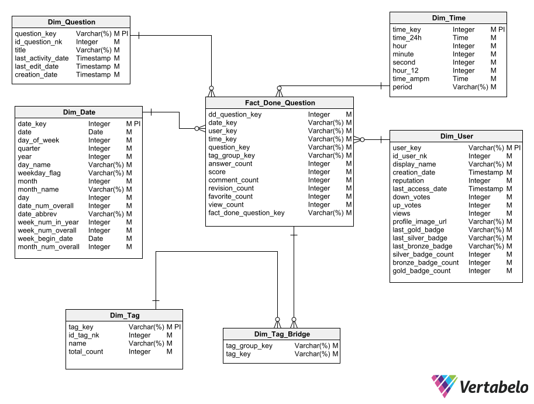

# 1. **StackOverflow Design**

------------

- [1. **StackOverflow Design**](#1-stackoverflow-design)
  - [1.1. Specification of analytical needs that the proposed model will solve](#11-specification-of-analytical-needs-that-the-proposed-model-will-solve)
  - [1.2. Architecture](#12-architecture)
    - [1.2.1 Architecture design](#121-architecture-design)
    - [1.2.2. Components description](#122-components-description)
  - [1.3. Proposed dimensional model](#13-proposed-dimensional-model)
    - [1.3.1. Star schema 1](#131-star-schema-1)
    - [1.3.2. Star schema 2](#132-star-schema-2)
  - [1.4. Mapping by table](#14-mapping-by-table)
    - [1.4.1. Dim_Question](#141-dim_question)
    - [1.4.2. Dim_Answer](#142-dim_answer)
    - [1.4.3. Dim_User](#143-dim_user)
    - [1.4.4. Dim_tag](#144-dim_tag)
    - [1.4.5. Dim_tag_bridge](#145-dim_tag_bridge)
    - [1.4.6. Dim_Time](#146-dim_time)
    - [1.4.7. Dim_Date](#147-dim_date)
    - [1.4.8. Fact_Done_Question](#148-fact_done_question)
    - [1.4.9. Fact_Done_Answer](#149-fact_done_answer)

## 1.1. Specification of analytical needs that the proposed model will solve

Our dimensional model is based on the StackOverflow data set, the needs that it will solve are the following:

1. ¿What is the total number of questions asked during a defined time?
2. ¿What is the percentage of questions that have been answered during a defined time?
3. ¿What is the day of the week and month of the year with the highest number of questions and answers?
4. ¿Which users have the highest reputation?
5. ¿Which users have solved the most questions?
6. ¿Which questions have had the most views?
7. ¿What technologies are the most frequently asked questions about?
8. ¿What are the most favorited and highest rated questions that were created over a period of time?
9. ¿How was the behavior of the questions and answers made during the pandemic period compared to previous years?
10. ¿What are the questions that have received the most feedback?

These are just some of the questions that we could answer, it is hoped that the dimensional model will allow analytical users to be able to answer more types of questions.

## 1.2. Architecture

### 1.2.1 Architecture design

As ilustrated in below image, there are four separe and distinct components to consider in the our data lake architecture: data source, ETL system, data presentation area and business intelligence applications.

### 1.2.2. Components description

**Data Source:**
These are the operational systems of record that capture the business's transactions. The data lake can have more than one source system and they are outside of the data lake. This data lake is using only one source system and the data is in csv format. 

**Raw data zone:**
This is the firts data layer, the data is stored with its original format, it does not have transformation applied yet. 

**Process zone:**
This is the second data layer, the data has some transformations applied according to the requirements, the transformations is applied through some ETL process. 

**Access zone:**
This is the last data layer, here the data is stored and made available for direct querying by users, report writers and BI applications.

**Govern zone:**
This zone lets administrators authorize who can take action on specific resources, for this proyect this zone gives full control, and visibility to manage Google Cloud resources centrally.

**Data consumption:**
Final area where BI applications are connected to the data lake, here, dashboards are generated to present key information to take decisions.

## 1.3. Proposed dimensional model

### 1.3.1. Star schema 1

- **Bussiness process:** Done Question
- **Granularity:** A record corresponds a done question

###  1.3.2. Star schema 2
- **Bussiness process:** Done Answer
- **Granularity:** A record corresponds a done answer

##  1.4. Mapping by table

| **Source field nomenclature**                                                               |
| ------------------------------------------------------------------------------------------- |
| 
**[Dataset] => [Tabla] => [Campo]**
 |

###  1.4.1. Dim_Question

- **Description:** Save the context of the question asked
- **Granularity:** a record represents a question post
- **Uniqueness policy:** the etl will search the questions and assign a surrogate key when this question is not stored in the dimension.
- **Invalidity policy:** All fields are required.
- **SCD Policy:** All fields will be Slowly Changing Dimension type one.
- 
| Column name        | Display name       | Type     | Source                                                    | Comment                 | Sample            |
| ------------------ | ------------------ | -------- | --------------------------------------------------------- | ----------------------- | ----------------- |
| question_key       | Question Key       | String   | -                                                         | Surragate key generated | 68d2e3f           |
| id_question_nk     | Id natural key     | Integer  | stakoverflow =>post_question=>id                          | Natural Key             | 4                 |
| title              | Title              | String   | stakoverflow =>post_question=>title                       | -                       | Null pointer java |
| last_activity_date | Last activity date | Timestamp     | stakoverflow =>post_question=>last_activity_date     | -                       | 27/06/2021        |
| last_edit_date     | Last edit date     | Timestamp     | stakoverflow =>post_question=>last_edit_date         | -                       | 27/06/2021        |
| creation_date      | Creation date      | Timestamp     | stakoverflow =>post_question=>creation_date          | -                       | 27/06/2021        |

###  1.4.2. Dim_Answer

- **Description:** Saves the context of the answer made.
- **Granularity:** a record represents a reply post.
- **Uniqueness policy:** the etl will search for responses and assign a surrogate key when this response is not stored in the dimension.
- **Invalidity policy:** All fields are required.
- **SCD Policy:** All fields will be Slowly Changing Dimension type one

| Column name        | Display name       | Type     | Source                                                    | Comment                 | Sample            |
| ------------------ | ------------------ | -------- | --------------------------------------------------------- | ----------------------- | ----------------- |
| answer_key         | Answer Key         | String   | -                                                         | Surragate key generated | 68d2e3f           |
| id_answer_nk       | Id natural key     | Integer  | stakoverflow =>post_answer=>id                            | Natural Key             | 4                 |
| last_activity_date | Last activity date | Timestamp| stakoverflow =>post_answer=>last_activity_date            | -                       | 27/06/2021        |
| last_edit_date     | Last edit date     | Timestamp| stakoverflow =>post_answer=>last_edit_date                | -                       | 27/06/2021        |
| creation_date      | Creation date      | Timestamp| stakoverflow =>post_answer=>creation_date                 | -                       | 27/06/2021        |

###  1.4.3. Dim_User

- **Description:** Save the context of a user
- **Granularity:** a record represents a user.
- **Uniqueness policy:** the etl will look for users and assign a surrogate key when this question is not stored in the dimension.
- **Invalidity policy:** All fields are required.
- **SCD Policy:** All fields will be Slowly Changing Dimension type one.

| Column name        | Display name       | Type     | Source                                           | Comment                 | Sample                                 |
| ------------------ | ------------------ | -------- | ------------------------------------------------ | ----------------------- | -------------------------------------- |
| user_key           | User key           | String   | -                                                | Surragate key generated | 68d2e3f                                |
| id_user_nk              | Id natural key     | Integer  | stakoverflow =>users=>id                         | Natural Key             | 4                                      |
| display_name       | Display name       | Integer  | stakoverflow =>users=>display_name               | -                       | Henry                                  |
| creation_date      | Creation date      | Timestamp | stakoverflow =>users=>creation_date              | -                       | 27/06/2021                             |
| reputation         | Reputation         | Integer  | stakoverflow =>users=>reputation                 | -                       | 10                                     |
| last_access_date   | Last access date   | Timestamp | stakoverflow =>users=>last_access_date           | -                       | 27/06/2021                             |
| down_votes         | Down votes         | Integer  | stakoverflow =>users=>down_votes                 | -                       | 0                                      |
| up_votes           | Up votes           | Integer  | stakoverflow =>users=>up_votes                   | -                       | 1                                      |
| views              | Views              | Integer  | stakoverflow =>users=>views                      | -                       | 1                                      |
| profile_image_url  | Profile image url  | String   | stakoverflow =>users=>profile_image_url          | -                       | https://www.gravatar.com/avatar/730d47 |
| last_gold_badge    | Last gold badge    | String   | stakoverflow =>badges                            | Calculater ETL          | student                                |
| last_silver_badge  | Last silver badge  | String   | stakoverflow =>badges                            | Calculater ETL          | supporter                              |
| last_bronze_badge  | Last bronce badge  | String   | stakoverflow =>badges                            | Calculater ETL          | editor                                 |
| silver_badge_count | Silver badge count | Integer  | stakoverflow =>badges                            | Calculater ETL          | 2                                      |
| bronze_badge_count | Bronze badge count | Integer  | stakoverflow =>badges                            | Calculater ETL          | 2                                      |
| gold_badge_count   | Gold badge count   | Integer  | stakoverflow =>badges                            | Calculater ETL          | 1       

### 1.4.4. Dim_tag
- **Description:** Store the tags for the questions
- **Granularity:** A record represents a tag
- **Uniqueness policy:** The ETL searches the tags and assigns a surrogate key when the tag is new
- **Nulliness policy:** All fields are required
- **SCD policy:**  All fields use SCD 1

| Column name | Display name | Type    | Source                    | Comment                 | Sample     |
| ----------- | ------------ | ------- | ------------------------- | ----------------------- | ---------- |
| tag_key     | tag_key      | String  | -                         | Surragate key generated | 68d2e3f    |
| id_tag_nk   | id_nk        | Integer | stakoverflow =>tags.id    | Natural Key             | 1          |
| name        | Name         | String  | stakoverflow =>tag.name   | -                       | JavaScript |
| total_ount  | Count        | Integer | stakoverflow =>tags.count | -                       | 100        |

### 1.4.5. Dim_tag_bridge
- **Description:** The bridge stores the relation between the fact table and the tag table
- **Granularity:** A record represents a group of tags for a question
- **Uniqueness policy:** The ETL searches the tags and assigns a surrogate key when the tag is new
- **Nulliness policy:** All fields are required

| Column name   | Display name  | Type   | Source | Comment                 | Sample  |
| ------------- | ------------- | ------ | ------ | ----------------------- | ------- |
| tag_group_key | Tag group key | String | -      | Surragate key generated | abc-def |
| tag_key       | Tag key       | String | -      | Foreign key to dim_tag  | ghi-jkl |

### 1.4.6. Dim_Time
- **Description:** This dimension stores records about time
- **Granularity:** A record represents the time in a day
- **Uniqueness policy:** A record represents the time in a day
- **Nulliness policy:** All fields are required
- **SCD policy:**  All fields use SCD 0

| Column name | Display name | Type     | Source | Comment                 | Sample       |
| ----------- | ------------ | -------- | ------ | ----------------------- | ------------ |
| time_key    | Time key     | Integer  | -      | Surragate key generated | 127          |
| time_24h    | Time 24h     | Time     | -      | -                       | 12:01:27 AM  |
| hour        | Hour         | Integer  | -      | -                       | 0            |
| minute      | Minute       | Integer  | -      | -                       | 1            |
| second      | Second       | Integer  | -      | -                       | 27           |
| hour_12     | Hour 12      | Integer  | -      | -                       | 12           |
| time_ampm   | AM-PM        | DateTime | -      | -                       | 12:01:27 a.m |
| period      | Period       | String   | -      | -                       | midnight     |

### 1.4.7. Dim_Date
- **Description:** This dimension stores records about day
- **Granularity:** A record represents a day in a year
- **Uniqueness policy:** A record represents a day in a year
- **Nulliness policy:** All fields are required
- **SCD policy:**  All fields use SCD 0

| Column name  | Display name | Type    | Source | Comment                 | Sample   |
| ------------ | ------------ | ------- | ------ | ----------------------- | -------- |
| date_key     | Date key     | Integer | -      | Surragate key generated | 20130101 |
| date         | Date         | Date    | -      | -                       | 01/01/13 |
| day_of_week  | Day of week  | Integer | -      | -                       | 1        |
| quarter      | Quarter      | Integer | -      | -                       | 2        |
| year         | Year         | Integer | -      | -                       | 2013     |
| day_name     | Day name     | String  | -      | -                       | Thursday |
| weekday_flag | Weekday flag | String  | -      | -                       | Weekday  |
| month        | Month        | Integer | -      | -                       | 1        |
| month_name   | Month name   | String  | -      | -                       | January  |
| day          | Day          | Integer | -      | -                       | 1        |
| date_num_overall          | Date num overall          | Integer | -      | -                       | 2        |
| date_abbrev          | Date abbrev          | String | -      | -                       | Wed        |
| week_num_in_year          | Week num in year          | Integer | -      | -                       | 2       |
| week_num_overall          | Week num overall          | Integer | -      | -                       | 2        |
| week_beging_date          | Week beging date          | Date    | -      | -                       | 01/01/2021        |
| month_num_overall         | Month num overall         | Integer | -      | -                       | 2        |

### 1.4.8. Fact_Done_Question

- **Description:** Contains all the events that occur in the question asked business process.
- **Granularity:** a record represents a question asked
- **Uniqueness policy:** The Etl will build a record in the fact table based on the new questions that are made in StakOverflow.
- **Invalidity policy:** All fields are required.
- **Policy of absence of context:** When a dimension does not apply to a row of the fact, a foreign key will be defined to indicate the absence of data from it.

| Column name    | Display name   | Type    | Source                                               | Comment                                | Sample |
| -------------- | -------------- | ------- | ---------------------------------------------------- | -------------------------------------- | ------ |
| dd_question_key| Dd Question Key| Integer | Dim_question.id_question_nk                          | -                                      | 4      |
| time_key       | Time key       | Integer | Dim_Time.time_key                                    | Foreign key pointing to Dim_Time       | -      |
| date_key       | Date key       | Integer | Dim_Date.date_key                                    | Foreign key pointing to Dim_Date       | -      |
| user_key       | User key       | String  | Dim_User.user_key                                    | Foreign key pointing to Dim_User       | -      |
| question_key   | Question key   | String  | Dim_Question.question_key                            | Foreign key pointing to Dim_Question   | -      |
| tag_group_key  | Tag group key  | String  | Dim_Tag_Bridge.tag_group_key                         | Foreign key pointing to Dim_Tag_Bridge | -      |
| answer_count   | Answer count   | Integer | stakoverflow =>post_question=>answer_count  | -                                      | 2      |
| view_count     | View count     | Integer | stakoverflow =>post_question=>view_count    | -                                      | 10     |
| score          | Score          | Integer | stakoverflow =>post_question=>score         | -                                      | 5      |
| comment_count  | Comment count  | Integer | stakoverflow =>post_question=comment_count  | -                                      | 4      |
| revision_count | Revision count | Integer | stakoverflow =>post_history                 | Calculater ETL                         | 1      |
| favorite_count | Favorite count | Integer | stakoverflow =>post_question=favorite_count | -                                      | 2      |
| fac_done_question_key| Fact done question key | String | -     |  Primary key generated to fact_done_question| abd-gr7      |

###  1.4.9. Fact_Done_Answer

- **Description:**  Contains all the events that occur in the done response business process
- **Granularity:** A record represents a answer
- **Uniqueness Policy:** Etl will build a record in the fact table based on the new answers to the questions asked in StakOverflow.
- **Invalidity policy:** All fields are required.
- **Policy of absence of context:** When a dimension does not apply to a row of the fact, a foreign key will be defined to indicate the absence of data from it.

| Column name            | Display name           | Type    | Source                                    | Comment                                    | Sample |
| ---------------------- | ---------------------- | ------- | ----------------------------------------- | ------------------------------------------ | ------ |
| time_key               | Time key               | Integer | Dim_Time.time_key                         | Foreign key pointing to Dim_Time           | -      |
| date_key               | Date key               | Integer | Dim_Date.date_key                         | Foreign key pointing to Dim_Date           | -      |
| user_key               | User key               | String  | Dim_User.user_key                         | Foreign key pointing to Dim_User           | -      |
| score                  | Score                  | Integer | stakoverflow =>post_answer.score          | -                                          | 5      |
| comment_count          | Comment count          | Integer | stakoverflow =>post_answer.comment_count  | -                                          | 4      |
| revision_count         | Revision count         | Integer | stakoverflow =>post_history.post_id       | Calculater ETL                             | 1      |
| fact_done_question_key | Fact done question key | String  | Fact_Done_Question.fact_done_question_key | Foreing Key pointing to Fact_Done_Question | ab-cef |
| fact_done_answer_key   | Fact done answer key   | String  | -                                         | Primary key generated to Fact_Done_Answer  | hi-jkl |
| dd_answer_key          | DD answer key          | Integer | Dim_answer.id_answer_nk                   | -                                          | 7      |
