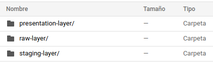
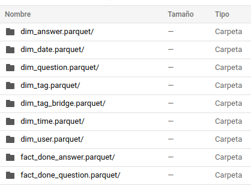
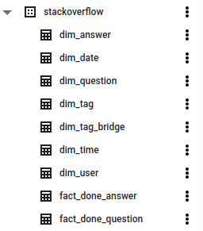
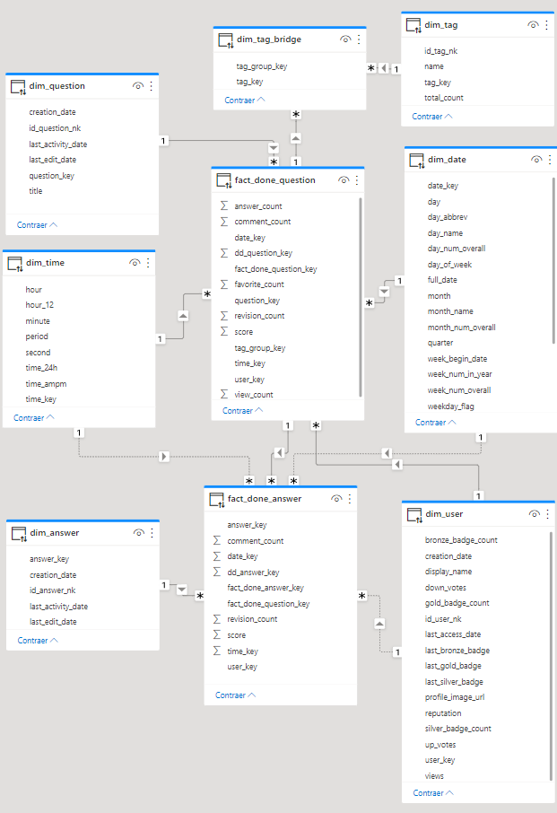

# 1. **StackOverflow's Development and Implementation**


------------

- [1. **StackOverflow's Development and Implementation**](#1-stackoverflows-development-and-implementation)
  - [1.1. Development](#11-development)
    - [1.1.1. ETLs](#111-etls)
    - [1.1.2. Layers](#112-layers)
      - [1.1.2.1. Raw layer](#1121-raw-layer)
      - [1.1.2.2. Staging layer](#1122-staging-layer)
      - [1.1.2.3. Presentation layer](#1123-presentation-layer)
  - [1.2. Implementation](#12-implementation)
    - [1.2.1. Cloud Storage](#121-cloud-storage)
    - [1.2.2. BigQuery and Power BI](#122-bigquery-and-power-bi)

## 1.1. Development
 ### 1.1.1. ETLs
 Having the dimentional models, it is time to create ETL for extract, transform and load the data source. For this goal we need a programming language and a framework to provide features that process big data.That programming language is Scala and that framework is Apache Spark.

Now we need a computational power to run those ETLs, we need a service in cloud computing, than provides this features. There are many options but we choose Databricks, because databricks give us a community edition with many services to run ETLs, also Databricks runs Apache Spark natively.

### 1.1.2. Layers
Our Data Lakehouse's architecture have three internal layer each one has a specific purpose, these are:
- Raw Layer
- Staging Layer
- Presentation Layer

#### 1.1.2.1. Raw layer
This layer storages the raw data, the ETLs in this layer extracts the data from data sources, transforms the data with the correct names of the columns, cleans the data and load the transformed data to this layer with a special format optimized to columns(parquet files).

- Example, raw tag ETL:
```scala
import org.apache.spark.sql.functions._

val location = "s3://idt115-stackoverflow/dataprep/pm15007/tags.csv/"
val bucketName = "idt-stackoverflow"
val layerName = "raw-layer"
val tableName = "tags.parquet"

val destination = s"gs://$bucketName/$layerName/$tableName"
// Reading tags from data source
val dirtyTable = spark.read
  .option("sep", ",")
  .option("header", false)
  .option("inferSchema", true)
  .csv(location)
// Set correct names to columns
val tags = dirtyTable
  .withColumnRenamed("_c0", "id")
  .withColumnRenamed("_c1", "tag_name")
  .withColumnRenamed("_c2", "count")
  .withColumnRenamed("_c3", "excerpt_post_id")
  .withColumnRenamed("_c4", "wiki_post_id")
// Checking tag's id is not null
val validTags = tags.filter(col("id").isNotNull)
// Writing valid tags
validTags.write
  .option("compression", "snappy")
  .option("header", true)
  .mode("overwrite")
  .parquet(destination);
```

#### 1.1.2.2. Staging layer
This layer storages the preprocessed  data, the ETLs in this layer extracts the data from Raw layer, transforms the data with joining tables with view to future dimensionals, dropping unused columns, flatten data arrays, and other necessary transformations, after that the data loads to this layer.

- Example, staging tag ETL:
```scala
import org.apache.spark.sql.functions._

val bucketName = "idt-stackoverflow"
val originLayer = "raw-layer"
val detinantionLayer = "staging-layer"
val tableName = "tags.parquet"
val origin = s"gs://$bucketName/$originLayer/$tableName"
val destination = s"gs://$bucketName/$detinantionLayer/$tableName"
// Reading tags from raw layer
val rawTags = spark.read.option("inferSchema", "true").parquet(origin)
// Dropping unused columns
val tags = rawTags.drop("excerpt_post_id").drop("wiki_post_id")
// Writing tags
tags.write
  .option("compression", "snappy")
  .option("header", true)
  .mode("overwrite")
  .parquet(destination);
```

#### 1.1.2.3. Presentation layer
This layer storages the curated data, the ETLs in this layer extracts the date from Staging layer, transforms the data creating the dimensionals, joining tables to create bridges and fact tables, the final data is loading to this layer.
- Example, presentation tag ETL:

```scala
import org.apache.spark.sql.functions._

val bucketName = "idt-stackoverflow"
val originLayer = "staging-layer"
val detinantionLayer = "presentation-layer"
val tableName = "tags.parquet"
val dimName = "dim_tag.parquet"
val origin = s"gs://$bucketName/$originLayer/$tableName"
val destination = s"gs://$bucketName/$detinantionLayer/$dimName"
// Reading tags from staging layer
val tags = spark.read.option("inferSchema", "true").parquet(origin)
// Renaming columns and adding subrrogate key: tag_key
val dimTag = tags.withColumn("tag_key", expr("uuid()"))
                 .withColumnRenamed("count", "total_count")
                 .withColumnRenamed("id", "id_tag_nk")
                 .withColumnRenamed("tag_name", "name")
// Writing tag dimension
dimTag.write
  .option("compression", "snappy")
  .option("header", true)
  .mode("overwrite")
  .parquet(destination);
```

All source code of Scala is in [sourceFiles folder](sourceFiles) and all Databrick's notebooks is in [notebooks folder](notebooks)

## 1.2. Implementation
### 1.2.1. Cloud Storage
All data is storing in different layers that are containing in a bucket, this bucket is hosted in GCP(Google Cloud Platform) specifically in the service called **Cloud Storage**. This bucket is accessed remotely and allow us to read and write big data, this is possible thanks to a service account provided by IAM(Identity Access Management) of GCP.

Bucket's content


Presentation Layer


### 1.2.2. BigQuery and Power BI
All dimensionals, bridges and fact tables stored in presentation layers must be exporting from Cloud Storage to BigQuery (BigQuery is also a services provides by GCP), this is necessary because Cloud Storage only allows to store data, while BigQuery allows to create dimensional models, and query them. Also BigQuery can be access with connectors from diferent tools, for diferent purposes, for example, Machine Learning, Data Science, Business Intelligence, etc.

In this project we need a tool that allow us make Business Intelligence, this tool is Power BI. Power BI allow us to connect directly to BigQuery using DirectQuery, already connected we can creating all dashboard we considers necessary to answer the analytical needs.

Dimensional model in BigQuery


Dimensional model in Power BI


