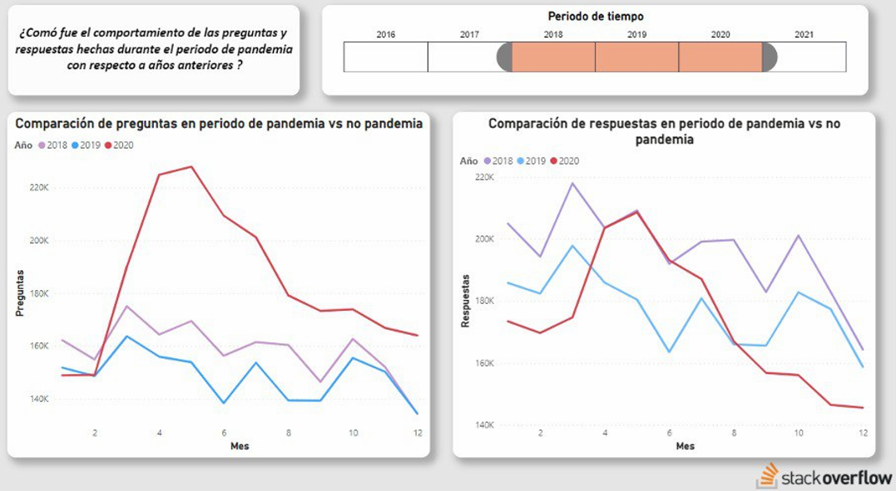

# 1. **StackOverflow Results**

------------
- [1. **StackOverflow Results**](#1-stackoverflow-results)
  - [1.1. Development of dashboards for the resolution of analytical needs](#11-development-of-dashboards-for-the-resolution-of-analytical-needs)
    - [1.1.1. What is the total number of questions asked during a defined time?](#111-what-is-the-total-number-of-questions-asked-during-a-defined-time)
    - [1.1.2. What is the percentage of questions that have been answered during a defined time?](#112-what-is-the-percentage-of-questions-that-have-been-answered-during-a-defined-time)
    - [1.1.3. What is the day of the week and the month of the year with the highest number of questions and answers?](#113-what-is-the-day-of-the-week-and-the-month-of-the-year-with-the-highest-number-of-questions-and-answers)
    - [1.1.4. Which users have the highest reputation?](#114-which-users-have-the-highest-reputation)
    - [1.1.5. Which users have solved the greatest number of questions?](#115-which-users-have-solved-the-greatest-number-of-questions)
    - [1.1.6. Which questions have had the most visits?](#116-which-questions-have-had-the-most-visits)
    - [1.1.7. What technologies are the most frequently asked questions about?](#117-what-technologies-are-the-most-frequently-asked-questions-about)
    - [1.1.8. What are the most favorited and highest rated questions that were created over a period of time?](#118-what-are-the-most-favorited-and-highest-rated-questions-that-were-created-over-a-period-of-time)
    - [1.1.9. How was the behavior of the questions and answers made during the pandemic period compared to previous years?](#119-how-was-the-behavior-of-the-questions-and-answers-made-during-the-pandemic-period-compared-to-previous-years)
    - [1.1.10. What are the questions that have received the most feedback?](#1110-what-are-the-questions-that-have-received-the-most-feedback)
  - [1.2. Conclusions](#12-conclusions)
  - [1.3. Live test of project reports](#13-live-test-of-project-reports)
     

## 1.1. Development of dashboards for the resolution of analytical needs
 ### 1.1.1. What is the total number of questions asked during a defined time?
 
 
 
**Description:**

This dashboard allows us to select a period of time, be it the desired year and months. Once the period of time has been defined, the graph shows us the total number of questions asked during that period.
The graph has a time hierarchy enabled, so it allows us to see the total number of questions either by year, quarter, month or day. For the image shown, the graph shows the total number of questions asked per month for the year 2018.

 
 
 ### 1.1.2. What is the percentage of questions that have been answered during a defined time?
 
 
 
 **Description:**

This dashboard also allows us to select a period of time, be it a year, several years and the desired months. Once the time period has been defined, the graph shows us the percentage of questions that have been answered in that selected period. In other words, if for a time T 100 questions are asked, but only 80 are answered, the graph would show us a percentage of 80% for that time T.
The graph also has a time hierarchy enabled, so it allows us to see the percentage of questions answered by year, quarter, month or day. For the image shown, the graph shows us the percentage of questions answered per month for the year 2019.

 
 ### 1.1.3. What is the day of the week and the month of the year with the highest number of questions and answers?
 
  
   
   **Description:**

The figure shows the graphs that compare the questions made against the answers made, so you can see which is the month and the day of the week that there was more activity on the Stackoverflow platform, in addition, you can see information cards that they say the total answers, questions and the percentage of questions answered during the defined period of time.
To better understand scatter plots, you have to: the further to the right is a point, the greater the number of questions and the higher the number of answers, so the best point must be located at the top right and the worst at the bottom right. the left.

  
 ### 1.1.4. Which users have the highest reputation?
 
  
  
  **Description:**

This dashboard shows us the 10 users who have the highest reputation, the last gold, silver and bronze badge that they have won, in the same way when selecting a user from the top 10, automatically the display of ''questions asked per year'' is updated, in such a way that you can see the questions that user has made over the years.

 ### 1.1.5. Which users have solved the greatest number of questions?
 
  
  
  **Description:**

In this dashboard you can establish a period of time to know which are the users that have provided the most answers to solve the questions asked. You can filter by year or years and by months.
In the bar graph, the names of the users are listed from highest to lowest contribution, to their right are some interesting measures such as: The total number of answers made, the users who have contributed one or more answers and an average number of questions users respond.

In the specific case of the figure, it shows us the users who answered the most questions during the year 2019, and in the bar graph you can see the number of answers that each user provided.

  
 
 ### 1.1.6. Which questions have had the most visits?
 
  
 
 
  **Description:**

  
This dashboard shows us the questions that were asked in a defined period either for years or months and that now have the highest number of visits, and as interesting measures it shows us the number of total questions asked, the total number of visits obtained and the average of visits for questions during the defined period of time.

  
  
 ### 1.1.7. What technologies are the most frequently asked questions about?
 
  
  
  **Description:**

  
The dashboard presents us with the top 10 technologies that were asked the most in a defined period of time, these technologies were the trend in the Stackoverflow platform during that period. As additional data, they show us the total number of questions asked, the total number of technologies addressed and an average number of technology labels per question.

  
 ### 1.1.8. What are the most favorited and highest rated questions that were created over a period of time?
 
  
  
   **Description:**

  
The dashboard clearly shows us which are the questions that have been marked as favorites and with the highest score, analyzed from a period of time, in this case for the year 2020, a period of time marked by the appearance of the pandemic. . Basically, the report performs the analysis through the presentation of two horizontal bar graphs, the first of which represents all those questions most marked as favorites and the second shows the questions with the highest score.
  
In addition, additional elements are presented that allow increasing the analytical capacity of the report, such as the segmentation of the period in which the scores or markings are made on the questions, direct presentation of the question with the highest score or favorite marking. If we select the questions presented on the bar graphs, a series of counters are also presented that allow us to know the number of reviews, scores, answers and comments received for the selected question.

  
  
 ### 1.1.9. How was the behavior of the questions and answers made during the pandemic period compared to previous years?
 
  
  
   **Description:**

  
The dashboard shows us in a concrete way the behavior that occurred with respect to the creation of questions and answers during the quarantine period which is for the year 2020, this behavior has been compared with respect to previous years, as shows the figure. The period from 2018 -2020 was taken as a reference, this period clearly determines in the line graphs how the generation of questions and answers had its highest point in the first months in which the nations implemented their respective quarantines, as well as the interesting decline in questions and answers in the months after that time period.
  
Through the interaction with the graphs we will be able to observe relevant data such as the number of questions or answers made for each year under analysis, as well as the number of the month and its corresponding name. In such a way that it will allow us to interact by selecting on the graphs in those months that are of analytical interest both to answer the analytical question as well as for subsequent questions that may arise.

  
  
 ### 1.1.10. What are the questions that have received the most feedback?
 
  
  
  **Description:**

  
The dashboard clearly shows us which are the questions that have received the most feedback during a period. The report analyzes the question based on two perspectives, the first perspective is shown through the first horizontal bar graph which shows the questions with the highest number of responses received. The second graph shows us the questions with the greatest number of comments, this is because the greatest feedback that the questions can have is through the comments and answers received.
  
Additionally, visual elements are presented, such as the segmentator of periods in which the comments and answers to the questions are made, in addition, if we select one of the questions in the bar graphs through the visual card, it will show us the name of the question with More responses and comments. Finally, the report is equipped with a series of counters that allow us to directly view the number of reviews, scores, responses and comments received, they will give us specific data if we select specific questions the respective graph as such.

## 1.2. Conclusions
1. With the development of the dimensional models for the business processes of questions and answers made, it will allow the community of users of the Stack Overflow platform to be able to know first-hand the current state of the platform, in terms of behavior patterns. in the generation of questions and answers in specific periods of time, user behavior patterns when interacting within the platform, patterns related to the level of feedback that the questions receive, technologies most consulted during certain periods of time, among others analysis variables resulting from established business processes

2. The development of a Big data solution will allow the Stack Overflow community to have a Data Lakehouse, which will directly solve the main analytical requirements that led to the development of the project. It is important to mention that the final data can also be applied in data science solutions, Machine Learning application, Business Intelligence, that is, the final model is equipped with the capacity to feed superior data analysis processes, thus increasing the potential of the solution.

3. The creation of reports that provide a concrete solution to business requirements, allows us to really understand the enormous analytical contribution that the processed data can give organizations, the innumerable concerns, questions or needs that may arise over time. Since a report allows direct transmission of the findings found in the data, findings that can increase the success of strategic decision-making.

## 1.3. Live test of project reports

Through the following link you can view a live test of the corresponding reports previously shown, it should be noted that in order to view them you will need to log in with the corresponding institutional account of the University of El Salvador.

<a href="https://tiuesedusv.sharepoint.com/:u:/s/IDT-stackoverflow/Ee5tYFQ4nopHjvkFxxFxcckBvtDjzAMlh_mIMp_DONO1eQ?e=aHB16j" target="_blank">Link for live test of reports</a>

